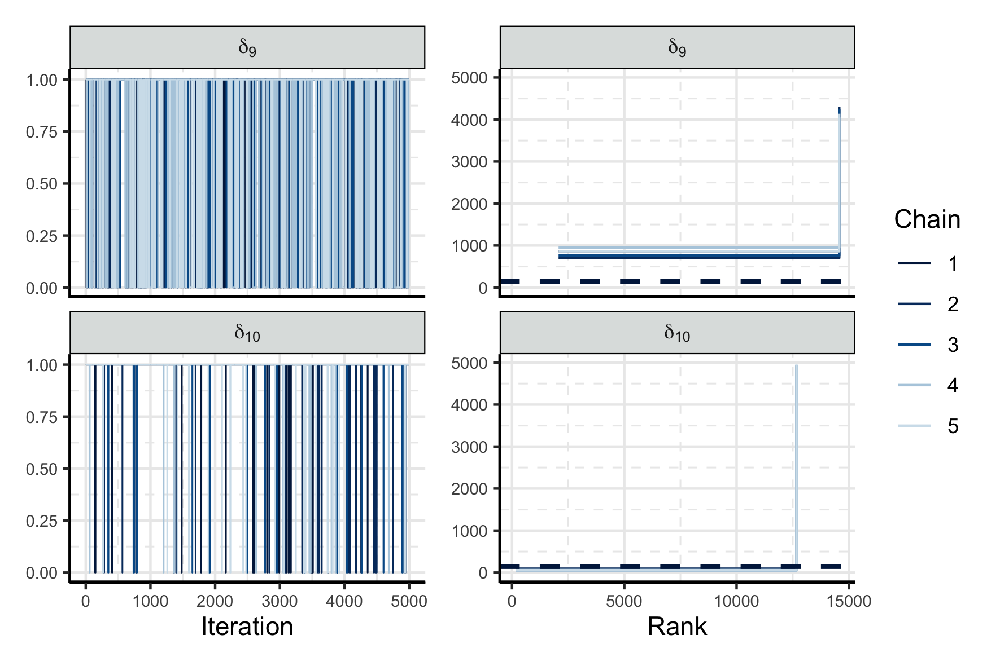

```{r setup, include = FALSE}
knitr::opts_chunk$set(echo = FALSE, comment = NA, fig.align = "center")
```
<!--  
  - RSS conference, the abstract can be 300 words.
-->


# Introduction

The Bayesian philosophy is appealing in part because the posterior distribution quantifies all sources of uncertainty.
However, a joint model for all data and parameters is a prerequisite to posterior inference, and in situations where multiple, heterogeneous sources of data are available, specifying such a joint model is challenging.
Models that consider such data are necessary to describe complex phenomena at a useful precision.
One possible approach begins by specifying individual submodels for each source of data.
These submodels could guide the statistician when directly specifying the joint model, but to use the submodels only informally seems wasteful.
Instead, it may be preferable to construct a joint model by formally joining the individual submodels together.

There is a general interest in integrating many sources of data into a single model, and some specific forms of combining data are well established.
Meta-analyses and evidence synthesis methods are important modelling techniques that summarise many disparate data, often using hierarchical models [@ades_multiparameter_2006; @presanis_synthesising_2014].
Outside of the statistical literature, a common name for combining multiple data is _data fusion_ [@lahat_multimodal_2015-1; @kedem_statistical_2017], though there are many distinct methods that fall under this general name.
More familiar to Bayesian statisticians are the family of _divide and conquer_ methods (D&C).
These are useful in tall data settings, where the number of observations presents a computational challenge.
D&C methods split the data into subsets, fit the same model to each subset to produce the subposteriors, and combine these subposteriors.
Specific D&C methods include _consensus Monte Carlo_ [@scott_bayes_2016-1],
the embarrassingly parallel MCMC algorithm of @neiswanger_asymptotically_2014, and subposterior averaging via the Wasserstein baryceter [@srivastava_scalable_2018].
The _Bayesian Fusion_ method of @dai_monte_2019-1 combines these subposteriors exactly.
Decomposing a joint model into distinct submodels is particularly useful when one submodel is misspecified [@liu_modularization_2009; @jacob_better_2017-1; @carmona_semi-modular_2020] and we want to limit the flow of information out of the misspecified module [@lunn_bugs_2009; @plummer_cuts_2015].

Applied researchers often collect multiple disparate data sets, or data of different modalities, and wish to combine them. 
For example, to estimate SARS-CoV-2 positivity @donnat_bayesian_2020 build an intricate hierarchical model that integrates both testing data and self-reported questionnaire data, and @parsons_evaluating_2020 specify a hierarchical model of similar complexity to estimate the number of injecting drug users in Ukraine. 
Both applications clearly delineate between the numerous sources of data they consider.
In conservation ecology, _integrated population models_ (IPMs) [@zipkin_synthesizing_2018] are used to estimate population dynamics, e.g. reproduction and immigration rates, using multiple data on the same population.
Such data have standard models associated with them, such as the Cormack—Jolly—Seber model [@lebreton_modeling_1992] for capture-recapture data, and the IPM serves as the framework in which the standard models are combined.

_Markov melding_ [@goudie_joining_2019] is a general statistical methodology for combining submodels.
Specifically, it considers $\Nm$ submodels that share some common quantity $\phi$.
Each of the $\modelindex = 1, \ldots, \Nm$ submodels also has distinct parameters $\psi_{\modelindex}$, data $Y_{\modelindex}$ and form $\pd_{\modelindex}(\phi, \psi_{\modelindex}, Y_{\modelindex})$, which are combined into a joint model $\pd_{\text{meld}}(\phi, \psi_{1}, \ldots, \psi_{\Nm}, Y_{1}, \ldots, Y_{\Nm})$.
However, it is unclear how to integrate models where there is no single quantity $\phi$ common to all submodels, such for submodels that are linked in a chain structure.

We propose an extension to Markov melding, which we call _chained Markov melding_[^chained], which facilitates the combination of submodels that are in a chain structure.
Specifically, in the $\Nm = 3$ case, we address the case in which submodel 1 and 2 share a common quantity $\phi_{1 \cap 2}$, and submodel 2 and 3 share a different quantity $\phi_{2 \cap 3}$.
Two examples serve to illustrate our methodology, which we introduce in the following section.
The computational effort required to fit a complex, multi-response model is a burden to the model development process.
We propose a multi-stage posterior estimation method that exploits the properties of our chained melded model to reduce this burden.
We can parallelise aspects of the computation across the submodels, using less computationally expensive techniques for some submodels.
Reusing existing software implementations of submodels, and where available subposterior samples, is also possible. 
Multi-stage samplers can aid in understanding the contribution of each submodel to the final posterior, and are used in many applied settings, including hierarchical modelling [@lunn_fully_2013-1] and joint models [@mauff_joint_2020].

[^chained]: _"Chained graphs"_ were considered by @lauritzen_chain_2002, however they are unrelated to our proposed model. We use "chained" to emphasise the nature of the relationships between submodels.

## Example introduction

In this section we provide a high-level overview of two applications involving chain-like inter-submodel relationships.
We will provide more details and illustrate our methodology with these examples in Section \ref{examples}.

### An Integrated population model for little owls

Integrated population models (IPMs) [@zipkin_synthesizing_2018] combine multiple data to estimate key quantities governing the dynamics of a specific population.
@schaub_local_2006 and @abadi_estimation_2010 used an IPM to estimate fecundity, immigration, and yearly survival rates for a population of little owls.
These authors collect and model three types of data, illustrated in Figure \ref{fig:owls-simple-dag}: capture-recapture data $Y_{1}$ with associated capture-recapture submodel $\pd_{1}(\phi_{1 \cap 2}, \psi_{1}, Y_{1})$; population counts $Y_{2}$ with associated submodel $\pd_{2}(\phi_{1 \cap 2}, \phi_{2 \cap 3}, \psi_{2}, Y_{2})$; and nest-record data $Y_{3}$ with associated fecundity submodel $\pd_{3}(\phi_{2 \cap 3}, \psi_{3}, Y_{3})$.
The population count model $\pd_{2}$ shares the parameter $\phi_{1 \cap 2}$ with the capture-recapture model $\pd_{1}$, and the parameter $\phi_{2 \cap 3}$ with the fecundity model $\pd_{3}$.
No single source of data is sufficient to estimate all quantities of interest, so it is necessary to integrate the three submodels into a single joint model to produce acceptably precise estimates of fecundity and immigration rates.
We will show that the chained Markov melding framework developed in Section \ref{chained-model-specification} encapsulates the process of integrating these submodels, and IPMs in general.

\input{tex-input/owls-example/0001-owls-simple-dag.tex}

### Survival analysis with time varying covariates and uncertain event times

Our second example considers the time to onset of acute respiratory distress syndrome (ARDS) amongst patients in intensive care units, and factors that influence the onset of ARDS.
A patient can be said to be experiencing ARDS if the ratio of the partial pressure of arterial blood oxygen (\paoii) to the faction of inspired oxygen (\fioii) is less than 300mmHg [@the_ards_definition_task_force_acute_2012].
Drawing arterial blood is a painful procedure, and calculating \paoii requires laboratory testing, so patients' \pfratio\ ratios are not always available.
An alternative is to consider the ratio of peripheral oxygen saturation (\spoii) to \fioii, as the former can be obtained from a pulse oximeter, a device typically worn on the finger tip that produces immediate measurements.
The \sfratio\ ratio can then be converted to a \pfratio\ by various formula [@pandharipande_derivation_2009-1; @brown_nonlinear_2016-1].
However, the noise introduced by the \spoii\ measurements [@nitzan_pulse_2014] and the conversion formula yield a \pfratio\ value that is contaminated by statistically nonneglible amounts of noise.
This results in uncertainty about time of onset of ARDS.

Factors that influence the time-to-onset of ARDS are both longitudinal and time invariant.
Both types of data can be considered in _joint models_ [@rizopoulos_joint_2012], which are composed of two distinct submodels, one for each data type.
Failing to incorporate the uncertainty surrounding the event time may result overconfident and/or biased estimates of the parameters in the joint model.

Chained Markov melding offers a conceptually straightforward, Bayesian approach to incorporating uncertain event times into joint models.
Specifically, we consider the event time as a submodel-derived quantity from a hierarchical regression model akin to @lu_using_1993. 
We call this submodel the _uncertain event time_ submodel and denote it $\pd_{1}(\phi_{1 \cap 2}, \psi_{1}, Y_{1})$, where $\phi_{1 \cap 2}$ is the event time.
The survival submodel $\pd_{2}(\phi_{1 \cap 2}, \phi_{2 \cap 3}, \psi_{2}, Y_{2})$ uses $\phi_{1 \cap 2}$, the common quantity, as the response.
We treat the longitudinal submodel, $\pd_{3}(\phi_{2 \cap 3}, \psi_{3}, Y_{3})$, separately from the survival submodel, as is common in two-stage survival modelling, and denote the subject-specific parameters that also appear in the survival model as $\phi_{2 \cap 3}$.
The high level submodel relationships are displayed as a DAG in Figure \ref{fig:surv-simple-dag}.
\input{tex-input/surv-example/0001-surv-simple-dag.tex}

## Markov melding

We now review Markov melding [@goudie_joining_2019] before detailing our proposed extension.
As noted in the introduction, Markov melding is a method for combining $\Nm$ submodels $\pd_{1}(\phi, \psi_{1}, Y_{1}), \ldots, \pd_{\Nm}(\phi, \psi_{\Nm}, Y_{\Nm})$ which share the same $\phi$.
When the submodel prior marginals $\pd_{\modelindex}(\phi)$ are identical, i.e. $\pd_{\modelindex}(\phi) = \pd(\phi)$ for all $\modelindex$, it is possible to combine the submodels using _Markov combination_ [@dawid_hyper_1993-1; @massa_combining_2010]
\input{tex-input/orig-markov-melding/0010-markov-combination.tex}
Markov combination is not immediately applicable when submodel prior marginals are distinct, so Goudie _et al._&nbsp;define a _marginal replacement_ procedure, where individual submodel prior marginals are replaced with a common marginal $\pd_{\text{pool}}(\phi)$
\input{tex-input/orig-markov-melding/0011-marginal-replacement.tex}
where $\pd_{\text{pool}}(\phi) = h(\pd_{1}(\phi), \ldots, \pd_{\Nm}(\phi))$ is the result of a pooling function $h$ that appropriately summarises all prior marginals.
This ensures the prior marginals are the same in all submodels.
Goudie _et al._&nbsp;show that $\pd_{\text{repl}, \modelindex}(\phi, \psi_{\modelindex}, Y_{\modelindex})$ minimises the Kullback–Leibler (KL) divergence between a distribution $\q(\phi, \psi_{\modelindex}, Y_{\modelindex})$ and $\pd_{\modelindex}(\phi, \psi_{\modelindex}, Y_{\modelindex})$ under the constraint that $\q(\phi) = \pd_{\text{pool}}(\phi)$, and that marginal replacement is valid when $\phi$ is a deterministic function of the other parameters in submodel $\modelindex$.
Markov melding joins the submodels via the Markov combination of the marginally replaced submodels
\input{tex-input/orig-markov-melding/0012-markov-melding.tex}

### Pooled prior

Goudie _et al._&nbsp;proposed forming $\pd_{\text{pool}}(\phi)$ using one of several forms of linear or logarithmic prior pooling [@ohagan_uncertain_2006]
\input{tex-input/orig-markov-melding/0020-orig-pooling.tex}
where $\lambda = (\lambda_{1}, \ldots, \lambda_{\Nm})$ are nonnegative weights, which are chosen subjectively to ensure $\pd_{\text{pool}}(\phi)$ appropriately represents prior knowledge about the common quantity.
Two special cases of pooling are of particular interest.
_Product of experts (PoE) pooling_  [@hinton_training_2002] is a special case of logarithmic pooling that occurs when $\lambda_{\modelindex} = 1$ for all $\modelindex$.
_Dictatorial pooling_ is a special case of either pooling method when $\lambda_{\modelindex'} = 1$ and $\lambda_{\modelindex} = 0$ for all $\modelindex \neq \modelindex'$.

# Chained model specification

Consider $\modelindex = 1, \ldots, \Nm$ submodels each with data $Y_{\modelindex}$ and parameters $\theta_{\modelindex}$ denoted $\pd_{\modelindex}(\theta_{\modelindex}, Y_{\modelindex})$, with $\Nm \geq 3$.
We assume that the submodels are connected in a manner akin to a chain and so can be ordered such that only 'adjacent’ submodels in the chain have parameters in common.
Specifically we assume that submodels $\modelindex$ and $\modelindex + 1$ have some parameters $\phi_{\modelindex \cap \modelindex + 1}$ in common for $\modelindex = 1, \ldots, \Nm - 1$.
For notational convenience define $\phi_{1} = \phi_{1 \cap 2}, \phi_{\Nm} = \phi_{\Nm-1 \cap \Nm}$ and $\phi_{\modelindex} = \phi_{\modelindex - 1 \cap \modelindex} \cup \phi_{\modelindex \cap \modelindex + 1}, \modelindex = 2, \ldots, \Nm - 1$, so that $\phi_{\modelindex}$ denotes the parameters in model $\modelindex$ shared with at least one other submodel.
The submodel-specific parameters of submodel $\modelindex$ are thus $\psi_\modelindex = \theta_\modelindex \setminus \phi_\modelindex$.
Define the vector of all common quantities $\boldsymbol{\phi} = (\phi_{1 \cap 2}, \ldots, \phi_{\Nm - 1 \cap \Nm}) = \bigcup_{\modelindex = 1}^{\Nm}\phi_{\modelindex}$, and $\boldsymbol{\phi}_{-\modelindex} = \boldsymbol{\phi} \setminus \phi_{\modelindex}$.
It will also be convenient to define $\boldsymbol{\psi} = (\psi_{1}, \ldots, \psi_{\Nm})$ and likewise $\boldsymbol{Y} = (Y_{1}, \ldots, Y_{\Nm})$.
Note that all constituent elements of $\boldsymbol{\phi}, \boldsymbol{\psi}$ and $\boldsymbol{Y}$ may themselves be vectors.

All submodels, and marginal and conditional distributions thereof, have density functions that are assumed to exist and integrate to one.
When considering conditional distributions we assume that the parameter being conditioned on has support in the relevant region.

## Extending marginal replacement

We now define the chained melded model by extending the marginal replacement procedure to submodels linked in a chain-like way.
The $\modelindex$\textsuperscript{th} marginally replaced submodel is
\input{tex-input/multiple-phi/0001-chained-marginal-replacement.tex}
where $\pd_{\text{pool}}(\boldsymbol{\phi}) = g(\pd_{1}(\phi_{1}), \pd_{2}(\phi_{2}), \ldots, \pd_{\modelindex}(\phi_{\modelindex}))$ is a pooling function that appropriately summarises all submodel prior marginals.
The second equality in Equation \eqref{eqn:chained-marginal-replacement} is because of the conditional independence $(\psi_{\modelindex}, Y_{\modelindex} \indep \boldsymbol{\phi}_{-\modelindex}) \mid \phi_{\modelindex}$ that exists due to the chained relationship between submodels.
It is important to note that $\pd_{\text{repl}, \modelindex}(\boldsymbol{\phi}, \psi_{\modelindex}, Y_{\modelindex})$ is defined on a larger parameter space than $\pd_{\modelindex}(\phi_{\modelindex}, \psi_{\modelindex}, Y_{\modelindex})$, as it includes $\boldsymbol{\phi}_{-\modelindex}$.
We discuss this choice in the following section.

Define $\pd_{\text{repl}, \modelindex}(\phi_{\modelindex}, \psi_{\modelindex}, Y_{\modelindex}) = \int \pd_{\text{repl}, \modelindex}(\boldsymbol{\phi}, \psi_{\modelindex}, Y_{\modelindex})\text{d}\boldsymbol{\phi}_{-\modelindex}$.
Each marginally replaced submodel, as defined in Equation \eqref{eqn:chained-marginal-replacement}, minimises the following KL divergence
\input{tex-input/multiple-phi/0003-chained-marginal-replacement-kl.tex}
where $\pd_{\text{pool}}(\phi_{\modelindex}) = \int \pd_{\text{pool}}(\boldsymbol{\phi})\text{d}\boldsymbol{\phi}_{-\modelindex}$.
We can thus interpret $\pd_{\text{repl}, \modelindex}(\phi_{\modelindex}, \psi_{\modelindex}, Y_{\modelindex})$ as a minimally modified $\pd_{\modelindex}(\phi_{\modelindex}, \psi_{\modelindex}, Y_{\modelindex})$ which admits $\pd_{\text{pool}}(\phi_{\modelindex})$ as a marginal. 
Note that it is the combination of $\pd_{\text{repl}, \modelindex}(\phi_{\modelindex}, \psi_{\modelindex}, Y_{\modelindex})$ and $\pd(\boldsymbol{\phi}_{-\modelindex} \mid \phi_{\modelindex})$ that uniquely determine \eqref{eqn:chained-marginal-replacement}.

We form the chained melded model by taking the Markov combination of the marginally replaced submodels
\input{tex-input/multiple-phi/0010-melded-model-cond.tex}

## Pooled prior

Specifying \eqref{eqn:melded-model-full} requires forming an appropriate joint prior for $\boldsymbol{\phi}$.
Like in Markov melding, we choose the pooling function $g$ to appropriately represent prior knowledge about the common quantities.
This is not trivial given the many possibilities of pooling functions and pooling weights, which we detail in the following sections.
Hence, it is important to assess the ensuing pooled prior is indeed an appropriate summary of prior knowledge, and we recommend producing prior predictive visualisations of the pooled prior as part of a Bayesian workflow [@gabry_visualization_2019; @gelman_bayesian_2020].

We have chosen to define $\pd_{\text{pool}}(\boldsymbol{\phi})$ as a general function of all prior marginals 
\input{tex-input/pooled-prior-discussion/0030-pooled-prior-general-def.tex}
This is because we do not assume any of the components of $\boldsymbol{\phi}$ are are a priori independent.
If the elements of $\boldsymbol{\phi}$ are independent, then we can form $\pd_{\text{pool}}(\boldsymbol{\phi})$ as the product of $\Nm - 1$ standard pooling functions $h_{\modelindex}$ defined in Section \ref{pooled-prior}
\input{tex-input/pooled-prior-discussion/0010-bad-alternative-one.tex}

A useful notion in between \eqref{eqn:pooled-prior-general-def} and \eqref{eqn:bad-alternative-one} is that if $\pd_{\modelindex}(\phi_{\modelindex - 1 \cap \modelindex}, \phi_{\modelindex \cap \modelindex + 1}) = \pd_{\modelindex}(\phi_{\modelindex - 1 \cap \modelindex}) \pd_{\modelindex}(\phi_{\modelindex \cap \modelindex + 1})$ then we can define
\input{tex-input/pooled-prior-discussion/0031-pooled-prior-split-def.tex}
without any additional assumptions.
That is, if any two consecutive components of $\boldsymbol{\phi}$ are independent under the submodel containing both of them, we can divide the pooled prior specification problem into two pooling functions. 
Because each pooling function considers fewer marginals it is easier to choose pooling weights and assess the suitability of the pooled prior via prior predictive checks.

A complication encountered in the chained melding setting is that standard linear and logarithmic pooling, as defined in Equations \eqref{eqn:orig-pooling-linear} and \eqref{eqn:orig-pooling-logarithmic}, are not immediately applicable when the submodels marginal distributions consider different parameters.
The interpretation Equation \eqref{eqn:orig-pooling-linear} is particularly unclear.
We now propose extensions to logarithmic, linear, and dictatorial pooling for use in the case of chained melding.

### Linear pooling

Our generalisation of linear pooling to handle marginals of different variables involves two steps.
The first step forms intermediary pooling densities via standard linear pooling, using appropriate marginals of the relevant quantity
\input{tex-input/multiple-phi/0080-M-model-linear-pooling.tex}
where $\lambda_{\modelindex} = (\lambda_{\modelindex, 1}, \lambda_{\modelindex, 2})$ are nonnegative pooling weights.
We discuss the choice of $\lambda$ in the following section.
In step two we form the pooled prior as the product of the intermediaries
\input{tex-input/multiple-phi/0055-silly-linear-overall.tex}
Clearly, this assumes a priori independence amongst all components of $\boldsymbol{\phi}$ which may be undesirable, particularly if this independence was not present in any particular marginal $\pd_{\modelindex}(\phi_{\modelindex})$.

### Logarithmic pooling

Extending logarithmic pooling for chained Markov melding is straightforward.
We define the logarithmically pooled prior to be 
\input{tex-input/multiple-phi/0050-pooled-prior-overall.tex}
for nonnegative weight vector $\lambda = (\lambda_{1}, \ldots, \lambda_{\Nm})$.
Note that \eqref{eqn:pooled-prior-overall} does not imply independence between the elements of $\boldsymbol{\phi}$:
\input{tex-input/multiple-phi/0051-pooled-prior-log-alt-def.tex}
One advantage of logarithmic pooling is that does not necessarily imply a priori independence between the components of $\boldsymbol{\phi}$.
When $\lambda_{1} = \lambda_{2} = \ldots = \lambda_{\Nm} = 1$ we obtain the special case of product-of-experts (PoE) pooling [@hinton_training_2002]. 

### Dictatorial pooling

Chained Markov melding does not admit a direct analogue to dictatorial pooling as defined in Section \ref{pooled-prior} because not all submodel prior marginals contain all common quantities.
For example, consider the logarithmically pooled prior of Equation \eqref{eqn:pooled-prior-overall} with one entry in $\lambda$ set to $1$ and all others set to $0$.
This choice of $\lambda$ results in $\pd_{\text{pool}}(\boldsymbol{\phi}) = \pd_{\text{pool}}(\phi_{\modelindex})$, and is implicitly flat for $\boldsymbol{\phi}_{-\modelindex}$.
It seems reasonable to require any generalisation of dictatorial pooling to result in an explicit prior for all components in $\boldsymbol{\phi}$.
Such a generalisation should also retain the original intention of dictatorial pooling, i.e.&nbsp;'_the authoritative prior for_ $\phi_{\modelindex}$ _is_ $\pd_{\modelindex}(\phi_{\modelindex})$'.

We propose two possible forms of dictatorial pooling that satisfy the aforementioned criteria.
The first considers $\pd_{\modelindex}(\phi_{\modelindex})$ as the authoritative prior for $\phi_{\modelindex}= (\phi_{\modelindex - 1 \cap \modelindex}, \phi_{\modelindex \cap \modelindex + 1})$.
This results in
\input{tex-input/pooled-prior-discussion/0040-dictatorial-one-submodel.tex}
where $g_{1}$ and $g_{2}$ are linear or logarithmic pooling functions as desired.
In our second proposal we require the prior for each element in $\boldsymbol{\phi}$ to be associated with only one submodel.
This is equivalent to logarithmic pooling with the following choice of pooling weights
\input{tex-input/pooled-prior-discussion/0041-dictatorial-def-all.tex}
<!-- % takes up too much space, but slightly annoying to describe in words.-->
We set all of the non-zero elements of $\lambda_{\text{dict}}$ to $1$ when using dictatorial pooling.

We will later require the specific forms of dictatorial pooling with $\Nm = 3$ and all non-zero elements of $\lambda = 1$, which are
\input{tex-input/multiple-phi/0057-dictatorial-pooling.tex}

### Pooling weights

Choosing values for the pooling weights ($\lambda$) is an important step in specifying the pooled prior.
Figure \ref{fig:pooled_densities_plot} illustrates how $\lambda$ and the choice of pooling method impacts $\pd_{\text{pool}}(\boldsymbol{\phi})$ when pooling normal distributions.
Specifically, we consider $\Nm = 3$ submodels and pool
\input{tex-input/multiple-phi/0061-marginal-gaussian-example.tex}
where $\text{N}(\phi; \mu, \sigma^{2})$ is the normal density function with mean $\mu$ and standard deviation $\sigma$.
The two dimensional density function $\pd_{2}$ has an additional parameter $\rho$, which controls the intra-submodel marginal correlation.
We set $\mu_{1} = -2.5, \mu_{2} = \left[\mu_{2, 1} \,\, \mu_{2, 2}\right]' = \left[0 \,\, 0\right]', \mu_{3} = 2.5, \sigma_{1}^{2} = \sigma_{2}^{2} = \sigma_{3}^{2} = 1$ and $\rho = 0.8$.
In the logarithmic case we set $\lambda_{1} = \lambda_{3}$ and parameterise $\lambda_{2} = 1 - 2\lambda_{1}$, so that $\lambda_{1} + \lambda_{2} + \lambda_{3} = 1$ whilst limiting ourselves to varying only $\lambda_{1}$.
Similarly, in the linear case we set $\lambda_{1, 1} = \lambda_{2, 2} = \lambda_{1}$ and $\lambda_{1, 2} = \lambda_{2, 1} = 1 - 2 \lambda_{1}$.
We consider 5 evenly spaced values of $\lambda_{1} \in [0, 0.5]$.

For both pooling methods, as the weight $\lambda_{1}$ associated with models $\pd_{1}$ and $\pd_{3}$ increases, the contributions of $\pd_{1}(\phi_{1 \cap 2})$ and $\pd_{3}(\phi_{2 \cap 3})$ increase.
Note the lack of correlation in $\pd_{\text{pool}}$ under linear pooling (right column of Figure \ref{fig:pooled_densities_plot}) due to Equation \eqref{eqn:silly-linear-overall}.
A large, near-flat plateau is visible in the $\lambda_{1} = 0.25$ and $\lambda_{1} = 0.375$ cases, which is a result of the mixture of four, 2-D normal distributions that linear pooling produces in this example.
The logarithmic pooling process produces a more concentrated prior for small values of $\lambda_{1}$, and does not result in a priori independence between $\phi_{1 \cap 2}$ and $\phi_{2 \cap 3}$.
Appendix \ref{log-pooling-gaussian-densities} analytically shows that $\lambda_{2}$ controls the quantity of correlation present in $\pd_{\text{pool}}$ in this setting.

```{r pooled_densities_plot, fig.cap = "Contour plots of $\\pd_{\\text{pool}}(\\boldsymbol{\\phi})$ (red) under logarithmic and linear pooling (left and right column respectively). The values of $\\lambda_{1}$ are indicated in the plot titles, and the constituent marginal densities are shown in blue."}
knitr::include_graphics("plots/pooling-tests/version-two.pdf")
```

# Posterior estimation

We now present two multi-stage MCMC methods for generating samples from the melded posterior.
By employing a multi-stage strategy we can avoid evaluating all submodels simultaneously.
This is desirable in situations where simultaneously evaluating the submodel terms is computationally infeasible or cumbersome, whilst evaluating the prior marginal distributions is possible and relatively inexpensive.
The first sampler operates sequentially, accruing and refining samples by considering one submodel at a time.
The second parallelises parts of the sampling process, and has the potential to produce posterior samples from the melded posterior in less time than the sequential method.
Both sampler assume $\pd_{\text{pool}}(\boldsymbol{\phi})$ decomposes in sampler-specific ways, which we detail along when introducing each sampler.

We also describe an approximate method, where stage one submodels are summarised by normal distributions for use in stage two.

We only consider the $\Nm = 3$ case, as this setting includes both of our examples.
Generic methodology for efficiently sampling arbitrary numbers of submodels in parallel is beyond the scope of this work [see @lindsten_divide-and-conquer_2017 for one such methodology].

## Sequential sampler

The sequential sampler assumes that the pooled prior decomposes such that 
\input{tex-input/multi-stage-sampler/0002-sequential-sampler-decomposition.tex}
This is necessary to avoid sampling all the elements of $\boldsymbol{\phi}$ in the first stage.
All pooled priors trivially satisfy \eqref{eqn:sequential-sampler-decomposition}, as all but $\pd_{3}(\phi_{1 \cap 2}, \phi_{2 \cap 3})$ can be assumed to be flat.
Infeasible regions of the posterior can be avoided by including a portion of the pooled prior in the earlier stages, thus reducing the computational cost.

#### Stage one

Stage one of the sequential sampler targets
\input{tex-input/multi-stage-sampler/0020-stage-one-target.tex}
using a generic proposal kernel for both $\phi_{1 \cap 2}$ and $\psi_{1}$.
The corresponding acceptance probability for a proposed update from $(\phi_{1 \cap 2}, \psi_{1})$ to $(\phi_{1 \cap 2}^{*}, \psi_{1}^{*})$ is
\input{tex-input/multi-stage-sampler/0021-stage-one-acceptance-probability.tex}

#### Stage two

The stage two target augments the stage one target by including the second submodel, corresponding prior marginal distribution, and an additional pooled prior term
\input{tex-input/multi-stage-sampler/0030-stage-two-target.tex}
A Metropolis-within-Gibbs strategy is employed, where the stage one samples are used as a proposal for $\phi_{1 \cap 2}$, whilst a generic proposal kernel is used for $\psi_{2}$ and $\phi_{2 \cap 3}$.
Thus the proposal distributions for $\phi_{1 \cap 2}^{*}$ and $(\phi_{2 \cap 3}^{*}, \psi_{2}^{*})$ are 
\input{tex-input/multi-stage-sampler/0031-stage-two-gibbs-updates.tex}
The acceptance probability for this proposal strategy is
\input{tex-input/multi-stage-sampler/0032-stage-two-acceptance-probabilities.tex}
Our judicious choice of proposal distribution has resulted in a cancellation in Equation \eqref{eqn:stage-two-acceptance-probabilities-one} which removes all terms related to $\pd_{1}$.
Similarly, all terms related to $\pd_{1}$ are constant -- hence cancel -- in Equation \eqref{eqn:stage-two-acceptance-probabilities-two}.
This eliminates any need to re-evaluate the first submodel.

#### Stage three

In stage three we target the full melded posterior
\input{tex-input/multi-stage-sampler/0044-stage-three-target.tex}
The target has now been broadened to include terms from the third submodel and the entirety of the pooled prior.
Again, we employ a Metropolis-within-Gibbs sampler, with proposals drawn such that
\input{tex-input/multi-stage-sampler/0045-stage-three-gibbs-updates.tex} 
which leads to acceptance probabilities of
\input{tex-input/multi-stage-sampler/0046-stage-three-acceptance-probabilities.tex}
The informed choice of proposal distribution for ($\phi_{1 \cap 2}, \phi_{2 \cap 3}, \psi_{1}, \psi_{2}$) has allowed us to target the full melded posterior without needing to evaluate all submodels simultaneously.  

## Parallel sampler

We now devise a strategy where stage one samples submodels 1 and 3 in parallel. Stage two reuses these samples in a Metropolis-within-Gibbs sampler, which targets the full melded posterior.
The stage specific targets are displayed in Figure \ref{fig:parallel-dag}.

\input{tex-input/dc-sampler/0001-parallel-dag.tex}

The parallel sampler assumes that the pooled prior decomposes such that
\input{tex-input/dc-sampler/0002-parallel-decomposition.tex}
All pooled priors trivially satisfy \eqref{eqn:parallel-decomposition} by assuming  $\pd_{\text{pool}, 1}(\phi_{1 \cap 2})$ and $\pd_{\text{pool}, 3}(\phi_{2 \cap 3})$ are flat priors.
The benefits for considering fractions of the pooled prior in earlier stages are the same as the sequential sampler.

#### Stage one

Two independent, parallel sampling processes occur in stage one.
Submodels one and three are targeted
\input{tex-input/dc-sampler/0021-stage-one-targets.tex}
using submodel-specific transition kernels, leading to acceptance probabilities of
\input{tex-input/dc-sampler/0022-stage-one-acceptance-probs.tex}
which can be computed independently of one another.

#### Stage two

Stage two targets the melded posterior of Equation \eqref{eqn:melded-model-full} using a Metropolis-within-Gibbs sampler, where the proposal distributions are
\input{tex-input/dc-sampler/0031-stage-two-proposals.tex}
The acceptance probabilities for these updates are
\input{tex-input/dc-sampler/0032-stage-two-acceptance.tex}
Note that all stage two acceptance probabilities only contain terms from the second submodel and the pooled prior.

## Normal approximations to submodel components

Normal approximations are commonly employed to summarise submodels for subsequent use in more complex models.
For example, two-stage meta-analyses often use a normal distribution centred on each studies' effect estimate [@burke_meta-analysis_2017].
Suppose we employ such an approximation to summarise the prior and posterior of $\phi_{1 \cap 2}$ and $\phi_{2 \cap 3}$ under $\pd_{1}$ and $\pd_{3}$ respectively.
In addition, assume that

- Such approximations are appropriate for $\pd_{1}(\phi_{1 \cap 2}), \pd_{1}(\phi_{1 \cap 2} \mid Y_{1}), \pd_{3}(\phi_{2 \cap 3})$, and $\pd_{3}(\phi_{2 \cap 3} \mid Y_{3})$.
- We are not interested in $\psi_{1}$ and $\psi_{3}$, and can integrate them out of all relevant densities.
- We employ dictatorial pooling and choose $\pd_{2}(\phi_{1 \cap 2}, \phi_{2 \cap 3})$ as the authoritative prior.

The latter two assumptions imply that the melded posterior of interest is proportional to
\input{tex-input/multiple-normal-approximation/0010-normal-approx-melded-posterior-target.tex}

Suppose we can approximate $\pd_{1}$ and $\pd_{3}$ using normal distributions, e.g approximate the subposterior $\pd_{1}(\phi_{1 \cap 2} \mid Y_{1})$ by a normal density with mean $\widehat{\mu}_{1}$ and covariance matrix $\widehat{\Sigma}_{1}$ denoting the approximation $\widehat{\pd}_{1}(\phi_{1 \cap 2} \mid \widehat{\mu}_{1}, \widehat{\Sigma}_{1})$.
In general, all $\widehat{\pd}(\cdot \mid \widehat{\mu}, \widehat{\Sigma})$ terms are normal approximations, each with distinct mean and covariance.
The approximate melded posterior is thus
\input{tex-input/multiple-normal-approximation/0020-normal-approximation-approximate-target.tex}
where the terms in the denominator of Equation \eqref{eqn:normal-approximation-approximate-target} are approximations to the respective submodel prior marginal distributions.
The product of independent normal densities is an unnormalised multivariate normal density with independent components, so we rewrite Equation \eqref{eqn:normal-approximation-approximate-target} as
\input{tex-input/multiple-normal-approximation/0030-normal-approx-nu-de-form.tex}
Finally, the ratio of normal densities is also an unnormalised normal density, and hence Equation \eqref{eqn:normal-approx-nu-de-form} simplifies to
\input{tex-input/multiple-normal-approximation/0040-final-normal-approx.tex}
Standard MCMC methods can be used to sample from the approximate melded posterior.
If instead we opt for product-of-experts pooling, all $\mu_{\text{de}}$ and $\Sigma_{\text{de}}$ terms disappear from the parameter definitions in Equation \eqref{eqn:final-normal-approx}.

# Examples

## Little owls

We now return to the integrated population model (IPM) for the little owls introduced in Section \ref{an-integrated-population-model-for-little-owls}.
@finke_efficient_2019 consider a number of variations on the original model of @schaub_local_2006 and @abadi_estimation_2010: here we consider only the 
variant from @finke_efficient_2019 with the highest marginal likelihood.

### Submodels

Before we detail the specifics of each submodel, we need to introduce some notation. 
Data and parameters are stratified into two age-groups $a \in \{J, A\}$ where $J$ denotes juvenile owls and $A$ adults, two sexes $s \in \{M, F\}$, and observations occur annually at times $t \in \{1, \ldots, T\}$, where $T = 25$ here.
The sex- and age-specific probability of an owl surviving from time $t$ to $t + 1$ is $\delta_{a, s, t}$, and the sex-specific probability of a previously captured owl being recaptured at time $t + 1$ is $\pi_{s, t + 1}$ so long as the owl is alive at time $t + 1$.
Owls are assumed to develop from juveniles into adults after 1 year.

#### Capture recapture: $\pd_{1}$

Capture-recapture data pertain to owls that are released at time $t$ (having been captured and tagged).
These individuals are then recaptured at time $u = t + 1, \dots, T$, or not recaptured before the conclusion of the study, in which case $u = T + 1$. 
Define $M_{a, s, t, u}$ as the number of owls of sex $s$, and age-group $a$ last observed at time $t$, recaptured at time $u$.
We aggregate these observations into age-group and sex specific matrices $\boldsymbol{M}_{a, s}$, with $T$ rows, corresponding to released times, and $T + 1$ columns, corresponding to recapture times.
Let $R_{a, s, t} = \sum_{u = 1}^{T + 1} \boldsymbol{M}_{a, s, t, u}$ be the number of owls released at time $t$, i.e. a vector containing the row-wise sum of the entries in $\boldsymbol{M}_{a, s}$.
We assume the recapture times for owls released at time $t$ follow a sex- and age-specific multinomial likelihood
\input{tex-input/owls-example/0010-capture-recapture-submodel.tex}
with probabilities $\boldsymbol{Q}_{a, s, t} = \{Q_{a, s, t, u}\}_{u = 1}^{T + 1}$ such that
\input{tex-input/owls-example/0011-multinomial-probabilities.tex}

#### Fecundity: $\pd_{3}$

The fecundity submodel considers the number of breeding females at time $t$, $N_{t}$, and the number of chicks produced that survive and leave the nest $n_{t}$.
A Poisson model is employed to estimate fecundity (reproductive rate) $\rho$
\input{tex-input/owls-example/0030-fecundity-submodel.tex}

#### Count data model: $\pd_{2}$ 

To estimate population abundance, a two level model is used: the first models the observed (counted) number of females at each point in time, with a second, latent process modelling the total number of females in population.
Denote the total number of juvenile and adult females in the population at time $t$ as $\boldsymbol{x}_{t} = \left[x_{J, t}, x_{A, t}\right]$.
If $\text{sur}_{t}$ adult females survive from time $t - 1$ to time $t$, and $\text{imm}_{t}$ adult females immigrate over the same time period, then the latent, population level model is
\input{tex-input/owls-example/0020-count-data-submodel.tex}
where $\eta$ is the immigration rate.
We assume the initial population sizes $x_{J, 1}$ and $x_{A, 1}$ are both a priori independently uniformly distributed over $\{0, 1, \ldots, 50\}$.
The observation model is  
\input{tex-input/owls-example/0021-observation-process.tex}
 
#### Parameterisation and melding quantities

@abadi_estimation_2010 parameterise the time dependent quantities via linear predictors, to minimise the number of parameters in the submodels.
The specific parameterisation of @finke_efficient_2019 we employ is
\input{tex-input/owls-example/0040-parameterisation-info.tex}
thus the quantities in common between the submodels are $\phi_{1 \cap 2} = (\alpha_{0}, \alpha_{2})$ and $\phi_{2 \cap 3} = \rho$.
Our definition of $\phi_{1 \cap 2}$ does not include $\alpha_{1}$ as it is male specific and does not exist in $\pd_{2}$.

To align the notation of this example with our chained melding notation we define, for all permitted values of $a, s$ and $t$, $Y_{1} = (\boldsymbol{M}_{a, s})$, $\psi_{1} = (\alpha_{1}, \alpha_{4}, \alpha_{5, t})$; $Y_{2} = (y_{t})$, $\psi_{2} = (\boldsymbol{x}_{t}, \alpha_{6}, \text{sur}_{t}, \text{imm}_{t})$; and $Y_{3} = (N_{t}, n_{t})$, $\psi_{3} = \varnothing$.

#### Priors

We use the priors of @abadi_estimation_2010 for the parameters in each submodel.
Denote $\boldsymbol{\alpha} = (\alpha_{0}, \ldots, \alpha_{5})$.
In both $\pd_{1}$ and $\pd_{2}$ the elements of $\boldsymbol{\alpha}$ are assigned independent $\text{N}(0, 100^2)$ priors truncated to $[-10, 10]$. 
A $\text{U}(0, 10)$ prior is assigned to $\rho$ in $\pd_{2}$ and $\pd_{3}$.

To completely specify $\pd_{\text{meld}}$ we must choose how to form $\pd_\text{pool}(\phi_{1 \cap 2}, \phi_{2 \cap 3})$.
We form $\pd_\text{pool}(\phi_{1 \cap 2}, \phi_{2 \cap 3})$ using three pooling methods and estimate the melded posterior in each case.
The first pooling method is product-of-experts (PoE) pooling, which is logarithmic pooling with $\lambda = (1, 1, 1)$, and we denote the melded posterior as $\pd_{\text{meld, PoE}}$.
We also use logarithmic pooling with $\lambda = (\frac{1}{2}, \frac{1}{2}, \frac{1}{2})$, which is denoted $\pd_{\text{meld, log}}$.
The final pooling method is linear pooling with $\lambda = (\frac{1}{2}, \frac{1}{2}, \frac{1}{2}, \frac{1}{2})$, denoted $\pd_{\text{meld, lin}}$.

### Posterior estimation 

We estimate the melded posterior using both the normal approximation and parallel sampler described in Section \ref{parallel-sampler}.
This allows us to use pre-existing implementations of the submodels.
Specifically, the capture-recapture submodel is written in BUGS [@lunn_bugs_2009] and sampled via `rjags` [@plummer_rjags_2019]. 
The fecundity submodel is written in Stan [@carpenter_stan_2017] and sampled via `rstan` [@stan_development_team_rstan_2021].
The the count data submodel is also written in BUGS, and we reuse this implementation in stage two of the multi-stage sampler via `Nimble` [@de_valpine_programming_2017] and its `R` interface [@nimble_development_team_nimble_2019].
A modified version of the count data submodel is used to demonstrate the normal approximation method of Section \ref{normal-approximations-to-submodel-components}, which is also run through `rjags`.

Code and data for all examples are available at [https://github.com/hhau/melding-multiple-phi](https://github.com/hhau/melding-multiple-phi). 
__TODO:__ Swap this for a Zenodo DOI

### Results

```{r phi_subpost, fig.cap = "Credible intervals for $\\phi_{1 \\cap 2} = (\\alpha_{0}, \\alpha_{2})$ and $\\phi_{2 \\cap 3} = \\rho$ from the posterior of the original integrated population model $\\pd_{\\text{ipm}}$; the chained melded posteriors using product-of-experts pooling, logarithmic pooling, and linear pooling denoted $\\pd_{\\text{meld}}$, $\\pd_{\\text{meld, log}}$ and $\\pd_{\\text{meld, lin}}$; the melded posterior using the normal approximation $\\widehat{\\pd}_{\\text{meld}}$; and the individual subposteriors from submodels $\\pd_{1}, \\pd_{2}$, and $\\pd_{3}$. Intervals are 50\\%, 80\\%, 95\\%, and 99\\% wide."}
knitr::include_graphics("plots/owls-example/subposteriors.pdf")
```

<!-- ```{r phi_qq_compare, fig.cap = "Quantile-Quantile plot of ($\\phi_{1 \\cap 2}, \\phi_{2 \\cap 3}$) for the IPM posterior (y-axis) and melded posterior (x-axis). The empirical quantiles are displayed as a solid red line, and the optimal quantile is shown as a dashed black line. The melded posterior quantiles obtained using the normal approximation are plotted as a dot-dash blue line."}
knitr::include_graphics("plots/owls-example/orig-meld-qq-compare.pdf")
``` -->

We empirically validate our methodology and sampler by comparing the melded posterior samples to a large sample -- 6 chains of $2 \times 10^5$ iterations each -- from the original IPM posterior.
Figure \ref{fig:phi_subpost} depicts the posterior credible intervals [@gabry_bayesplot_2021; @kay_tidybayes_2020] for the common quantities from the individual submodels, the melded models, and the original IPM.
We see that the count data alone ($\pd_{2}$) contain minimal information about $\alpha_{0}, \alpha_{2}$ and $\rho$; incorporating the data from the other submodels is essential for precise estimates.
All forms of the melded posterior, including the normal approximation, are indistinguishable from the original IPM.
The lack of difference between the melded posteriors that use different pooled priors indicates that the prior has almost no effect on the posterior.
This also suggests that the normal approximations are good summaries of the subposteriors.

Trace plots, rank plots, and numerical convergence measures [@vehtari_rank-normalization_2020-1] for both stages of the parallel sampling process are presented in Appendix \ref{diagnostics-for-the-owls-example}.

## Uncertain event times in joint longitudinal and survival models.

- what: brief overview of the submodels, relate to @lu_using_1993 and @sweeting_estimating_2010

- why we're using simulated data

### Submodels

#### First submodel: Event submodel

The first submodel describes an observable process, and say that an event to occurs when the process crosses some threshold.
Consider individuals $i = 1, \ldots, N$ for whom we record $j = 1, \ldots, J_{i}$ measurements $z_{i, j}$ at times $t_{i, j}$, further denoting $\boldsymbol{z}_{i} = (z_{i, 1}, \ldots, z_{i, J_{i}})$ and $\boldsymbol{t}_{i}$ analogously.
We fit the following hierarchical linear regression model
\input{tex-input/surv-example/0020-submodel-one-model.tex}
Individuals are said to experience the event of interest $T^{*}_{i}$ when their fitted model crosses some threshold $\kappa$, which is to say $T^{*}_{i} = (\kappa -\beta_{0, i})\mathop{/} \beta_{1, i}$.
In addition, we censor the events at time $t = 1$ such that we only record event times $T_{i} = \min(T^{*}_{i}, 1)$ and event indicators $\delta_{i} = \boldsymbol{1}(T^{*}_{i} \in (0, 1))$.
Due to our simple regression model it is possible for $T^{*}_{i}$ to be less than zero.
However, we do not consider the possibility that events occur prior to $t = 0$, and in cases where $T^{*}_{i} < 0$ we set $T_{i} = 1$ and $\delta_{i} = 0$.
We also remark that even this simple definition for $T^{*}_{i}$ results in a  non-invertible link function; one cannot uniquely compute the values of $\beta_{0, i}$ and $\beta_{1, i}$ given $T^{*}_{i}$ and $\kappa$.
Hence we consider this submodel in stage 1 when estimating the chained melded posterior.

To align this submodel with our notation we denote this submodels data as $Y_{1} = (\boldsymbol{t}_{1}, \ldots, \boldsymbol{t}_{N}, \boldsymbol{z}_{1}, \ldots, \boldsymbol{z}_{N})$ and common quantity $\phi_{1 \cap 2} = (T_{1}, \ldots, T_{N}, \delta_{1}, \ldots, \delta_{N})$, with $\psi_{1}$ defined to be all model parameters in Equation \eqref{eqn:submodel-one-model}.

#### Second submodel: Survival submodel

- _in the thesis, there should be a brief discussion on the issues encountered when trying to compute this_.

Our second submodel is a standard parametric Weibull survival model with rate $\gamma$.
Say we observe a baseline covariate $w_{i}$ for each individual.
We define the hazard and survival probabilities at time $t$
\input{tex-input/surv-example/0030-submodel-two-hazard-general.tex}
where $\theta_{0}$ is an intercept, $\theta_{1}$ is the regression parameter for the baseline covariate, and $\alpha$ quantifies the strength of the association between the event time and the fitted value from the longitudinal model $m_{i}(t)$, which we will define momentarily.
The log-likelihood is proportional to $\boldsymbol{1}_{\{\delta_{i} = 1\}} h_{i}(t) + S_{i}(t)$.
We complete the model by specifying the following priors
\input{tex-input/surv-example/0033-surv-model-priors.tex}
where $\overline{T}$ is the log of the crude event rate, in line with @brilleman_bayesian_2020.
Note that the model in Equation $\eqref{eqn:surv-model-priors}$ is written in terms of generic event time $t$, but we will consider uncertain event times for each individual $T_{i}$ from submodel 1.

In melding notation we have $Y_{3} = (w_{1}, \ldots, w_{N})$, and $\psi_{2} = (\gamma, \theta_{0}, \theta_{1}, \alpha)$. The common quantities, $\phi_{1 \cap 2}$ and $\phi_{2 \cap 3}$ are defined in previous and following sections respectively.

#### Third submodel: Longitudinal submodel

The third submodel is the longitudinal submodel. 
Specifically, we collect $k = 1, \ldots, K_{i}$ longitudinal observations for each individual $x_{i, k}$ at times $\tau_{i, k}$, which are not necessarily the same as the observations times in the event submodel $t_{i, j}$.
We stack each individuals observations and observation times in appropriate vectors $\boldsymbol{x}_{i} = (x_{1}, \ldots, x_{K_{i}})$ and $\boldsymbol{\tau}_{i} = (\tau_{1}, \ldots, \tau_{K_{i}})$.
The model is
\input{tex-input/surv-example/0040-submodel-three-model.tex}
and we define $m_{i}(t) = \eta_{0, i} + \eta_{1, i}t$. 
Note that this form of $m_{i}(t)$ requires numerical integration to obtain the survival probability in Equation \eqref{eqn:submodel-two-hazard-general}.

In our notation we denote data $Y_{3} = (\boldsymbol{x}_{1}, \ldots, \boldsymbol{x}_{N})$, and define the common quantity to be the parameters governing $m_{i}(t)$, i.e. $\phi_{2 \cap 3} = \boldsymbol{\eta} = (\eta_{0, 1}, \ldots, \eta_{0, N}, \eta_{1, 1}, \ldots, \eta_{1, N})$. 
The remaining parameters are absorbed into $\psi_{3} = (\mu_{\eta, 0}, \mu_{\eta, 1}, \sigma_{\eta, 0}, \sigma_{\eta, 1}, \sigma_{x})$.

#### Pooled prior:

- What are we going to do about it?
- exchangeable individuals means the prior marginals are $\pd_{1}(\phi_{1 \cap 2})^{N}$ and $\pd_{3}(\phi_{2 \cap 3})^{N}$.
- What on earth is $\pd_{2}(\phi_{1 \cap 2}, \phi_{2 \cap 3})$?
    - particularly $\pd_{2}(\phi_{1 \cap 2})$, the prior distribution for the event times and indicators in the survival model? 
    - there is a suite a methodology for simulating realistic event times from a survival model i.e. @crowther_simulating_2013. Can we repurpose this to sample from the prior?
        - Or, we can be lazy and use MCMC as $N$ is small.
- Just do PoE and not worry about it.

### Simulation details

Because we have multiple models for the common quantities, the joint model obtained via the product of the independent submodels is not generative.
As simulating from the prior predictive distribution is not possible, we need to choose how we generate synthetic data.
We do so by first simulating a latent event indicator for each of $N = 36$ individuals, then joint simulating the relevant submodel parameters.

Specifically, we first simulate a latent indicator variable $E_{i} \sim \text{Bern}(0.5)$ which is 1 if individual $i$ truly experiences the event of interest, and is 0 otherwise.
If $E_{i} = 1$, the critical parameters and covariates $(\beta_{1, i}, w_{i}, \eta_{0, i}, \eta_{1, i})$ are simulated from a multivariate normal distribution with mean $(1.5, 5, 3, 1.5)$ and covariance $\Sigma = \boldsymbol{I} + \boldsymbol{C}$, where $\boldsymbol{I}$ is the identity matrix and $\boldsymbol{C}$ is a matrix with non-diagonal entries of $0.5$ and diagonal entries of $0$.
Alternatively, if $E_{i} = 0$, all elements of $(\beta_{1, i}, w_{i}, \eta_{0, i}, \eta_{1, i})$ are independently simulated from standard normal distributions.

Observation times $\boldsymbol{t}_{i}$ and $\boldsymbol{\tau}_{i}$ are uniformly distributed between 0 and 1, and the number of observations $J_{i}$ and $K_{i}$ are uniformly distributed on the integers between 2 and 8 inclusive.

Remaining parameters and submodel data are simulated conditionally given the critical parameters. 
In submodel 1, the random intercept $\beta_{0, i}$ is simulated from $\text{N}(1, 0.1^2)$, and observations are then simulated such that $\boldsymbol{z}_{i} \sim \text{N}(\beta_{0, i} + \beta_{1, i}\boldsymbol{t}_{i}, 0.1\boldsymbol{I})$.
We simulate observations in submodel 3 such that $\boldsymbol{x}_{i} \sim \text{N}(\eta_{0, i} + \eta_{1, i}\boldsymbol{\tau}_{i}, \boldsymbol{I})$.

- need to introduce this now it contains both submodels
Figure \ref{fig:both_long_submodels} displays the simulated data and fitted model where we set $\kappa = 0.2$, and depict the subposterior $\pd_{1}(\phi_{1 \cap 2} \mid Y_{1})$ via the blue uncertainty intervals.


```{r both_long_submodels, fig.cap = "REWRITE"}
knitr::include_graphics("plots/surv-example/both-longitudinal-submodels.pdf")
```

### Estimation and results

#### Estimation

The chained posterior is estimated using the parallel sampler.
In addition, the stage two Metropolis-within-Gibbs sampler updates each individual in $\phi_{1 \cap 2}$ separately, also in a Metropolis-within-Gibbs manner.
Such a proposal scheme is not obviously correct, so we show that it targets the desired chained posterior in Appendix BLAH.
All submodels are implemented in `Stan`[^stanver]; The stage one subposteriors are sampled using `Stan`'s dynamic HMC algorithm, and we use the `log_prob` function from `rstan` to evaluate the survival submodel in stage two.
All MCMC samplers consist of 5 chains of 5000 iterations each. The stage one samplers add an additional 1000 warmup iterations, which are discarded.
Numerical diagnostics including the split-$\widehat{R}$, bulk and tail effective sample sizes from @vehtari_rank-normalization_2020-1 are provided in Appendix \ref{diagnostics-for-the-survival-example}, as well as visual diagnostics of parameters with the worst numerical diagnostics.

[^stanver]: Submodel 2 requires numerical integration, which is performed using the `Stan` function `integrate_1d`. Previous versions of `Stan` report numerical errors when performing this integration, so we require a `Stan`/`rstan` version of `2.26` or higher. At the time of writing this version of `rstan` is not on `CRAN`, but sources and binaries can be obtained from the `stan-dev` GitHub.

Of note is the relationship between our parallel two stage sampler and the two stage, importance sampling approach of @mauff_joint_2020.
However the two stage estimation process of @mauff_joint_2020 is only applicable to joint models, i.e. they do not consider uncertainty arising from $\pd_{1}$.
They also require, for each iteration of the importance sampler, estimates of the marginal likelihood of the survival data $\pd_{2}(\phi_{1 \cap 2})$. 

#### Results


To understand the impact and importance of accounting for uncertainty in the event times and longitudinal submodel parameters, we compare the posterior distribution for the survival submodel parameters $\psi_{2}$ in four different settings:

1. The chained melded posterior, which accounts for the uncertainty in both $\phi_{1 \cap 2}$ and $\phi_{2 \cap 3}$.
1. Fixing $\phi_{1 \cap 2}$ and $\phi_{2 \cap 3}$ to their respective subposterior medians. Note that fixing $\phi_{1 \cap 2}$ to its posterior mean would be nonsensical, as it results in non-integer values for the $\delta_{i}$s.
1. Fixing $\phi_{1 \cap 2}$ and melding over $\phi_{2 \cap 3}$, which accounts for only the uncertainty in the longitudinal submodel.
1. Fixing $\phi_{2 \cap 3}$ and melding over $\phi_{1 \cap 2}$, which accounts for only the uncertainty in the event time submodel.

Figure \ref{fig:psi_2_comparison} displays the density estimates of the four aforementioned posterior distributions.
We see that accounting for the uncertainty in the event time submodel is critical, as the two posterior distributions with fixed $\phi_{1 \cap 2}$ are overconfident and biased.
In this straightforward example accounting for the uncertainty in $\phi_{2 \cap 3}$ appears seems less important. 
The difference between the chained melded posterior and the posterior with $\phi_{2 \cap 3}$ fixed is minimal, however a small difference between the posteriors is visible for $\alpha$.

```{r psi_2_comparison, fig.cap = "Comparison of posterior distributions of $\\psi_{2}$ using chained melding, propagating the subposterior median of $\\phi_{1 \\cap 2}$ and $\\phi_{2 \\cap 3}$ into stage two, and combinations thereof."}
knitr::include_graphics("plots/surv-example/psi-2-method-comparison.pdf")
```


```{r kaplan_meier_pc, fig.cap = "Survival probabilities for chained melded posterior and the posterior with both $\\phi_{1 \\cap 2}$ and $\\phi_{2 \\cap 3}$ fixed. The black lines are the Kaplan-Meier curves obtained using 500 representative stage two samples of $\\phi_{1 \\cap 2}$ from the chained melded posterior. The intervals are 80\\% posterior intervals, and the central lines are posterior means of average survival probability. The quantities relevant to the chained melded posterior are coloured red, and the fixed posterior blue."}
knitr::include_graphics("plots/surv-example/kaplan-meier-pc.pdf")
```

- I don't full believe Figure \ref{fig:kaplan_meier_pc} just yet. There is something going wrong numerically in the posterior predictive computations that I haven't figured out just yet

# Discussion

We have introduced the chained melded model, and illustrated the process by which multiple sources of information are combined to obtained the chained melded posterior.
Our examples demonstrate that practitioners are combining multiple sources of information in this 'chained' way, and that ignoring the uncertainty in any submodel component can produce biased, over-confident inference.
- Rehash what exactly we got out of the examples -- simple cases, framework makes it conceptually easier?

One contribution of this work is to make explicit the often informal process of summarising and/or approximating submodels for use in subsequent analyses.
The two most common, we believe, approximation strategies are
    1. Approximating the subposterior of the common quantity with a normal distribution, which is reused as a prior in stage two.
    2. Taking only a point estimate of the subposterior, and treating it as data in stage two.
These strategies may, but not always, produce acceptable approximations to the chained melded model.
It is interesting to note that many 'preprocessing' steps in an analysis pipeline can be thought of as 'summary by point estimate', where data are denoised or otherwise cleaned via models for future use. 
Such strategies are implementations of 'multi-phase' inference [@lin_trio_2014], and present additional statistical issues not discussed here.

- Discussion of estimation methods
- refines other components of submodels, where as using a parametric approximation to subposterior as a prior in latter models does not

- This is a discussion point related to the survival example. It might go here, it might go in the actual  discussion.
The uncertainty surrounding the event time is not unique to this example. 
Incorporating uncertainty in the event time into joint models is challenging, and no general framework exists for doing so.
Setting specific methodologies include: @wang_integrative_2020, who consider uncertain event times arising from record linkage, where the event time is assumed to be one of a finite number of event times arising from the record linkage; and @giganti_accounting_2020, @oh_considerations_2018, and @oh_raking_2021, who leverage external validation to account for measurement error in the event time.

_some discussion of seq/para_

- One distinction we explore is between the sequential integration of information and considering all submodels in parallel, i.e. what should one do if an additional submodel becomes available in the future?
    - What assumptions must be satisfied for the process to be 'exchangeable' w.r.t the order in which data become available? 
- We describe the independence criteria necessary for the sequential process to yield the same posterior as the chained melded model, and note that in general they do not yield the same posterior.
    - How should one set $\pd_{1}(\phi_{1 \cap 2})$ when one does not yet know what $\pd_{2}, \pd_{3},  \ldots$ are? Or set $\pd_{\text{pool}}$ when only $\pd_{1}, \pd_{2}$ are known, but there an unknown number of additional models to consider?
    - issue is with prior specification in the absence of other models, which is then too concentrated / in appropriate when other, related models are added is similar to the issue discussed in Section 4.4.3 of @jacob_better_2017-1.
- This is related to the idea that an inference process can/should be externally Bayesian, where by combining the data first then updating all the priors, should give the same result as independently updating the priors then combining the resulting posteriors.
    - Such a concept is not immediately applicable here, as it asks the process to satisfy strange criteria such as $\pd_{1}(\phi_{1 \cap 2} \mid Y_{3})\pd_{2}(\phi_{1 \cap 2} \mid Y_{3}) = \pd_{\text{meld}}^{12}(\phi_{1 \cap 2} \mid Y_{3})$ among others?

- _other related work we haven't found a home for just yet_
  - @niculescu-mizil_inductive_2012, some interesting discussion of the prior in a similar methodological setup (transfer learning and Bayesian networks)

- other pooling thoughts
  - Re: linear pooling / pooling more generally. It is possible to induce correlation between independent marginal distributions via copulas [@nelsen_introduction_2006] and other techniques [@lin_recent_2014], but these methods are less intuitive than capturing dependence in the pooling process.

- _sampler discussion_ I guess this could be worked into one of the other discussion points / conflict.
  Our sampling process gives back identical results to that of the original IPM.
  It does so whilst combining a number of different Bayesian inference methods and implementations.
  By no means is this the only combination of tools that could be used, it is merely illustrative of the idea developed here: we can use the output from one model to target some larger model, without needing to reimplement said model in a different language or framework.
  It is also an example of estimating an intricate model without ever simultaneously evaluating all components of the model, a useful property for large, complicated models.

## Disadvantages

- Submodels may conflict with each other
    - Though we wouldn't have detected this if we could directly evaluate the joint.
- submodels may be practically unidentifiable
- Not all intermediary distributions/outputs are meaningful, depends on what we choose to sample at what stage. 

## Conflict

- Hopefully I'll address this in the next chapter

<!-- -------------------- END OF MAIN BODY OF DOCUMENT -------------------- -->
\newpage

<!-- The {-} tag here suppresses the section numbering. -->
# Bibliography {-}

<!-- This makes pandoc-citeproc put the references before the end of document. -->
<div id="refs"></div>

\newpage

<!-- Now switch to alphabetical numbering for the appendix, and reset the counter. -->
\renewcommand{\thesection}{\Alph{section}}
<!-- \setcounter{section}{0} -->

# General case of the chained melded model and pooled prior

## Chained melded model

Denote $\boldsymbol{\phi} = (\phi_{1 \cap 2}, \ldots, \phi_{\Nm - 1 \cap \Nm}), \boldsymbol{\psi} = (\psi_{1}, \ldots, \psi_{\Nm})$, and $\boldsymbol{Y} = (Y_{1}, \ldots, Y_{\Nm})$.
The $\Nm$ model chained melded model is 
\input{tex-input/multiple-phi/0011-melded-model-general.tex}

## Pooled prior

#### Linear pooling

The general $\Nm$ model linear pooled prior is
\input{tex-input/multiple-phi/0080-M-model-linear-pooling.tex}
where, for $2 \leq \modelindex \leq \Nm - 2$,
\input{tex-input/multiple-phi/0081-M-model-linear-pooling-marg.tex}

#### Logarithmic pooling

The general $\Nm$ model logarithmic pooled prior is
\input{tex-input/multiple-phi/0090-M-model-logarithmic-pooling.tex}

# Log pooling Gaussian densities

We can exactly compute $\pd_{\text{pool}}$ when logarithmically pooling Gaussian densities.
Noting that, in the one dimensional case, $\text{N}(\phi; \mu, \sigma^2)^{\lambda_{\modelindex}} = \text{N}(\phi; \mu, \frac{\sigma^2}{\lambda_{\modelindex}})$, we use the results of @bromiley_products_2003 and write
\input{tex-input/multiple-phi/0070-log-pooling-gaussian.tex}
hence $\pd_{\text{pool}}(\phi_{1 \cap 2}, \phi_{2 \cap 3}) = \text{N}(\left[\phi_{1 \cap 2} \,\, \phi_{2 \cap 3}\right]^{\top}\hspace{-0.5em};\, \mu_{\text{log}}, \, \Sigma_{\text{log}})$.
The choice of $\lambda_{2}$ is critical; by controlling the contribution of $\pd_{2}$ to $\pd_{\text{pool}}$, $\lambda_{2}$ controls the degree of correlation present in the latter.
The left hand column of Figure \ref{fig:pooled_densities_plot} illustrates this phenomena.
When $\lambda_{1} = \lambda_{3} = 0 \implies \lambda_{2} = 1$, all correlation in $\pd_{2}$ is present in $\pd_{\text{pool}}$.
The correlation decreases for increasing values of $\lambda_{1}$ until $\lambda_{1} = \lambda_{3} = 0.5 \implies \lambda_{2} = 0$, where no correlation persists.

# Coherency of the chained melded model

- _I think a few of these results are wrong. Maybe this should just be a paragraph?_
    - 3 ii) is definitely wrong.
    - 3 i) doesn't required independence 
- _Some discussion of the M = 3 case in text, with reference to the general case (if I can figure out what that even means) in the appendix_
- _I think I can also put together a discussion of what it means to be externally Bayesian in this context now?_.
    - _no_

A reasonable requirement for a modular inference method is that the final posterior distribution should not, at least theoretically, depend on the order in which data are observed or integrated into the model.
In the context of belief distributions, @bissiri_general_2016 call this property 'coherence', which we will co-opt.
Specifically, in the $\Nm = 3$ case, it seems desirable that the chained melded model be the same if either $\pd_{1}$ or $\pd_{3}$ are integrated with submodel $\pd_{2}$ first.
We will show that the form proposed in Equation \eqref{eqn:melded-model-full} satisfies this property, whilst the model produced by applying the melding method of @goudie_joining_2019 is, in general, sensitive to the order of integration.
    <!-- 
        - should we also check p(13)2?
            - (13)2 is the same as original melding with \phi = (\phi_{1 \cap 2}, \phi_{2 \cap 3}),
            - but the strategy doesn't generalise to higher $M$ (M = 4 immediately disproves)

        - say we had 9 models, and the first three formed \pd_{1}, the second three formed \pd_{2} and the remaining $\pd_{3}$. Would we apply melding here twice? No, we would think about this as chained melding with M = 9 models.
    -->

## Applying Markov melding twice

The general thing I want to be able to say is


The idea is that they can only possibly be equal if there is prior independence between the common quantities in each submodel.
If this is missing, then for any, non product-of-experts, choice of weight functions

Denote the original melding operator with $\circledast$. 
Its output is 
\input{tex-input/noncommutativity/0005-def-usual-melded-model.tex}
where $\pd_{\text{pool}}^{12}(\phi_{1 \cap 2}) = g^{12}(\pd_{1}(\phi_{1 \cap 2}), \pd_{2}(\phi_{1 \cap 2}))$ for some pooling function $g^{12}$.
We denote the parameter space of the output as $\boldsymbol{\Theta}_{12} = (\phi_{1 \cap 2}, \phi_{2 \cap 3}, \psi_{1}, \psi_{2}, Y_{1}, Y_{2})$, so that any prior marginal distribution of $\pd_{\text{meld}}^{12}$ can be derived by integrating out the irrelevant components of $\boldsymbol{\Theta}_{12}$.
For example,  
\input{tex-input/noncommutativity/0006-example-melded-marginal-definition.tex}
where $\boldsymbol{\Theta}_{12} \setminus \phi_{2 \cap 3}$ is $\boldsymbol{\Theta}_{12}$ without $\phi_{2 \cap 3}$.

To integrate third submodel, we apply the original operator to $\pd_{\text{meld}}^{12}$ and $\pd_{3}$
\input{tex-input/noncommutativity/0007-iterated-application-melding.tex}
so that the parentheses in the superscript of $\pd_{\text{meld}}^{(12)3}$ indicate the order in which the submodels are melded.
As before we define $\pd_{\text{pool}}^{(12)3}(\phi_{2 \cap 3}) = g^{(12)3}(\pd_{\text{meld}}^{12}(\phi_{2 \cap 3}), \pd_{3}(\phi_{2 \cap 3}))$, but for a potentially different choice of pooling function $g^{(12)3}$.

It will be convenient to consider the following, expanded form of Equation \eqref{eqn:iterated-application-melding-two}
\input{tex-input/noncommutativity/0013-expanded-double-melded-model.tex}
and the equivalent expression for $\pd_{\text{meld}}^{1(23)}$, which we derive by careful inspection of the superscripts
\input{tex-input/noncommutativity/0018-symmetric-expanded-double-melded-model.tex}

## Does melding twice produce the same model as the chained melded model?

For Equations \eqref{eqn:expanded-double-melded-model} and \eqref{eqn:symmetric-expanded-double-melded-model} to be equal to the model defined in Equation \eqref{eqn:melded-model-full}, the following equalities must hold:
\input{tex-input/noncommutativity/0040-coinciding-equalities.tex}
It is clear from Equation \eqref{eqn:coinciding-equalities-one} that one necessary condition is for $\phi_{1 \cap 2}$ and $\phi_{2 \cap 3}$ to be _a priori_ independent in $\pd_{2}$.

### Melded marginal equality

By inspecting Equation \eqref{eqn:coinciding-equalities-one} we note the additional necessary condition that $\pd_{\text{meld}}^{12}(\phi_{2 \cap 3}) = \pd_{2}(\phi_{2 \cap 3})$.
To see when this is true, consider the following derivation
\input{tex-input/noncommutativity/0015-verify-dictatorial-pooling.tex}
Hence, for $\pd_{\text{meld}}^{12}(\phi_{2 \cap 3}) = \pd_{2}(\phi_{2 \cap 3})$ to hold we require $\pd_{\text{pool}}^{12}(\phi_{1 \cap 2}) = \pd_{2}(\phi_{1 \cap 2})$.
This is _dictatorial pooling_, where one submodel's prior marginal is used as a prior in the melded model.
An identical argument can be used to show that $\pd_{\text{meld}}^{23}(\phi_{1 \cap 2}) = \pd_{2}(\phi_{1 \cap 2})$ requires the equivalent choice of dictatorial pooling for $\phi_{2 \cap 3}$, i.e. $\pd_{\text{pool}}^{23}(\phi_{2 \cap 3}) = \pd_{2}(\phi_{2 \cap 3})$.

### Pooling equality

Without any loss of generality, we examine only the $\pd_{\text{pool}}^{12}(\phi_{1 \cap 2}) \pd_{\text{pool}}^{(12)3}(\phi_{2 \cap 3}) = \pd_{\text{pool}}(\phi_{1 \cap 2}, \phi_{2 \cap 3})$ equality in Equation \eqref{eqn:coinciding-equalities-two} for further necessary conditions.
There are three decisions to be made about the method of pooling used on the right hand side (RHS) of this equality:

1. Form $\pd_{\text{pool}}(\phi_{1 \cap 2}, \phi_{2 \cap 3})$ via the logarithmic pooling method of Equation \eqref{eqn:pooled-prior-overall}.
    
    Logarithmic pooling results in a RHS proportional to $\pd_{1}(\phi_{1 \cap 2})^{\lambda_{1}} \pd_{2}(\phi_{1 \cap 2}, \phi_{2 \cap 3})^{\lambda_{2}} \pd_{3}(\phi_{2 \cap 3})^{\lambda_{3}}$.
    Hence both $g^{12}$ and $g^{(12)3}$ are logarithmic pooling functions; if either were a linear pooling function we would get more than one term, and if either were dictatorial the left hand side (LHS) would exclude either $\pd_{1}(\phi_{1 \cap 2})$ or $\pd_{3}(\phi_{2 \cap 3})$.
    Thus,
    \input{tex-input/noncommutativity/0041-pooling-equality-rhs-log.tex}
    for arbitrary positives weights $\lambda_{\cdot}$.
    Equation \eqref{eqn:pooling-equality-rhs-log} holds iff $\pd_{2}(\phi_{1 \cap 2}, \phi_{2 \cap 3}) = \pd_{2}(\phi_{1 \cap 2})\pd_{2}(\phi_{2 \cap 3})$ and $\pd_{\text{meld}}^{12}(\phi_{2 \cap 3}) = \pd_{2}(\phi_{2 \cap 3})$. 
    We have shown earlier that is only true if dictatorial pooling is used for $g^{12}$.
    But if $g^{12}$ is dictatorial, then the LHS of Equation \eqref{eqn:pooling-equality-rhs-log} would not contain a $\pd_{1}(\phi_{1 \cap 2})$ term, which is a contradiction.
    Hence, Equation \eqref{eqn:pooling-equality-rhs-log} is not true in general.

    A special case of logarithmic pooling is that of product of experts, where $g^{12}(\pd_{1}(\phi_{1 \cap 2}), \pd_{2}(\phi_{1 \cap 2})) = \pd_{1}(\phi_{1 \cap 2})\pd_{2}(\phi_{1 \cap 2})$ and $g^{(12)3}(\pd_{\text{meld}}^{12}(\phi_{2 \cap 3}), \pd_{3}(\phi_{2 \cap 3})) = \pd_{\text{meld}}^{12}(\phi_{2 \cap 3})\pd_{3}(\phi_{2 \cap 3})$.
    In this specific instance all prior terms cancel, and only terms containing data remain in the melded model, so Equation \eqref{eqn:pooling-equality-rhs-log} is trivially true (both sides are equal to 1).

2. From $\pd_{\text{pool}}(\phi_{1 \cap 2}, \phi_{2 \cap 3})$ via the linear pooling method of Equations \eqref{eqn:silly-linear-solution-1} -- \eqref{eqn:silly-linear-overall}.

    If linear pooling is used then the RHS contains 4 terms.
    Thus both $g^{12}$ and $g^{1(23)}$ are linear -- all other combinations of pooling functions produce fewer than four terms -- and results in
    \input{tex-input/noncommutativity/0042-pooling-equality-rhs-lin.tex}
    Equation \eqref{eqn:pooling-equality-rhs-lin} again requires $\pd_{\text{meld}}^{12}(\phi_{2 \cap 3}) = \pd_{2}(\phi_{2 \cap 3})$, which we have shown to only be possible under dictatorial pooling.
    Thus we arrive at the same contradiction as before.

3. Use dictatorial pooling.
    
    There are two valid dictatorial pooling choices for the RHS:

    i. Set $\pd_{\text{pool}}(\phi_{1 \cap 2}, \phi_{2 \cap 3}) = \pd_{2}(\phi_{1 \cap 2}, \phi_{2 \cap 3})$.

        If one chooses $g^{12}(\pd_{1}(\phi_{1 \cap 2}), \pd_{2}(\phi_{1 \cap 2})) = \pd_{2}(\phi_{1 \cap 2})$ and $g^{(12)3}(\pd_{\text{meld}}^{12}(\phi_{2 \cap 3}), \pd_{3}(\phi_{2 \cap 3})) = \pd_{\text{meld}}^{12}(\phi_{2 \cap 3})$, then Equation \eqref{eqn:coinciding-equalities-two} simplifies to $\pd_{2}(\phi_{1 \cap 2}) \pd_{\text{meld}}^{12}(\phi_{2 \cap 3}) = \pd_{2}(\phi_{1 \cap 2}, \phi_{2 \cap 3})$, which is true iff the prior independence assumption is satisfied.
        Additionally, we require $\pd_{\text{meld}}^{12}(\phi_{2 \cap 3}) = \pd_{2}(\phi_{2 \cap 3})$, which as we have noted, is only true if $g^{12}$ is dictatorial.
        In this case, unlike previous cases, $g^{12}$ is exactly the dictatorial pooling function we require.

    i. Set $\pd_{\text{pool}}(\phi_{1 \cap 2}, \phi_{2 \cap 3}) = \pd_{1}(\phi_{1 \cap 2}) \pd_{3}(\phi_{2 \cap 3})$.

        Satisfying Equation \eqref{eqn:coinciding-equalities-two} is possible in this case if $g^{12}(\pd_{1}(\phi_{1 \cap 2}), \pd_{2}(\phi_{1 \cap 2})) = \pd_{1}(\phi_{1 \cap 2})$ and $g^{(12)3}(\pd_{\text{meld}}^{12}(\phi_{2 \cap 3}), \pd_{3}(\phi_{2 \cap 3})) = \pd_{3}(\phi_{2 \cap 3})$.

So in general, applying the original melding operator twice does not result in the same model as \eqref{eqn:melded-model-full}, except in cases where $\phi_{1 \cap 2}$ and $\phi_{2 \cap 3}$ are a priori independent in $\pd_{2}$ and specific forms of dictatorial pooling are used.

## Is the original operator commutative? 

Commutativity of the original operator would imply that $(\pd_{1} \circledast \pd_{2}) \circledast \pd_{3} = \pd_{1} \circledast (\pd_{2} \circledast \pd_{3})$.
By carefully considering the indices in Equation \eqref{eqn:expanded-double-melded-model} and \eqref{eqn:symmetric-expanded-double-melded-model}, we find that the original melding operator is only commutative if 
\input{tex-input/noncommutativity/0016-commutativity-condition.tex}
which implies the following equalities
\input{tex-input/noncommutativity/0014-orig-melding-commutative-equalities.tex}
Showing one of the equalities in Equation \eqref{eqn:orig-melding-commutative-equalities-1} and \eqref{eqn:orig-melding-commutative-equalities-2} implies its partner equality is also true. 
Consider the first equality
\input{tex-input/noncommutativity/0017-pooling-equality.tex}
Assume that $g^{12}$ and $g^{1(23)}$ are both linear or logarithmic pooling functions.
For Equation \eqref{eqn:pooling-equality} to be true, $\pd_{2}(\phi_{1 \cap 2}) = \pd_{\text{meld}}^{23}(\phi_{1 \cap 2})$, which is the same result we require in Equation \eqref{eqn:orig-melding-commutative-equalities-2}.
We have already shown that this is only true when using certain forms of dictatorial pooling.
Hence, the original operator is commutative under in the same settings in which applying the original melding operator twice results in the chained melded model.
 

# Diagnostics for the owls example

## Stage one diagnostics

\input{tex-input/owls-example/appendix-info/0010-stage-one-diagnostics.tex}

```{r stage_one_mcmc_trace_capture_recapture, fig.cap = "Stage one trace plot of $\\phi_{1 \\cap 2}$ in the capture recapture submodel."}

```

```{r stage_one_mcmc_trace_fecundity, fig.cap = "Stage one trace plot of $\\phi_{2 \\cap 3}$ in the fecundity submodel."}
knitr::include_graphics("plots/owls-example/stage-one-diagnostics-fecundity.png")
```

## Stage two diagnostics

\input{tex-input/owls-example/appendix-info/0020-stage-two-diagnostics.tex}

```{r stage_two_mcmc_diags, fig.cap = "Stage two trace and rank plots of $\\phi_{1 \\cap 2}$ and $\\phi_{2 \\cap 3}$."}
knitr::include_graphics("plots/owls-example/stage-two-diagnostics.png")
```

\newpage

# Diagnostics for the Survival example

## Stage one diagnostics

### Numerical diagnostics

\input{tex-input/surv-example/0080-submodel-one-numeric-diags.tex}
\input{tex-input/surv-example/0081-submodel-three-numeric-diags.tex}

### Visual diagnostics

```{r stage_one_submodel_one_diag, fig.cap = "Stage one trace and rank plots for the parameters in both $\\psi_{1}$ and $\\phi_{1 \\cap 2}$ with the worst $\\widehat{R}$ and $N_{\\text{eff}}$"}
knitr::include_graphics("plots/surv-example/stage-one-submodel-one-diags.png")
```

```{r stage_one_submodel_three_diag, fig.cap = "Stage one trace and rank plots for the parameters in both $\\psi_{3}$ and $\\phi_{2 \\cap 3}$ with the worst $\\widehat{R}$ and $N_{\\text{eff}}$"}
knitr::include_graphics("plots/surv-example/stage-one-submodel-three-diags.png")
```

## Stage two diagnostics

### Numerical diagnostics

\input{tex-input/surv-example/0090-stage-two-phi-12-diag.tex}
\input{tex-input/surv-example/0091-stage-two-phi-23-diag.tex}
\input{tex-input/surv-example/0092-stage-two-psi-2-diag.tex}

### Visual diagnostics

```{r surv_ex_stage_two_diag_phi_12, fig.cap = "Stage two trace and rank plots for the parameters in $\\boldsymbol{\\phi}_{1 \\cap 2}$ with the worst $\\widehat{R}$ and $N_{\\text{eff}}$"}

```

```{r surv_ex_stage_two_diag_phi_23, fig.cap = "Stage two trace and rank plots for the parameters in $\\boldsymbol{\\phi}_{2 \\cap 3}$ with the worst $\\widehat{R}$ and $N_{\\text{eff}}$"}
knitr::include_graphics("plots/surv-example/stage-two-phi-23-diags.png")
```

```{r surv_ex_stage_two_diag_psi_2, fig.cap = "Stage two trace and rank plots for the parameters in $\\boldsymbol{\\psi}_{2}$ with the worst $\\widehat{R}$ and $N_{\\text{eff}}$"}
knitr::include_graphics("plots/surv-example/stage-two-psi-2-diags.png")
```
