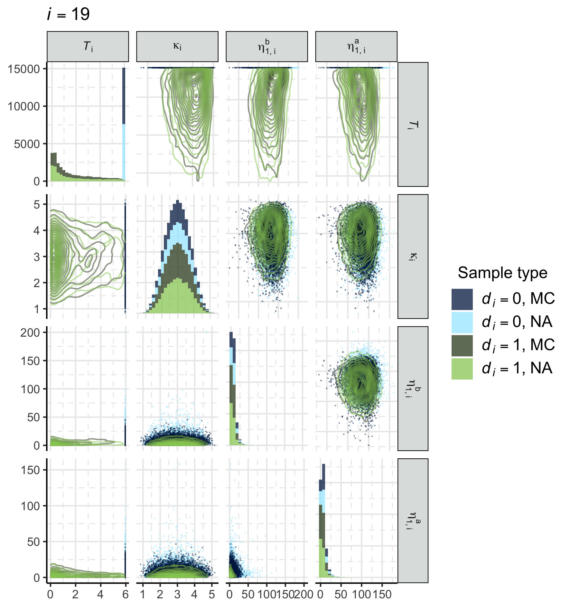

<!-- arXiv / local YAML header -->
<!-- title: "Extending Markov melding for chains of submodels"
author: "Andrew Manderson"
date: "`r format(Sys.time(), '%d %B, %Y')`"
abstract: |
  A challenge for practitioners of Bayesian inference is specifying a model that incorporates multiple relevant, heterogeneous data.
  It may be easier to instead specify distinct submodels for each source of data, then join the submodels together.
  We consider chains of submodels, where submodels directly relate to their neighbours via common quantities which may be parameters or deterministic functions thereof.
  We propose _chained Markov melding_, an extension of Markov melding, to combine chains of submodels into a joint model.
  Estimating the posterior of a complex joint model is challenging, so we describe a sampler that uses the chain structure to incorporate information contained in the submodels in multiple stages, possibly in parallel.
  We demonstrate our methodology using two examples.
  The first example considers an ecological integrated population model, where multiple data are required to accurately estimate population immigration and reproduction rates.
  We also consider a joint longitudinal and time-to-event model with uncertain, submodel-derived event times.
  Chained Markov melding is a conceptually appealing approach to integrating submodels in these settings.
fontfamily: tgpagella
fontsize: 10pt
papersize: a4
geometry: margin=2.25cm
bibliography: bibliography/multi-phi-bib.bib
csl: bibliography/journal-of-the-royal-statistical-society.csl
link-citations: true
hyperrefoptions:
  - backref
  - colorlinks=true
output:
  pdf_document:
    includes:
      in_header:
        tex-input/pre.tex
    fig_caption: true
    number_sections: true
    keep_tex: true
-->


```{r setup, include = FALSE}
knitr::opts_chunk$set(echo = FALSE, comment = NA, fig.align = "center")
```

# Introduction

The Bayesian philosophy is appealing in part because the posterior distribution quantifies all sources of uncertainty.
However, a joint model for all data and parameters is a prerequisite to posterior inference, and in situations where multiple, heterogeneous sources of data are available, specifying such a joint model is challenging.
Models that consider such data are necessary to describe complex phenomena at a useful precision.
One possible approach begins by specifying individual submodels for each source of data.
These submodels could guide the statistician when directly specifying the joint model, but to use the submodels only informally seems wasteful.
Instead, it may be preferable to construct a joint model by formally joining the individual submodels together.

There is a general interest in integrating many sources of data into a single model, and some specific forms of combining data are well established.
Meta-analyses and evidence synthesis methods are important modelling techniques that summarise many disparate data, often using hierarchical models [@ades_multiparameter_2006; @presanis_synthesising_2014].
Outside of the statistical literature, a common name for combining multiple data is _data fusion_ [@lahat_multimodal_2015-1; @kedem_statistical_2017], though there are many distinct methods that fall under this general name.
More familiar to Bayesian statisticians are the family of _divide and conquer_ methods (D&C).
These are useful in tall data settings, where the number of observations presents a computational challenge.
D&C methods split the data into subsets, fit the same model to each subset to produce the subposteriors, and combine these subposteriors.
Specific D&C methods include _consensus Monte Carlo_ [@scott_bayes_2016-1],
the embarrassingly parallel MCMC algorithm of @neiswanger_asymptotically_2014, and subposterior averaging via the Wasserstein baryceter [@srivastava_scalable_2018].
The _Bayesian Fusion_ method of @dai_monte_2019-1 combines these subposteriors exactly.
Decomposing a joint model into distinct submodels is particularly useful when one submodel is misspecified [@liu_modularization_2009; @jacob_better_2017-1; @carmona_semi-modular_2020] and we want to limit the flow of information out of the misspecified module [@lunn_bugs_2009; @plummer_cuts_2015].

Applied researchers often collect multiple disparate data sets, or data of different modalities, and wish to combine them.
For example, to estimate SARS-CoV-2 positivity @donnat_bayesian_2020 build an intricate hierarchical model that integrates both testing data and self-reported questionnaire data, and @parsons_evaluating_2020 specify a hierarchical model of similar complexity to estimate the number of injecting drug users in Ukraine.
Both applications clearly delineate between the numerous sources of data they consider.
In conservation ecology, _integrated population models_ (IPMs) [@zipkin_synthesizing_2018] are used to estimate population dynamics, e.g. reproduction and immigration rates, using multiple data on the same population.
Such data have standard models associated with them, such as the Cormack—Jolly—Seber model [@lebreton_modeling_1992] for capture-recapture data, and the IPM serves as the framework in which the standard models are combined.

_Markov melding_ [@goudie_joining_2019] is a general statistical methodology for combining submodels.
Specifically, it considers $\Nm$ submodels that share some common quantity $\phi$.
Each of the $\modelindex = 1, \ldots, \Nm$ submodels also has distinct parameters $\psi_{\modelindex}$, data $Y_{\modelindex}$ and form $\pd_{\modelindex}(\phi, \psi_{\modelindex}, Y_{\modelindex})$, which are combined into a joint model $\pd_{\text{meld}}(\phi, \psi_{1}, \ldots, \psi_{\Nm}, Y_{1}, \ldots, Y_{\Nm})$.
However, it is unclear how to integrate models where there is no single quantity $\phi$ common to all submodels, such for submodels that are linked in a chain structure.

We propose an extension to Markov melding, which we call _chained Markov melding_[^chained], which facilitates the combination of submodels that are in a chain structure.
Specifically, in the $\Nm = 3$ case, we address the case in which submodel 1 and 2 share a common quantity $\phi_{1 \cap 2}$, and submodel 2 and 3 share a different quantity $\phi_{2 \cap 3}$.
Two examples serve to illustrate our methodology, which we introduce in the following section.
The computational effort required to fit a complex, multi-response model is a burden to the model development process.
We propose a multi-stage posterior estimation method that exploits the properties of our chained melded model to reduce this burden.
We can parallelise aspects of the computation across the submodels, using less computationally expensive techniques for some submodels.
Reusing existing software implementations of submodels, and where available subposterior samples, is also possible.
Multi-stage samplers can aid in understanding the contribution of each submodel to the final posterior, and are used in many applied settings, including hierarchical modelling [@lunn_fully_2013-1] and joint models [@mauff_joint_2020].

[^chained]: _"Chained graphs"_ were considered by @lauritzen_chain_2002, however they are unrelated to our proposed model. We use "chained" to emphasise the nature of the relationships between submodels.

## Example introduction

In this section we provide a high-level overview of two applications involving chain-like inter-submodel relationships.
We will provide more details and illustrate our methodology with these examples in Section \ref{examples}.

### An Integrated population model for little owls

Integrated population models (IPMs) [@zipkin_synthesizing_2018] combine multiple data to estimate key quantities governing the dynamics of a specific population.
@schaub_local_2006 and @abadi_estimation_2010 used an IPM to estimate fecundity, immigration, and yearly survival rates for a population of little owls.
These authors collect and model three types of data, illustrated in Figure \ref{fig:owls-simple-dag}: capture-recapture data $Y_{1}$ with associated capture-recapture submodel $\pd_{1}(\phi_{1 \cap 2}, \psi_{1}, Y_{1})$; population counts $Y_{2}$ with associated submodel $\pd_{2}(\phi_{1 \cap 2}, \phi_{2 \cap 3}, \psi_{2}, Y_{2})$; and nest-record data $Y_{3}$ with associated fecundity submodel $\pd_{3}(\phi_{2 \cap 3}, \psi_{3}, Y_{3})$.
The population count model $\pd_{2}$ shares the parameter $\phi_{1 \cap 2}$ with the capture-recapture model $\pd_{1}$, and the parameter $\phi_{2 \cap 3}$ with the fecundity model $\pd_{3}$.
No single source of data is sufficient to estimate all quantities of interest, so it is necessary to integrate the three submodels into a single joint model to produce acceptably precise estimates of fecundity and immigration rates.
We will show that the chained Markov melding framework developed in Section \ref{chained-model-specification} encapsulates the process of integrating these submodels, and IPMs in general.

\input{tex-input/owls-example/0001-owls-simple-dag.tex}

### Survival analysis with time varying covariates and uncertain event times

Our second example considers the time to onset of acute respiratory distress syndrome (ARDS) amongst patients in intensive care units, and factors that influence the onset of ARDS.
A patient can be said to be experiencing ARDS if the ratio of the partial pressure of arterial blood oxygen (\paoii) to the faction of inspired oxygen (\fioii) is less than 300mmHg [@the_ards_definition_task_force_acute_2012].
Drawing arterial blood is a painful procedure, and calculating \paoii requires laboratory testing, so patients' \pfratio\ ratios are not always available.
An alternative is to consider the ratio of peripheral oxygen saturation (\spoii) to \fioii, as the former can be obtained from a pulse oximeter, a device typically worn on the finger tip that produces immediate measurements.
The \sfratio\ ratio can then be converted to a \pfratio\ by various formula [@pandharipande_derivation_2009-1; @brown_nonlinear_2016-1].
However, the noise introduced by the \spoii\ measurements [@nitzan_pulse_2014] and the conversion formula yield a \pfratio\ value that is contaminated by statistically nonneglible amounts of noise.
This results in uncertainty about time of onset of ARDS.

Factors that influence the time-to-onset of ARDS are both longitudinal and time invariant.
Both types of data can be considered in _joint models_ [@rizopoulos_joint_2012], which are composed of two distinct submodels, one for each data type.
Failing to incorporate the uncertainty surrounding the event time may result overconfident and/or biased estimates of the parameters in the joint model.

Chained Markov melding offers a conceptually straightforward, Bayesian approach to incorporating uncertain event times into joint models.
Specifically, we consider the event time as a submodel-derived quantity from a hierarchical regression model akin to @lu_using_1993.
We call this submodel the _uncertain event time_ submodel and denote it $\pd_{1}(\phi_{1 \cap 2}, \psi_{1}, Y_{1})$, where $\phi_{1 \cap 2}$ is the event time.
The survival submodel $\pd_{2}(\phi_{1 \cap 2}, \phi_{2 \cap 3}, \psi_{2}, Y_{2})$ uses $\phi_{1 \cap 2}$, the common quantity, as the response.
We treat the longitudinal submodel, $\pd_{3}(\phi_{2 \cap 3}, \psi_{3}, Y_{3})$, separately from the survival submodel, as is common in two-stage survival modelling, and denote the subject-specific parameters that also appear in the survival model as $\phi_{2 \cap 3}$.
The high level submodel relationships are displayed as a DAG in Figure \ref{fig:surv-simple-dag}.
\input{tex-input/surv-example/0001-surv-simple-dag.tex}

## Markov melding

We now review Markov melding [@goudie_joining_2019] before detailing our proposed extension.
As noted in the introduction, Markov melding is a method for combining $\Nm$ submodels $\pd_{1}(\phi, \psi_{1}, Y_{1}), \ldots, \pd_{\Nm}(\phi, \psi_{\Nm}, Y_{\Nm})$ which share the same $\phi$.
When the submodel prior marginals $\pd_{\modelindex}(\phi)$ are identical, i.e. $\pd_{\modelindex}(\phi) = \pd(\phi)$ for all $\modelindex$, it is possible to combine the submodels using _Markov combination_ [@dawid_hyper_1993-1; @massa_combining_2010]
\input{tex-input/orig-markov-melding/0010-markov-combination.tex}
Markov combination is not immediately applicable when submodel prior marginals are distinct, so Goudie _et al._&nbsp;define a _marginal replacement_ procedure, where individual submodel prior marginals are replaced with a common marginal $\pd_{\text{pool}}(\phi)$
\input{tex-input/orig-markov-melding/0011-marginal-replacement.tex}
where $\pd_{\text{pool}}(\phi) = h(\pd_{1}(\phi), \ldots, \pd_{\Nm}(\phi))$ is the result of a pooling function $h$ that appropriately summarises all prior marginals.
This ensures the prior marginals are the same in all submodels.
Goudie _et al._&nbsp;show that $\pd_{\text{repl}, \modelindex}(\phi, \psi_{\modelindex}, Y_{\modelindex})$ minimises the Kullback–Leibler (KL) divergence between a distribution $\q(\phi, \psi_{\modelindex}, Y_{\modelindex})$ and $\pd_{\modelindex}(\phi, \psi_{\modelindex}, Y_{\modelindex})$ under the constraint that $\q(\phi) = \pd_{\text{pool}}(\phi)$, and that marginal replacement is valid when $\phi$ is a deterministic function of the other parameters in submodel $\modelindex$.
Markov melding joins the submodels via the Markov combination of the marginally replaced submodels
\input{tex-input/orig-markov-melding/0012-markov-melding.tex}

### Pooled prior

Goudie _et al._&nbsp;proposed forming $\pd_{\text{pool}}(\phi)$ using linear or logarithmic prior pooling [@ohagan_uncertain_2006]
\input{tex-input/orig-markov-melding/0020-orig-pooling.tex}
where $\lambda = (\lambda_{1}, \ldots, \lambda_{\Nm})$ are nonnegative weights, which are chosen subjectively to ensure $\pd_{\text{pool}}(\phi)$ appropriately represents prior knowledge about the common quantity.
Two special cases of pooling are of particular interest.
_Product of experts (PoE) pooling_  [@hinton_training_2002] is a special case of logarithmic pooling that occurs when $\lambda_{\modelindex} = 1$ for all $\modelindex$.
_Dictatorial pooling_ is a special case of either pooling method when $\lambda_{\modelindex'} = 1$ and $\lambda_{\modelindex} = 0$ for all $\modelindex \neq \modelindex'$.

# Chained model specification

Consider $\modelindex = 1, \ldots, \Nm$ submodels each with data $Y_{\modelindex}$ and parameters $\theta_{\modelindex}$ denoted $\pd_{\modelindex}(\theta_{\modelindex}, Y_{\modelindex})$, with $\Nm \geq 3$.
We assume that the submodels are connected in a manner akin to a chain and so can be ordered such that only 'adjacent’ submodels in the chain have parameters in common.
Specifically we assume that submodels $\modelindex$ and $\modelindex + 1$ have some parameters $\phi_{\modelindex \cap \modelindex + 1}$ in common for $\modelindex = 1, \ldots, \Nm - 1$.
For notational convenience define $\phi_{1} = \phi_{1 \cap 2}, \phi_{\Nm} = \phi_{\Nm-1 \cap \Nm}$ and $\phi_{\modelindex} = \phi_{\modelindex - 1 \cap \modelindex} \cup \phi_{\modelindex \cap \modelindex + 1}, \modelindex = 2, \ldots, \Nm - 1$, so that $\phi_{\modelindex}$ denotes the parameters in model $\modelindex$ shared with at least one other submodel.
The submodel-specific parameters of submodel $\modelindex$ are thus $\psi_\modelindex = \theta_\modelindex \setminus \phi_\modelindex$.
Define the vector of all common quantities $\boldsymbol{\phi} = (\phi_{1 \cap 2}, \ldots, \phi_{\Nm - 1 \cap \Nm}) = \bigcup_{\modelindex = 1}^{\Nm}\phi_{\modelindex}$, and $\boldsymbol{\phi}_{-\modelindex} = \boldsymbol{\phi} \setminus \phi_{\modelindex}$.
It will also be convenient to define $\boldsymbol{\psi} = (\psi_{1}, \ldots, \psi_{\Nm})$ and likewise $\boldsymbol{Y} = (Y_{1}, \ldots, Y_{\Nm})$.
Note that all constituent elements of $\boldsymbol{\phi}, \boldsymbol{\psi}$ and $\boldsymbol{Y}$ may themselves be vectors.

All submodels, and marginal and conditional distributions thereof, have density functions that are assumed to exist and integrate to one.
When considering conditional distributions we assume that the parameter being conditioned on has support in the relevant region.

## Extending marginal replacement

We now define the chained melded model by extending the marginal replacement procedure to submodels linked in a chain-like way.
The $\modelindex$\textsuperscript{th} marginally replaced submodel is
\input{tex-input/multiple-phi/0001-chained-marginal-replacement.tex}
where $\pd_{\text{pool}}(\boldsymbol{\phi}) = g(\pd_{1}(\phi_{1}), \pd_{2}(\phi_{2}), \ldots, \pd_{\modelindex}(\phi_{\modelindex}))$ is a pooling function that appropriately summarises all submodel prior marginals.
The second equality in Equation \eqref{eqn:chained-marginal-replacement} is because of the conditional independence $(\psi_{\modelindex}, Y_{\modelindex} \indep \boldsymbol{\phi}_{-\modelindex}) \mid \phi_{\modelindex}$ that exists due to the chained relationship between submodels.
It is important to note that $\pd_{\text{repl}, \modelindex}(\boldsymbol{\phi}, \psi_{\modelindex}, Y_{\modelindex})$ is defined on a larger parameter space than $\pd_{\modelindex}(\phi_{\modelindex}, \psi_{\modelindex}, Y_{\modelindex})$, as it includes $\boldsymbol{\phi}_{-\modelindex}$.
We discuss this choice in the following section.

Define $\pd_{\text{repl}, \modelindex}(\phi_{\modelindex}, \psi_{\modelindex}, Y_{\modelindex}) = \int \pd_{\text{repl}, \modelindex}(\boldsymbol{\phi}, \psi_{\modelindex}, Y_{\modelindex})\text{d}\boldsymbol{\phi}_{-\modelindex}$.
Each marginally replaced submodel, as defined in Equation \eqref{eqn:chained-marginal-replacement}, minimises the following KL divergence
\input{tex-input/multiple-phi/0003-chained-marginal-replacement-kl.tex}
where $\pd_{\text{pool}}(\phi_{\modelindex}) = \int \pd_{\text{pool}}(\boldsymbol{\phi})\text{d}\boldsymbol{\phi}_{-\modelindex}$.
We can thus interpret $\pd_{\text{repl}, \modelindex}(\phi_{\modelindex}, \psi_{\modelindex}, Y_{\modelindex})$ as a minimally modified $\pd_{\modelindex}(\phi_{\modelindex}, \psi_{\modelindex}, Y_{\modelindex})$ which admits $\pd_{\text{pool}}(\phi_{\modelindex})$ as a marginal.
Note that it is the combination of $\pd_{\text{repl}, \modelindex}(\phi_{\modelindex}, \psi_{\modelindex}, Y_{\modelindex})$ and $\pd(\boldsymbol{\phi}_{-\modelindex} \mid \phi_{\modelindex})$ that uniquely determine \eqref{eqn:chained-marginal-replacement}.

We form the chained melded model by taking the Markov combination of the marginally replaced submodels
\input{tex-input/multiple-phi/0010-melded-model-cond.tex}

## Pooled prior

Specifying \eqref{eqn:melded-model-full} requires a joint prior for $\boldsymbol{\phi}$.
As in Markov melding we form the joint prior by pooling the marginal priors, selecting a pooling function $g$ that appropriately represents prior knowledge about the common quantities.
We define $\pd_{\text{pool}}(\boldsymbol{\phi})$ as a generic function of all prior marginals
\input{tex-input/pooled-prior-discussion/0030-pooled-prior-general-def.tex}
because we do not assume independence between the components of $\boldsymbol{\phi}$.
If they are independent, then we can form $\pd_{\text{pool}}(\boldsymbol{\phi})$ as the product of $\Nm - 1$ standard pooling functions $h_{\modelindex}$ defined in Section \ref{pooled-prior}
\input{tex-input/pooled-prior-discussion/0010-bad-alternative-one.tex}
An intermediary notion, between complete dependence \eqref{eqn:pooled-prior-general-def} and independence \eqref{eqn:bad-alternative-one}, is that if $\pd_{\modelindex}(\phi_{\modelindex - 1 \cap \modelindex}, \phi_{\modelindex \cap \modelindex + 1}) = \pd_{\modelindex}(\phi_{\modelindex - 1 \cap \modelindex}) \pd_{\modelindex}(\phi_{\modelindex \cap \modelindex + 1})$ then we can define
\input{tex-input/pooled-prior-discussion/0031-pooled-prior-split-def.tex}
without any additional assumptions.
That is, if any two consecutive components of $\boldsymbol{\phi}$ are independent in the submodel containing both of them, we can divide the pooled prior specification problem into two pooling functions.
The smaller number of arguments to $g_{1}$ and $g_{2}$ make it is easier to choose appropriate forms for those functions

Selecting an appropriate pooling function is not trivial given the many choices of functional form and pooling weights (which we discuss momentarily).
It is important that prior predictive visualisations of the pooled prior are produced [@gabry_visualization_2019; @gelman_bayesian_2020] to ensure that it suitably represents the available information.
A complication encountered in the chained melding setting is that standard linear and logarithmic pooling, as defined in Equations \eqref{eqn:orig-pooling-linear} and \eqref{eqn:orig-pooling-logarithmic}, are not immediately applicable when the submodels marginal distributions consider different parameters.
We now propose extensions to logarithmic, linear, and dictatorial pooling for use in the case of chained melding.

### Logarithmic pooling

Extending logarithmic pooling for chained Markov melding is straightforward.
We define the logarithmically pooled prior to be
\input{tex-input/multiple-phi/0050-pooled-prior-overall.tex}
for nonnegative weight vector $\lambda = (\lambda_{1}, \ldots, \lambda_{\Nm})$.
Note that \eqref{eqn:pooled-prior-overall} does not imply independence between the elements of $\boldsymbol{\phi}$ because
\input{tex-input/multiple-phi/0051-pooled-prior-log-alt-def.tex}
which is one advantage of logarithmic pooling.
When $\lambda_{1} = \lambda_{2} = \ldots = \lambda_{\Nm} = 1$ we obtain the special case of product-of-experts (PoE) pooling [@hinton_training_2002].

### Linear pooling

Our generalisation of linear pooling to handle marginals of different variables is a two step procedure.
The first step forms intermediary pooling densities via standard linear pooling, using appropriate marginals of the relevant quantity
\input{tex-input/multiple-phi/0080-M-model-linear-pooling.tex}
where $\lambda_{\modelindex} = (\lambda_{\modelindex, 1}, \lambda_{\modelindex, 2})$ are nonnegative pooling weights.
We discuss the choice of $\lambda$ in the following section.
In step two we form the pooled prior as the product of the intermediaries
\input{tex-input/multiple-phi/0055-silly-linear-overall.tex}
with
\input{tex-input/multiple-phi/00551-linear-normalising-constant.tex}
Clearly, this assumes prior independence amongst all components of $\boldsymbol{\phi}$ which may be undesirable, particularly if this independence was not present in any particular marginal $\pd_{\modelindex}(\phi_{\modelindex - 1 \cap \modelindex}, \phi_{\modelindex \cap \modelindex + 1})$.
We discuss extensions to linear pooling that enable prior dependence between the elements of $\boldsymbol{\phi}$ in Section \ref{discussion}.

### Dictatorial pooling

Chained Markov melding does not admit a direct analogue to dictatorial pooling as defined in Section \ref{pooled-prior} because not all submodel prior marginals contain all common quantities.
For example, consider the logarithmically pooled prior of Equation \eqref{eqn:pooled-prior-overall} with one entry in $\lambda$ set to $1$ and all others set to $0$.
This choice of $\lambda$ results in $\pd_{\text{pool}}(\boldsymbol{\phi}) = \pd_{\text{pool}}(\phi_{\modelindex})$, and is implicitly flat for $\boldsymbol{\phi}_{-\modelindex}$.
It seems reasonable to require any generalisation of dictatorial pooling to result in an explicit prior for all components in $\boldsymbol{\phi}$.
Such a generalisation should also retain the original intention of dictatorial pooling, i.e.&nbsp;'_the authoritative prior for_ $\phi_{\modelindex}$ _is_ $\pd_{\modelindex}(\phi_{\modelindex})$'.

We propose two possible forms of dictatorial pooling that satisfy the aforementioned criteria.
The first considers $\pd_{\modelindex}(\phi_{\modelindex})$ as the authoritative prior for $\phi_{\modelindex}= (\phi_{\modelindex - 1 \cap \modelindex}, \phi_{\modelindex \cap \modelindex + 1})$.
This results in
\input{tex-input/pooled-prior-discussion/0040-dictatorial-one-submodel.tex}
where $g_{1}$ and $g_{2}$ are linear or logarithmic pooling functions as desired.

In our second proposal we require the prior for each element in $\boldsymbol{\phi}$ to be associated with only one submodel.
When this condition is combined with one choice of $\pd_{\modelindex}$ or $\pd_{\modelindex + 1}$ for $\phi_{\modelindex \cap \modelindex + 1}$, no other choices are required.
For example, if $\Nm = 5$ and we dictate that $\pd_{3}$ is the authoritative prior for $\phi_{2 \cap 3}$ (and consequently $\phi_{3 \cap 4}$), this immediately implies
\input{tex-input/pooled-prior-discussion/0042-dictatorial-def-two.tex}
In general, this form of dictatorial pooling is equivalent to logarithmic pooling with the following choice of pooling weights
\input{tex-input/pooled-prior-discussion/0041-dictatorial-def-all.tex} <!-- % takes up too much space, but slightly annoying to describe in words.-->
with the non-zero elements of $\lambda_{\text{dict}}$ set to $1$.

<!-- We will later require the specific forms of dictatorial pooling with $\Nm = 3$ and all non-zero elements of $\lambda = 1$, which are
\input{tex-input/multiple-phi/0057-dictatorial-pooling.tex}
 -->

### Pooling weights

Choosing values for the pooling weights is an important step in specifying the pooled prior.
Because appropriate values for the weights depend on the submodels being pooled and the information available a priori, universal recommendations are impossible, so we illustrate the impact of different choices in a straightforward example.
Figure \ref{fig:pooled_densities_plot} illustrates how $\lambda$ and the choice of pooling method impacts $\pd_{\text{pool}}(\boldsymbol{\phi})$ when pooling normal distributions.
Specifically, we consider $\Nm = 3$ submodels and pool
\input{tex-input/multiple-phi/0061-marginal-gaussian-example.tex}
where $\text{N}(\phi; \mu, \sigma^{2})$ is the normal density function with mean $\mu$ and variance $\sigma^{2}$ (or covariance matrix where appropriate).
The two dimensional density function $\pd_{2}$ has an additional parameter $\rho$, which controls the intra-submodel marginal correlation.
We set $\mu_{1} = -2.5, \mu_{2} = \left[\mu_{2, 1} \,\, \mu_{2, 2}\right]' = \left[0 \,\, 0\right]', \mu_{3} = 2.5, \sigma_{1}^{2} = \sigma_{2}^{2} = \sigma_{3}^{2} = 1$ and $\rho = 0.8$.
In the logarithmic case we set $\lambda_{1} = \lambda_{3}$ and parameterise $\lambda_{2} = 1 - 2\lambda_{1}$, so that $\lambda_{1} + \lambda_{2} + \lambda_{3} = 1$ whilst limiting ourselves to varying only $\lambda_{1}$.
Similarly, in the linear case we set $\lambda_{1, 1} = \lambda_{2, 2} = \lambda_{1}$ and $\lambda_{1, 2} = \lambda_{2, 1} = 1 - 2 \lambda_{1}$.
We consider 5 evenly spaced values of $\lambda_{1} \in [0, 0.5]$.

```{r pooled_densities_plot, fig.cap = "Contour plots of $\\pd_{\\text{pool}}(\\boldsymbol{\\phi})$ (red) under logarithmic and linear pooling (left and right column respectively). The values of $\\lambda_{1}$ are indicated in the plot titles, and the constituent marginal densities are shown in blue."}
knitr::include_graphics("plots/pooling-tests/version-two.pdf")
```

For both pooling methods, as the weight $\lambda_{1}$ associated with models $\pd_{1}$ and $\pd_{3}$ increases, the relative contributions of $\pd_{1}(\phi_{1 \cap 2})$ and $\pd_{3}(\phi_{2 \cap 3})$ increase.
Note the lack of correlation in $\pd_{\text{pool}}$ under linear pooling (right column of Figure \ref{fig:pooled_densities_plot}) due to Equation \eqref{eqn:silly-linear-overall}.
A large, near-flat plateau is visible in the $\lambda_{1} = 0.25$ and $\lambda_{1} = 0.375$ cases, which is a result of the mixture of four, 2-D normal distributions that linear pooling produces in this example.
The logarithmic pooling process produces a more concentrated prior for small values of $\lambda_{1}$, and does not result in a priori independence between $\phi_{1 \cap 2}$ and $\phi_{2 \cap 3}$.
Appendix&nbsp;\ref{log-pooling-gaussian-densities} shows analytically that $\lambda_{2}$ controls the quantity of correlation present in $\pd_{\text{pool}}$ in this setting.

# Posterior estimation

We now present two multi-stage MCMC methods for generating samples from the melded posterior.
By employing a multi-stage strategy we can avoid evaluating all submodels simultaneously.
This is desirable in situations where simultaneously evaluating the submodel terms is computationally infeasible or cumbersome, whilst evaluating the prior marginal distributions is possible and relatively inexpensive.
The first sampler operates sequentially, accruing and refining samples by considering one submodel at a time.
The second parallelises parts of the sampling process, and has the potential to produce posterior samples from the melded posterior in less time than the sequential method.
Both sampler assume $\pd_{\text{pool}}(\boldsymbol{\phi})$ decomposes in sampler-specific ways, which we detail along when introducing each sampler.

We also describe an approximate method, where stage one submodels are summarised by normal distributions for use in stage two.

We only consider the $\Nm = 3$ case, as this setting includes both of our examples.
Generic methodology for efficiently sampling arbitrary numbers of submodels in parallel is beyond the scope of this work [see @lindsten_divide-and-conquer_2017 for one such methodology].

## Sequential sampler

The sequential sampler assumes that the pooled prior decomposes such that
\input{tex-input/multi-stage-sampler/0002-sequential-sampler-decomposition.tex}
This is necessary to avoid sampling all elements of $\boldsymbol{\phi}$ in the first stage.
All pooled priors trivially satisfy \eqref{eqn:sequential-sampler-decomposition}, as we can assume all but $\pd_{\text{pool}, 3}(\phi_{1 \cap 2}, \phi_{2 \cap 3})$ are improper, flat distributions.
However, including some portion of the pooled prior in each stage of the sampler can improve performance, and eliminate computational instabilities when submodel likelihoods contain little information.

#### Stage one

Stage one of the sequential sampler targets
\input{tex-input/multi-stage-sampler/0020-stage-one-target.tex}
using a generic proposal kernel for both $\phi_{1 \cap 2}$ and $\psi_{1}$.
The corresponding acceptance probability for a proposed update from $(\phi_{1 \cap 2}, \psi_{1})$ to $(\phi_{1 \cap 2}^{*}, \psi_{1}^{*})$ is
\input{tex-input/multi-stage-sampler/0021-stage-one-acceptance-probability.tex}

#### Stage two

The stage two target augments the stage one target by including the second submodel, corresponding prior marginal distribution, and an additional pooled prior term
\input{tex-input/multi-stage-sampler/0030-stage-two-target.tex}
A Metropolis-within-Gibbs strategy is employed, where the stage one samples are used as a proposal for $\phi_{1 \cap 2}$, whilst a generic proposal kernel is used for $\psi_{2}$ and $\phi_{2 \cap 3}$.
Thus the proposal distributions for $\phi_{1 \cap 2}^{*}$ and $(\phi_{2 \cap 3}^{*}, \psi_{2}^{*})$ are
\input{tex-input/multi-stage-sampler/0031-stage-two-gibbs-updates.tex}
The acceptance probability for this proposal strategy is
\input{tex-input/multi-stage-sampler/0032-stage-two-acceptance-probabilities.tex}
Our judicious choice of proposal distribution has resulted in a cancellation in Equation \eqref{eqn:stage-two-acceptance-probabilities-one} which removes all terms related to $\pd_{1}$.
Similarly, all terms related to $\pd_{1}$ are constant -- hence cancel -- in Equation \eqref{eqn:stage-two-acceptance-probabilities-two}.
This eliminates any need to re-evaluate the first submodel.

#### Stage three

In stage three we target the full melded posterior
\input{tex-input/multi-stage-sampler/0044-stage-three-target.tex}
The target has now been broadened to include terms from the third submodel and the entirety of the pooled prior.
Again, we employ a Metropolis-within-Gibbs sampler, with proposals drawn such that
\input{tex-input/multi-stage-sampler/0045-stage-three-gibbs-updates.tex}
which leads to acceptance probabilities of
\input{tex-input/multi-stage-sampler/0046-stage-three-acceptance-probabilities.tex}
The informed choice of proposal distribution for ($\phi_{1 \cap 2}, \phi_{2 \cap 3}, \psi_{1}, \psi_{2}$) has allowed us to target the full melded posterior without needing to evaluate all submodels simultaneously.

## Parallel sampler

We now devise a strategy where stage one samples submodels 1 and 3 in parallel. Stage two reuses these samples in a Metropolis-within-Gibbs sampler, which targets the full melded posterior.
The stage specific targets are displayed in Figure \ref{fig:parallel-dag}.

\input{tex-input/dc-sampler/0001-parallel-dag.tex}

The parallel sampler assumes that the pooled prior decomposes such that
\input{tex-input/dc-sampler/0002-parallel-decomposition.tex}
All pooled priors trivially satisfy \eqref{eqn:parallel-decomposition} by assuming $\pd_{\text{pool}, 1}(\phi_{1 \cap 2})$ and $\pd_{\text{pool}, 3}(\phi_{2 \cap 3})$ are improper, flat distributions.

#### Stage one

Two independent, parallel sampling processes occur in stage one.
Submodels one and three are targeted
\input{tex-input/dc-sampler/0021-stage-one-targets.tex}
using submodel-specific transition kernels, leading to acceptance probabilities of
\input{tex-input/dc-sampler/0022-stage-one-acceptance-probs.tex}
which can be computed independently of one another.

#### Stage two

Stage two targets the melded posterior of Equation \eqref{eqn:melded-model-full} using a Metropolis-within-Gibbs sampler, where the proposal distributions are
\input{tex-input/dc-sampler/0031-stage-two-proposals.tex}
The acceptance probabilities for these updates are
\input{tex-input/dc-sampler/0032-stage-two-acceptance.tex}
Note that all stage two acceptance probabilities only contain terms from the second submodel and the pooled prior.

## Normal approximations to submodel components

Normal approximations are commonly employed to summarise submodels for subsequent use in more complex models.
For example, two-stage meta-analyses often use a normal distribution centred on each studies' effect estimate [@burke_meta-analysis_2017].
Suppose we employ such an approximation to summarise the prior and posterior of $\phi_{1 \cap 2}$ and $\phi_{2 \cap 3}$ under $\pd_{1}$ and $\pd_{3}$ respectively.
In addition, assume that

- Such approximations are appropriate for $\pd_{1}(\phi_{1 \cap 2}), \pd_{1}(\phi_{1 \cap 2} \mid Y_{1}), \pd_{3}(\phi_{2 \cap 3})$, and $\pd_{3}(\phi_{2 \cap 3} \mid Y_{3})$.
- We are not interested in $\psi_{1}$ and $\psi_{3}$, and can integrate them out of all relevant densities.
- We employ dictatorial pooling and choose $\pd_{2}(\phi_{1 \cap 2}, \phi_{2 \cap 3})$ as the authoritative prior.

The latter two assumptions imply that the melded posterior of interest is proportional to
\input{tex-input/multiple-normal-approximation/0010-normal-approx-melded-posterior-target.tex}

Denote the normal approximation of $\pd_{1}(\phi_{1 \cap 2} \mid Y_{1})$ as $\widehat{\pd}_{1}(\phi_{1 \cap 2} \mid \widehat{\mu}_{1}, \widehat{\Sigma}_{1})$, which is a normal distribution with mean $\widehat{\mu}_{1}$ and covariance matrix $\widehat{\Sigma}_{1}$.
The corresponding normal approximation of the prior $\pd_{1}(\phi_{1 \cap 2})$ is $\widehat{\pd}_{1}(\phi_{1 \cap 2} \mid \widehat{\mu}_{1, 0}, \widehat{\Sigma}_{1, 0})$.
The equivalent approximations for the subposterior and prior of $\pd_{3}$ are $\widehat{\pd}_{3}(\phi_{2 \cap 3} \mid \widehat{\mu}_{3}, \widehat{\Sigma}_{3})$ and $\widehat{\pd}_{3}(\phi_{2 \cap 3} \mid \widehat{\mu}_{3, 0}, \widehat{\Sigma}_{3, 0})$ respectively.
Substituting in these approximations yields the approximate melded posterior
\input{tex-input/multiple-normal-approximation/0020-normal-approximation-approximate-target.tex}
This expression can be simplified.
Noting that he product of independent normal densities is an unnormalised multivariate normal density with independent components, we rewrite Equation \eqref{eqn:normal-approximation-approximate-target} as
\input{tex-input/multiple-normal-approximation/0030-normal-approx-nu-de-form.tex}
Finally, the ratio of normal densities is also an unnormalised normal density, and hence Equation \eqref{eqn:normal-approx-nu-de-form} simplifies to
\input{tex-input/multiple-normal-approximation/0040-final-normal-approx.tex}
Standard MCMC methods can be used to sample from the approximate melded posterior.
If instead we opt for product-of-experts pooling, all $\mu_{\text{de}}$ and $\Sigma_{\text{de}}$ terms disappear from the parameter definitions in Equation \eqref{eqn:final-normal-approx}.

# Examples

## Little owls

We now return to the integrated population model (IPM) for the little owls introduced in Section \ref{an-integrated-population-model-for-little-owls}.
@finke_efficient_2019 consider a number of variations on the original model of @schaub_local_2006 and @abadi_estimation_2010: here we consider only the
variant from @finke_efficient_2019 with the highest marginal likelihood.

### Submodels

Before we detail the specifics of each submodel, we must introduce some notation.
Data and parameters are stratified into two age-groups $a \in \{J, A\}$ where $J$ denotes juvenile owls and $A$ adults, two sexes $s \in \{M, F\}$, and observations occur annually at times $t \in \{1, \ldots, T\}$, with $T = 25$.
The sex- and age-specific probability of an owl surviving from time $t$ to $t + 1$ is $\delta_{a, s, t}$, and the sex-specific probability of a previously captured owl being recaptured at time $t + 1$ is $\pi_{s, t + 1}$ so long as the owl is alive at time $t + 1$.
Owls are assumed to develop from juveniles into adults after 1 year.

#### Capture recapture: $\pd_{1}$

Capture-recapture data pertain to owls that are released at time $t$ (having been captured and tagged).
These individuals are then recaptured at time $u = t + 1, \dots, T$, or not recaptured before the conclusion of the study, in which case $u = T + 1$.
Define $M_{a, s, t, u}$ as the number of owls of sex $s$ and age-group $a$ last observed at time $t$, recaptured at time $u$.
We aggregate these observations into age-group and sex specific matrices $\boldsymbol{M}_{a, s}$, with $T$ rows, corresponding to released times, and $T + 1$ columns, corresponding to recapture times.
Let $R_{a, s, t} = \sum_{u = 1}^{T + 1} \boldsymbol{M}_{a, s, t, u}$ be the number of owls released at time $t$, i.e. a vector containing the row-wise sum of the entries in $\boldsymbol{M}_{a, s}$.
The recapture times for owls released at time $t$ follow a sex- and age-specific multinomial likelihood
\input{tex-input/owls-example/0010-capture-recapture-submodel.tex}
with probabilities $\boldsymbol{Q}_{a, s, t} = \{Q_{a, s, t, u}\}_{u = 1}^{T + 1}$ such that
\input{tex-input/owls-example/0011-multinomial-probabilities.tex}

#### Fecundity: $\pd_{3}$

The fecundity submodel considers the number of breeding females at time $t$ denoted $N_{t}$, and the number of chicks produced that survive and leave the nest denoted $n_{t}$.
A Poisson model is employed to estimate fecundity (reproductive rate) $\rho$
\input{tex-input/owls-example/0030-fecundity-submodel.tex}

#### Count data model: $\pd_{2}$

To estimate population abundance, a two level model is used: the first level models the observed (counted) number of females at each point in time, with a second, latent process modelling the total number of females in population.
Denote the total number of juvenile and adult females in the population at time $t$ as $\boldsymbol{x}_{t} = \left[x_{J, t}, x_{A, t}\right]$.
If $\text{sur}_{t}$ adult females survive from time $t - 1$ to time $t$, and $\text{imm}_{t}$ adult females immigrate over the same time period, then the latent, population level model is
\input{tex-input/owls-example/0020-count-data-submodel.tex}
where $\eta_{t}$ is the immigration rate.
The initial population sizes $x_{J, 1}$ and $x_{A, 1}$ have independent discrete uniform priors on $\{0, 1, \ldots, 50\}$.
The observation model is
\input{tex-input/owls-example/0021-observation-process.tex}

#### Parameterisation and melding quantities

@abadi_estimation_2010 parameterise the time dependent quantities via linear predictors, to minimise the number of parameters in the submodels.
The specific parameterisation of @finke_efficient_2019 we employ is
\input{tex-input/owls-example/0040-parameterisation-info.tex}
thus the quantities in common between the submodels are $\phi_{1 \cap 2} = (\alpha_{0}, \alpha_{2})$ and $\phi_{2 \cap 3} = \rho$.
Not that the definition of $\phi_{1 \cap 2}$ does not include $\alpha_{1}$ as it is male specific and does not exist in $\pd_{2}$.

To align the notation of this example with our chained melding notation we define, for all permitted values of $a, s$ and $t$, $Y_{1} = (\boldsymbol{M}_{a, s})$, $\psi_{1} = (\alpha_{1}, \alpha_{4}, \alpha_{5, t})$; $Y_{2} = (y_{t})$, $\psi_{2} = (\boldsymbol{x}_{t}, \alpha_{6}, \text{sur}_{t}, \text{imm}_{t})$; and $Y_{3} = (N_{t}, n_{t})$, $\psi_{3} = \varnothing$.

#### Priors

We use the priors of @finke_efficient_2019 for the parameters in each submodel.
Denote $\boldsymbol{\alpha} = (\alpha_{0}, \alpha_{1}, \alpha_{2}, \alpha_{4}, \alpha_{6})$.
In both $\pd_{1}$ and $\pd_{2}$ the elements of $\boldsymbol{\alpha}$ are assigned independent $\text{Normal}(0, 2^2)$ priors truncated to $[-10, 10]$.
The time varying recapture probabilities $\alpha_{5, u}$ also have $\text{Normal}(0, 2^2)$ priors truncated to $[-10, 10]$.
A $\text{Uniform}(0, 10)$ prior is assigned to $\rho$ in $\pd_{2}$ and $\pd_{3}$.

To completely specify $\pd_{\text{meld}}$ we must choose how to form $\pd_\text{pool}(\phi_{1 \cap 2}, \phi_{2 \cap 3})$.
We form $\pd_\text{pool}(\phi_{1 \cap 2}, \phi_{2 \cap 3})$ using three pooling methods and estimate the melded posterior in each case.
The first pooling method is product-of-experts (PoE) pooling, which is logarithmic pooling with $\lambda = (1, 1, 1)$, and we denote the melded posterior as $\pd_{\text{meld, PoE}}$.
We also use logarithmic pooling with $\lambda = (\frac{1}{2}, \frac{1}{2}, \frac{1}{2})$, which is denoted $\pd_{\text{meld, log}}$.
The final pooling method is linear pooling with $\lambda = (\frac{1}{2}, \frac{1}{2}, \frac{1}{2}, \frac{1}{2})$, denoted $\pd_{\text{meld, lin}}$.

### Posterior estimation

We estimate the melded posterior using both the normal approximation and parallel sampler described in Section \ref{parallel-sampler}.
This allows us to use pre-existing implementations of the submodels.
Specifically, the capture-recapture submodel is written in BUGS [@lunn_bugs_2009] and sampled via `rjags` [@plummer_rjags_2019].
The fecundity submodel is written in Stan [@carpenter_stan_2017] and sampled via `rstan` [@stan_development_team_rstan_2021].
The the count data submodel is also written in BUGS, and we reuse this implementation in stage two of the multi-stage sampler via `Nimble` [@de_valpine_programming_2017] and its `R` interface [@nimble_development_team_nimble_2019].
A modified version of the count data submodel is used to demonstrate the normal approximation method of Section \ref{normal-approximations-to-submodel-components}, which is also run through `rjags`.

Code and data for all examples are available at [https://github.com/hhau/melding-multiple-phi](https://github.com/hhau/melding-multiple-phi).
__TODO:__ Swap this for a Zenodo DOI
Trace plots and numerical convergence measures [@vehtari_rank-normalization_2020] for both stages of the parallel sampling process are also available in the online repository.

### Results

```{r phi_subpost, fig.cap = "Top row: credible intervals for $\\phi_{1 \\cap 2} = (\\alpha_{0}, \\alpha_{2})$ and $\\phi_{2 \\cap 3} = \\rho$ from the posterior of the original integrated population model $\\pd_{\\text{ipm}}$; the chained melded posteriors using product-of-experts pooling, logarithmic pooling, and linear pooling denoted $\\pd_{\\text{meld}}$, $\\pd_{\\text{meld, log}}$ and $\\pd_{\\text{meld, lin}}$; the melded posterior using the normal approximation $\\widehat{\\pd}_{\\text{meld}}$; and the individual subposteriors from submodels $\\pd_{1}, \\pd_{2}$, and $\\pd_{3}$. Intervals are 50\\%, 80\\%, 95\\%, and 99\\% wide. Bottom row: otherwise identical to the top row but with the individual subposteriors removed."}
knitr::include_graphics("plots/owls-example/subposteriors-both-patchwork.pdf")
```

We empirically validate our methodology and sampler by comparing the melded posterior samples to a large sample -- 6 chains, each containing $1 \times 10^5$ post-warmup iterations -- from the original IPM posterior.
Figure \ref{fig:phi_subpost} depicts the posterior credible intervals [@gabry_bayesplot_2021; @kay_tidybayes_2020] for the common quantities from the individual submodels, the melded models, and the original IPM.
We see that the count data alone ($\pd_{2}$) contain minimal information about $\alpha_{0}, \alpha_{2}$ and $\rho$; incorporating the data from the other submodels is essential for precise estimates.

The melded posterior estimates are generally similar to the original IPM estimate,
PoE pooling produces the posterior most different from the original IPM, as it yields a prior for $(\alpha_{0}, \alpha_{2})$ that is more concentrated around zero than the other pooling methods.
The lack of large differences between the melded posteriors that use different pooled priors indicates that the prior has almost no effect on the posterior.
The similarity of the approximate approach ($\widehat{\pd}_{\text{meld}}$ - bottom row of Figure \ref{fig:phi_subpost}) to the melding approaches suggests that the normal approximations are good summaries of the subposteriors.

## Uncertain time to respiratory failure

We now return to the example introduced in Section \ref{survival-analysis-with-time-varying-covariates-and-uncertain-event-times}.
There are $i = 1, \ldots, N$ individuals in the data set.
Each individual is admitted to the ICU at time $0$, and is discharged or dies at time $C_{i}$.
See appendix \ref{cohort-selection-criteria} for information on $N$ and how the individuals were selected from MIMIC-III [@johnson_mimic-iii_2016].

### P/F ratio model (B-spline): $\pd_{1}$

Each individual has P/F ratio observations $z_{i, j}$ at times $t_{i, j}$, with $j = 1, \ldots, J_{i}$.
For each individual denote the vector of observations $\boldsymbol{z}_{i} = (z_{i, 1}, \ldots, z_{i, J_{i}})$ and observation times $\boldsymbol{t}_{i} = (t_{i, 1}, \ldots, t_{i, J_{i}})$.
To improve computational performance, we standardise the P/F data for each individual such that $z_{i, j} = \frac{\tilde{z}_{i, j} - \overline{z}_{i}}{\hat{s}_{i}}$, where $\tilde{z}_{i, j}$ is the underlying unstandardised observation with mean $\overline{z}_{i}$ and standard deviation $\hat{s}_{i}$.
Similarly we rescale the threshold for respiratory failure: $\tau_{i} = \frac{300 - \overline{z}_{i}}{\hat{s}_{i}}$.

We choose to model the P/F ratio using a B-spline of degree 3, with 2 boundary knots and 7 internal knots, and do not include an intercept column in the spline basis.
The internal knots are evenly spaced between the two boundary knots at $\min(\boldsymbol{t}_{i})$ and $\max(\boldsymbol{t}_{i})$.
These choices result in $k = 1, \ldots, 10$ spline basis terms per individual, with coefficients $\zeta_{i, k}$ where $\boldsymbol{\zeta}_{i} = (\zeta_{i, 1}, \ldots, \zeta_{i, 10})$.
We denote the individual specific B-spline basis evaluated at time $t_{i, j}$ as $B_{i}(t_{i, j}) \in \mathbb{R}_{+} \cup \{0\}$ so that the submodel can be written as
\begin{equation}
  z_{i, j} = \beta_{0, i} + B_{i}(t_{i, j})\boldsymbol{\zeta}_{i} + \varepsilon_{i, j}
  \label{eqn:pf-model-def}
\end{equation}
We employ a weakly informative prior for the intercept, and a heavy tailed ($t_{5}$) distribution for the error term[^pfoutliers] with a weakly informative half-normal prior for unknown scale parameter
\begin{equation}
  \beta_{0, i} \sim \text{N}(0, 1^2), \,\, \varepsilon_{i, j} \sim t_{5}(0, \omega_{i}), \,\,  \omega_{i} \sim \text{N}_{+}(0, 1^2).
  \label{eqn:pf-model-priors-simple}
\end{equation}
For the spline basis coefficients we set $\zeta_{i, 1} \sim \text{N}(0, 0.1^2)$, and for $k = 2, \ldots, 10$ we employ a random-walk prior $\zeta_{i, k} \sim \text{N}(\zeta_{i, k - 1}, 0.1^2)$.

[^pfoutliers]: P/F data contain many outliers for, amongst many possible reasons, arterial/venous blood sample mis-labelling; incorrectly recorded oxygenation support information; and differences between sample collection time, lab result time, and the observation time recorded as in the EHR.

If a solution to the optimisation problem exists
\begin{equation}
  T_{i} = \min_{t} \left\{
    \tau_{i} = \beta_{0, i} + B_{i}(t)\boldsymbol{\zeta}_{i}
    \mid
    t \in [\max(0, \min(\boldsymbol{t}_{i})), \max(\boldsymbol{t}_{i})]
  \right\},
  \label{eqn:event_time_model_def}
\end{equation}
then we conclude that a respiratory failure event $d_{i} = 1$ occurred at event time $T_{i}$.
We attempt to solve Equation \ref{eqn:event_time_model_def} using a standard multiple root finder [@soetaert_rootsolve_2020].
If there are no roots then the individual died or was discharged before respiratory failure occurred so we set $T_{i} = C_{i}$ and $d_{i} = 0$.
The relationship between $T_{i}$ and other model coefficients is displayed in the left hand panel of Figure \ref{fig:submodel-schematics}.

We would like to link this submodel with the other submodels via $(\{T_{i}, d_{i}\}_{i = 1}^{N})$.
However, we require a careful definition of the link parameter $\phi_{1 \cap 2}$ as it is a deterministic function of $(\beta_{0, i}, \boldsymbol{\zeta}_{i})$.
Keeping with the notation of @goudie_joining_2019, we define $\theta_{1, i} = (\beta_{0, i}, \boldsymbol{\zeta}_{i})$, with $\phi_{1 \cap 2, i} = f(\theta_{1, i}) = (T_{i}, d_{i})$, where $f$ is the output from attempting to solve Equation \eqref{eqn:event_time_model_def}, and $\phi_{1 \cap 2} = \phi_{1 \cap 2}(\theta_{1}) = (f(\theta_{1, i}), \ldots, f(\theta_{1, N}))$.
It is also convenient to define $\theta_{1} = (\theta_{1, 1}, \ldots, \theta_{1, N})$.

Care is also required when considering the prior marginal $\pd_{1}(\phi_{1 \cap 2})$.
We note that $\pd_{1}(\phi_{1 \cap 2}) = \prod_{i = 1}^{N}\pd_{1, i}(T_{i}, d_{i})$, and that $\pd_{1, i}(T_{i}, d_{i})$ conditions on each individual's length of stay (in specifying the location of the knots), as well as the range, mean, and standard deviation of the P/F data (by standardising $\tilde{z}_{i, j}$).
The analytic form of $\pd_{1, i}(T_{i}, d_{i})$ is not available and must be estimated, which we discuss in Appendix \ref{estimating-submodel-prior-marginal-distributions}.
To completely align with our chained melding notation we also define $Y_{1} = (\{\boldsymbol{z}_{i}, \boldsymbol{t}_{i}\}_{i = 1}^{N})$ and $\psi_{1} = (\psi_{1, 1}, \ldots, \psi_{1, N}) = (\{\omega_{i}\}_{i = 1}^{N})$.

The left column of Figure \ref{fig:pf_fit_and_fluid_fit_plot} displays the P/F data, the fitted submodel, and derived event times for individuals $i = 6, 15, 17$, and $29$.
The spline appears to fit the raw P/F data well, with the heavy tailed error term accounting for the larger deviations away from the fitted value.
It is interesting to see the relatively wide, multimodal distribution for $(T_{29}, d_{29})$ (there is a second mode at $(T_{29} = C_{29}, d_{29} = 0)$ and for other individuals not shown here).

\begin{figure}
  \begin{minipage}{.499\textwidth}
    \input{tex-input/mimic-example/0090-pf-schematic.tex}
  \end{minipage}%
  \begin{minipage}{.499\textwidth}
    \input{tex-input/mimic-example/0091-fluid-schematic.tex}
  \end{minipage}
  \caption{Parameters and form for the P/F ratio submodel ($\pd_{1}$, left) and cumulative fluid submodel ($\pd_{3}$, right).}
  \label{fig:submodel-schematics}
\end{figure}

### Cumulative fluid model (piecewise linear) $\pd_{3}$

We model the 8-hourly cumulative fluid balance data $x_{i, l}$ (in litres) at times $u_{i, l}$, $l = 1, \ldots, L_{i}$.
The cumulative data are derived from the raw fluid input/output observations, which we detail in Appendix&nbsp;\ref{calculating-the-cumulative-fluid-balance-from-the-raw-fluid-data}.
We denote the complete vector of observations by $\boldsymbol{x}_{i} = (x_{i, 1}, \ldots, x_{i, L_{i}})$ and times by $\boldsymbol{u}_{i} = (u_{i, 1}, \ldots, u_{i, L_{i}})$.

We assume a piecewise linear model, with intercept $\eta_{0, i}$, slope $\eta_{1, i}^{b}$ before the breakpoint at time $\kappa_{i}$, and slope $\eta_{1, i}^{a}$ after the breakpoint.
\begin{equation}
  x_{i, l} = \eta_{0, i} + \eta^{b}_{1, i}(u_{i, l} - \kappa_{i})\boldsymbol{1}_{\{u_{i, l} < \kappa_{i}\}} + \eta^{a}_{1, i}(u_{i, l} - \kappa_{i})\boldsymbol{1}_{\{u_{i, l} \geq \kappa_{i}\}} + \epsilon_{i, l} \\
   \label{eqn:piecewise-fluid-model}
\end{equation}
Prior distributions and justification are available in Appendix&nbsp;\ref{priors-and-justification-for-the-fluid-submodel}.
Figure \ref{fig:submodel-schematics} displays the parameters and their relationship to the fitted regression line.

To align with our melding notation we define $m_{i}(t) = \eta_{0, i} + \eta^{b}_{1, i}(t - \kappa_{i})\boldsymbol{1}_{\{t < \kappa_{i}\}} + \eta^{a}_{1, i}(t - \kappa_{i})\boldsymbol{1}_{\{t \geq \kappa_{i}\}}$, with $\phi_{2 \cap 3} = \left(\{\eta^{b}_{1, i}, \eta^{a}_{1, i}, \kappa_{i}\}_{i = 1}^{N}\right)$, $Y_{3} = (\{\boldsymbol{x}_{i}, \boldsymbol{u}_{i}\}_{i = 1}^{N})$, and $\psi_{3} = (\{\eta_{0, i}, \sigma^{2}_{x, i}\}_{i = 1}^{N})$.

The right column of Figure \ref{fig:pf_fit_and_fluid_fit_plot} displays the cumulative fluid data and the fitted submodel for individuals $i = 6, 15, 17$, and $29$.
There is relatively little noise in these data, which results in tight subposterior distributions for $\eta_{1, i}^{b}$ and $\eta_{1, i}^{a}$.

```{r pf_fit_and_fluid_fit_plot, fig.cap = 'The P/F ratio data ($Y_{1}$, left column); cumulative fluid data ($Y_{3}$, right column, in litres); subposterior means and 95\\% credible intervals for each of the submodels (black solid lines and grey intervals); and stage one event times ($T_{i}$, red rug in left column) for individuals $i = 6, 15, 17$, and $29$.'}
knitr::include_graphics('plots/mimic-example/combined-pf-fluid-fit-plot-small.pdf')
```

### Survival submodel $\pd_{2}$

Individuals experience respiratory failure ($d_{i} = 1$) at time $T_{i}$, or are censored[^competerisks] $(d_{i} = 0, T_{i} = C_{i})$.
We assume a Weibull hazard with shape parameter $\gamma$ for the event times.
All individuals have $b = 1, \ldots, B$ baseline (time invariant) covariates $w_{i, b}$ with $\boldsymbol{w}_{i} = (1, w_{i, 1}, \ldots, w_{i, B})$(i.e. including an intercept term), and coefficient $\theta \in \mathbb{R}^{B + 1}$.
The hazard is assumed to be influenced by these covariates and the rate of increase $\frac{\partial}{\partial t} m_{i}(t)$ in the cumulative fluid balance.
The strength of the latter relationship is captured by $\alpha$.
Hence, the hazard is
\begin{gather}
  h_{i}(T_{i}) = \gamma T_{i}^{\gamma - 1} \exp\left\{\boldsymbol{w}_{i}\theta + \alpha \frac{\partial}{\partial T_{i}} m_{i}(T_{i})\right\} \\
  \frac{\partial}{\partial T_{i}} m_{i}(T_{i}) = \eta^{b}_{1, i}\boldsymbol{1}_{\{T_{i} < \kappa_{i}\}} + \eta^{a}_{1, i}\boldsymbol{1}_{\{T_{i} \geq \kappa_{i}\}},
\end{gather}
The survival probability $S_{i}(T_{i}) = \exp\{-\int_{0}^{T_{i}}h_{i}(u)\text{d}u\}$ has an analytic form, which we derive in Appendix&nbsp;\ref{analytic-form-for-the-survival-probability}.
The likelihood for the submodel is
\begin{equation}
  \pd(T_{i}, d_{i} \mid \gamma, \boldsymbol{\theta}, \alpha, \kappa_{i}, \eta_{1, i}^{b}, \eta_{1, i}^{a}, \boldsymbol{w}_{i}) = h_{i}(T_{i})^{d_{i}} S_{i}(T_{i}), \\
\end{equation}
where we suppress the dependence on the parameters on the right hand side for brevity.

Our priors for the submodel specific parameters are
\begin{equation}
\begin{gathered}
  \gamma \sim \text{Gamma}(9.05, 8.72), \, \,
  \alpha \sim \text{SkewNormal}(0, 0.5, -2), \\
  \theta_{1} \sim \text{N}(\hat{E}, 0.5^2), \, \,
  (\theta_{2}, \ldots, \theta_{B + 1}) \sim \text{SkewNormal}(0, 0.5, -1),
  \label{eqn:surv-submodel-prior-def}
\end{gathered}
\end{equation}
where $\hat{E}$ is the log of the crude event rate [@brilleman_bayesian_2020], and $\boldsymbol{I}_{p}$ is the $p \times p$ identity matrix.
Appendix&nbsp;\ref{p2-prior-justification} contains our justification for these priors.
We adopt the same priors as the cumulative fluid balance submodel for $\kappa_{i}, \eta_{1, i}^{b}$, and $\eta_{1, i}^{a}$.

[^competerisks]: The relationship between this model and the competing risks approach is discussed in Appendix&nbsp;\ref{a-comparison-with-the-competing-risk-approach}.

### Estimation details

We consider logarithmic pooling with $\lambda = (\frac{4}{5}, \frac{4}{5}, \frac{4}{5})$ (any smaller value of $\lambda$ results in a prior that is so uninformative that it causes computational problems) and with $\lambda = (1, 1, 1)$ (Product-of-Experts).
Because the correlation between $\phi_{1 \cap 2}$ and $\phi_{2 \cap 3}$ in $\pd_{2}(\phi_{1 \cap 2}, \phi_{2 \cap 3})$ is important, we do not consider linear pooling in this example.
Logarithmic pooling requires estimates of $\pd_{1}(\phi_{1 \cap 2})$ and $\pd_{2}(\phi_{1 \cap 2}, \phi_{2 \cap 3})$.
Because these distributions are functions of discrete and continuous parameters standard kernel density estimation, as suggested by @goudie_joining_2019, is inappropriate.
Instead we fit appropriate parametric mixture distributions using Monte Carlo samples from the priors.
Samples from $\pd_{2}(\phi_{1 \cap 2}, \phi_{2 \cap 3})$ are obtained using the methodology of @crowther_simulating_2013 as implemented in `simsurv` @brilleman_simsurv_2021.
We will also require an estimate of $\pd_{2}(\phi_{1 \cap 2})$, which we obtain using the same methodology.
Further details about these estimates are available in Appendix&nbsp;\ref{estimating-submodel-prior-marginal-distributions}.

We use the parallel multi-stage sampler with $\pd_{\text{pool}, 1}(\phi_{1 \cap 2}) = \pd_{\text{pool}, 3}(\phi_{2 \cap 3}) \propto 1$ and $\pd_{\text{pool}}(\boldsymbol{\phi}) = \pd_{\text{pool}, 2}(\phi_{1 \cap 2}, \phi_{2 \cap 3})$.
That is, in stage one we target the subposteriors $\pd_{1}(\phi_{1 \cap 2}, \psi_{1} \mid Y_{1})$ and $\pd_{3}(\phi_{2 \cap 3}, \psi_{3} \mid Y_{3})$; in stage two we target the full melded model.
The stage one subposteriors are sampled using `Stan`, using 5 chains with $10^{3}$ warm-up iterations and $10^{4}$ post warm-up iterations.
These samples are used as proposal densities for $\phi_{1 \cap 2}$ and $\phi_{2 \cap 3}$ in stage two, and we use Stan to sample $\psi_{2}$ for every MH-within-Gibbs step, with 9 warm-up iterations and 1 post warm-up iteration[^initialisation].
We run 5 chains of $10^{4}$ iterations for all stage two targets.
Visual and numerical diagnostics [@vehtari_rank-normalization_2020] are assessed and are available in the repository accompanying this paper.

[^initialisation]: We also initialise Stan at the previous value of $\psi_{2}$, disable all adaptive procedures, and manually rescale the target using the `multiplier` syntax to ensure the default (identity) mass matrix is suitable.

It is crucial for the convergence of our multi-stage sampler that $\phi_{1 \cap 2}$ and $\phi_{2 \cap 3}$ are updated _individual-at-a-time_.
Appendix&nbsp;\ref{one-at-a-time} contains the details of this scheme.

### Results

To assess the impact of the melding process we compare the posterior for $\psi_{2}$ obtained using the chained melding approach with the posterior obtained by fixing $\phi_{1 \cap 2}$ and $\phi_{2 \cap 3}$.
Specifically, we fix $\phi_{1 \cap 2}$ to the median value[^median] for each individual under $\pd_{1}(\phi_{1 \cap 2} \mid Y_{1})$, which we denote $\tilde{\phi}_{1 \cap 2}$.
We fix $\phi_{2 \cap 3}$ to the subposterior mean of $\pd_{3}(\phi_{2 \cap 3} \mid Y_{3})$ similarly denoted $\tilde{\phi}_{2 \cap 3}$.
We also compare the melded posterior to the original marginal prior $\pd_{2}(\psi_{2})$, but we note that this comparison is difficult to interpret, as the melding process alters the prior for $\psi_{2}$.
Figure \ref{fig:psi_2_comparision_plot} displays the aforementioned densities for $(\theta_{3}, \theta_{17}, \gamma, \alpha) \subset \psi_{2}$.
For the baseline coefficients ($\theta_{3}, \theta_{17}$) the chained melding posterior differs only slightly in location from the posterior obtained using $\tilde{\phi}_{1 \cap 2}$ and $\tilde{\phi}_{2 \cap 3}$, with a small increase in uncertainty.
It is interesting that the large uncertainty in $\phi_{1 \cap 2}$ seems
A more pronounced change is visible in $\alpha$, where the melding process has added a notable degree of uncertainty and heavier left tail to the posterior.

```{r psi_2_comparision_plot, fig.cap = 'Density estimates for a subset of $\\psi_{2}$. The original marginal prior $\\pd_{2}(\\psi_{2})$ is shown as the grey dotted line (note that this is not the marginal prior under the melded model). The figure also contains the subposteriors obtained from chained melding using PoE pooling (red, solid line) and logarithmic pooling (blue, solid line), as well as the posterior obtained using fixed values of $\\phi_{1 \\cap 2}$ and $\\phi_{2 \\cap 3}$ (black, dashed line).'}
knitr::include_graphics('plots/mimic-example/psi-2-method-comparison-small.pdf')
```

To investigate which part of the melding process causes this change in the posterior of $\alpha$, we consider fixing only one of $\phi_{1 \cap 2}$ and $\phi_{2 \cap 3}$ to their respective point estimates.
Figure \ref{fig:alpha_only_comparision_plot} displays the same distributions for $\alpha$ as \ref{fig:psi_2_comparision_plot}, and adds the posteriors obtained using one fixed value ($\tilde{\phi}_{1 \cap 2}$ or $\tilde{\phi}_{2 \cap 3}$) whilst melding the other non-fixed parameter.
Evident for both choices of pooling is the importance of incorporating the uncertainty in $\phi_{1 \cap 2}$.
This is expected given the comparatively large uncertainty and multimodal nature of $\phi_{1 \cap 2}$ compared to $\phi_{2 \cap 3}$ (see Figure \ref{fig:pf_fit_and_fluid_fit_plot}).
We suspect that it is the multimodality in $\pd_{1}(\phi_{1 \cap 2} \mid Y_{1})$ that produces the shift in posterior mode of $\phi_{1 \cap 2}$, with the width of $\pd_{1}(\phi_{1 \cap 2} \mid Y_{1})$ affecting the increase in uncertainty.

```{r alpha_only_comparision_plot, fig.cap = 'Median (vertical line), 50\\%, 80\\%, 95\\%, and 99\\% credible intervals (least transparent to most transparent) for $\\alpha$. The marginal prior (grey, top row) and posterior with both $\\phi_{1 \\cap 2}$ and $\\phi_{2 \\cap 3}$ fixed (black, bottom row) are as in Figure \\ref{fig:psi_2_comparision_plot}. For the chained melded posteriors (red and blue, rows 2 -- 7), the tick label on the y-axis denotes the type of pooling used, and which of $\\phi_{1 \\cap 2}$ and $\\phi_{2 \\cap 3}$ are fixed.'}
knitr::include_graphics('plots/mimic-example/psi-2-alpha-only-compare.pdf')
```

The change to the posterior distribution of $\gamma$ in Figure \ref{fig:psi_2_comparision_plot} appears small, however when we consider the corresponding estimates of the survival probability, this difference becomes much more apparent.
Figure \ref{fig:kap_meier_pc_plot} displays the average survival probability under the melded posterior (using PoE pooling) of $\psi_{2}$ and $\phi_{2 \cap 3}$, and corresponding draws of $\phi_{1 \cap 2}$ converted into empirical survival probabilities using the Kaplan-Meier estimator.
Also shown is the Kaplan-Meier estimate using $\tilde{\phi}_{1 \cap 2}$, and the average survival probability computed using the posterior of $\psi_{2}$ with fixed $\tilde{\phi}_{1 \cap 2}$ and $\tilde{\phi}_{2 \cap 3}$.
The survival curves differ markedly, with the 95\% intervals overlapping only for small values of time.
It is also interesting to see that $\tilde{\phi}_{1 \cap 2}$, despite being a reasonable point estimate of $\pd_{1}(\phi_{1 \cap 2} \mid Y_{1})$, is not very likely under the melded posterior.
Figure \ref{fig:kap_meier_pc_plot} also suggests that the Weibull hazard is insufficiently flexible for this example, however more complex hazards are beyond the scope of this paper[^hazards].

```{r kap_meier_pc_plot, fig.cap = 'Empirical survival curves and average survival probabilities at time $t$. The black lines are draws of $\\phi_{1 \\cap 2}$ from the melded posterior using PoE pooling, converted into empirical survival curves via the Kaplan-Meier estimator. The red line and interval (posterior mean and 95\\% credible interval) denote the model-based average survival probability obtained from the melded posterior using PoE pooling computed from the values of $\\psi_{2}$ and $\\phi_{2 \\cap 3}$. The blue dashed line is the Kaplan-Meier estimate obtained from the subposterior median $\\tilde{\\phi}_{1 \\cap 2}$, and the blue solid line and interval are the corresponding model based estimate obtained using $\\psi_{2}$ and $\\tilde{\\phi}_{2 \\cap 3}$.'}
knitr::include_graphics('plots/mimic-example/kaplan-meier-pc.pdf')
```

[^median]: We choose the median because the mean value of $d_{i}$ is nonsensical. For each individual the samples of $\{(T_{i}, d_{i})\}_{i = 1}^{N}$ sorted by $T_{i}$, and the $\lfloor \frac{N}{2}\rfloor$\textsuperscript{th} tuple $(\tilde{T}_{i}, \tilde{d}_{i})$ is chosen as the median.

[^hazards]: More complex hazards (e.g. the default M-spline hazard in @brilleman_bayesian_2020) require numerically integrating the hazard to obtain the survival probabilities. Such integrations are not trivial, particularly when the hazard is discontinuous, which ours is at the breakpoint.

# Discussion

This paper introduces the chained melded model.
In doing so we have made explicit the notion of submodels related in a chain-like way,  which we illustrate with our examples.
Our examples also demonstrate the importance of quantifying the uncertainty when joining submodels; not doing so can produce biased, over-confident inference.

One contribution of our work is to make explicit the informal process of summarising and/or approximating submodels for use in subsequent analyses.
The two most common approximation strategies seem to be (i) approximating the subposterior of the common quantity with a normal distribution, which is used as a prior in subsequent models and (ii) taking only a point estimate of the subposterior, and treating it as a known value in further models.
These strategies may, but not always, produce acceptable approximations to the chained melded model.
Both the chained melded model and these approximation strategies are examples of 'multi-phase' and 'multi-source' inference [@meng_trio_2014], with the melding approach being the most sophisticated.

The melding methodology is very general and permits any form of uncertainty in the link parameters.
In Section \ref{uncertain-time-to-respiratory-failure} we use our chained melded model to incorporate uncertainty in the event times and indicators into a survival submodel.
We note that some specific forms of uncertainty have been considered in previous work.
These include @wang_integrative_2020, who consider uncertain event times arising from record linkage, where the event time is assumed to be one of a finite number of event times arising from the record linkage; and @giganti_accounting_2020, @oh_considerations_2018, and @oh_raking_2021, who leverage external validation data to account for measurement error in the event time.

The example in Section \ref{uncertain-time-to-respiratory-failure} has two more interesting aspects to discuss.

Firstly, the P/F ratio data used in the first submodel is obtained by finding all blood gas measurements from arterial blood samples.
Approximately $20\%$ of the venous/arterial labels are missing.
In these instances a logistic regression model, fit by the MIMIC team, is used to predict the missing label based on other covariates.
No information is available about this model, however it is theoretically possible to refit the model in a Bayesian framework and use the chained melded model to incorporate the uncertainty in the predicted sample label.

Secondly, the application of our multi-stage sampler to this example is similar to the two-stage approach used for joint longitudinal and time-to-event models [@mauff_joint_2020].
In the two-stage approach, the longitudinal model is fit using MCMC in stage one, and the samples being reused in stage two when considering the time-to-event data.
This can significantly reduce the computational effort required to fit the joint model.
However, unlike our multi-stage sampler, the two-stage approach does not target the full posterior distribution, which can lead to biased estimates.

Several interesting extensions to our methodology are possible.

1. That the linear pooling process of Section \ref{pooled-prior} results in a prior with no dependence between the components of $\boldsymbol{\phi}$ is unsatisfying. It should be possible to introduce dependence between components using multivariate or vine copulas [@kurowicka_dependence_2011; @nelsen_introduction_2006] or other techniques [@lin_recent_2014].
1. Our methodology assumes that the practitioner is aware of all the submodels they would like to combine when specifying the chained melded model. If an additional submodel becomes available after the chained model has been fit, the practitioner has no option other than respecifying the chained melded model and re-running the multi-stage sampler. Is is possible to adjust the chained melded model such that subsequent submodels, perhaps only at either end of the chain, can be incorporated without respecifying the model[^bettertogether]?
1. A key property of the multi-stage sampler is that previously considered submodels do not need to be reevaluated. However, if the dimension of $\boldsymbol{\phi}$ is large, or if the subposteriors differ in location or scale, then sampler can be brittle and at best the mixing will be poor. It may be possible to design a Sequential Monte Carlo algorithm that occasionally reevaluates all previous submodels. This would improve the robustness of the sampler at some computational cost.

[^bettertogether]: A similar issue is discussed in Section 4.4.3 of @jacob_better_2017-1.


<!-- This makes pandoc-citeproc put the references before the end of document. -->
<!-- <div id="refs"></div> -->

<!-- Now switch to alphabetical numbering for the appendix, and reset the counter. -->
\renewcommand{\thesubsection}{\Alph{subsection}}
\setcounter{subsection}{0}

# Appendix {-}

## General case of the chained melded model and pooled prior

### Chained melded model

Denote $\boldsymbol{\phi} = (\phi_{1 \cap 2}, \ldots, \phi_{\Nm - 1 \cap \Nm}), \boldsymbol{\psi} = (\psi_{1}, \ldots, \psi_{\Nm})$, and $\boldsymbol{Y} = (Y_{1}, \ldots, Y_{\Nm})$.
The $\Nm$ model chained melded model is
\input{tex-input/multiple-phi/0011-melded-model-general.tex}

### Pooled prior

##### Linear pooling

The general $\Nm$ model linear pooled prior is
\input{tex-input/multiple-phi/0080-M-model-linear-pooling.tex}
where, for $2 \leq \modelindex \leq \Nm - 2$,
\input{tex-input/multiple-phi/0081-M-model-linear-pooling-marg.tex}

##### Logarithmic pooling

The general $\Nm$ model logarithmic pooled prior is
\input{tex-input/multiple-phi/0090-M-model-logarithmic-pooling.tex}

## Log pooling Gaussian densities

We can exactly compute $\pd_{\text{pool}}$ when logarithmically pooling Gaussian densities.
Noting that, in the one dimensional case, $\text{N}(\phi; \mu, \sigma^2)^{\lambda_{\modelindex}} = \text{N}(\phi; \mu, \frac{\sigma^2}{\lambda_{\modelindex}})$, we use the results of @bromiley_products_2003 and write
multiple-phi/0070-log-pooling-gaussian.tex}
hence $\pd_{\text{pool}}(\phi_{1 \cap 2}, \phi_{2 \cap 3}) = \text{N}(\left[\phi_{1 \cap 2} \,\, \phi_{2 \cap 3}\right]^{\top}\hspace{-0.5em};\, \mu_{\text{log}}, \, \Sigma_{\text{log}})$.
The choice of $\lambda_{2}$ is critical; by controlling the contribution of $\pd_{2}$ to $\pd_{\text{pool}}$, $\lambda_{2}$ controls the degree of correlation present in the latter.
The left hand column of Figure \ref{fig:pooled_densities_plot} illustrates this phenomena.
When $\lambda_{1} = \lambda_{3} = 0 \implies \lambda_{2} = 1$, all correlation in $\pd_{2}$ is present in $\pd_{\text{pool}}$.
The correlation decreases for increasing values of $\lambda_{1}$ until $\lambda_{1} = \lambda_{3} = 0.5 \implies \lambda_{2} = 0$, where no correlation persists.

## Coherency of the chained melded model

- _I think a few of these results are wrong. Maybe this should just be a paragraph?_
    - 3 ii) is definitely wrong.
    - 3 i) doesn't required independence
- _Some discussion of the M = 3 case in text, with reference to the general case (if I can figure out what that even means) in the appendix_
- _I think I can also put together a discussion of what it means to be externally Bayesian in this context now?_.
    - _no_

A reasonable requirement for a modular inference method is that the final posterior distribution should not, at least theoretically, depend on the order in which data are observed or integrated into the model.
In the context of belief distributions, @bissiri_general_2016 call this property 'coherence', which we will co-opt.
Specifically, in the $\Nm = 3$ case, it seems desirable that the chained melded model be the same if either $\pd_{1}$ or $\pd_{3}$ are integrated with submodel $\pd_{2}$ first.
We will show that the form proposed in Equation \eqref{eqn:melded-model-full} satisfies this property, whilst the model produced by applying the melding method of @goudie_joining_2019 is, in general, sensitive to the order of integration.
    <!--
        - should we also check p(13)2?
            - (13)2 is the same as original melding with \phi = (\phi_{1 \cap 2}, \phi_{2 \cap 3}),
            - but the strategy doesn't generalise to higher $M$ (M = 4 immediately disproves)

        - say we had 9 models, and the first three formed \pd_{1}, the second three formed \pd_{2} and the remaining $\pd_{3}$. Would we apply melding here twice? No, we would think about this as chained melding with M = 9 models.
    -->

### Applying Markov melding twice

The general thing I want to be able to say is


The idea is that they can only possibly be equal if there is prior independence between the common quantities in each submodel.
If this is missing, then for any, non product-of-experts, choice of weight functions

Denote the original melding operator with $\circledast$.
Its output is
\input{tex-input/noncommutativity/0005-def-usual-melded-model.tex}
where $\pd_{\text{pool}}^{12}(\phi_{1 \cap 2}) = g^{12}(\pd_{1}(\phi_{1 \cap 2}), \pd_{2}(\phi_{1 \cap 2}))$ for some pooling function $g^{12}$.
We denote the parameter space of the output as $\boldsymbol{\Theta}_{12} = (\phi_{1 \cap 2}, \phi_{2 \cap 3}, \psi_{1}, \psi_{2}, Y_{1}, Y_{2})$, so that any prior marginal distribution of $\pd_{\text{meld}}^{12}$ can be derived by integrating out the irrelevant components of $\boldsymbol{\Theta}_{12}$.
For example,
\input{tex-input/noncommutativity/0006-example-melded-marginal-definition.tex}
where $\boldsymbol{\Theta}_{12} \setminus \phi_{2 \cap 3}$ is $\boldsymbol{\Theta}_{12}$ without $\phi_{2 \cap 3}$.

To integrate third submodel, we apply the original operator to $\pd_{\text{meld}}^{12}$ and $\pd_{3}$
\input{tex-input/noncommutativity/0007-iterated-application-melding.tex}
so that the parentheses in the superscript of $\pd_{\text{meld}}^{(12)3}$ indicate the order in which the submodels are melded.
As before we define $\pd_{\text{pool}}^{(12)3}(\phi_{2 \cap 3}) = g^{(12)3}(\pd_{\text{meld}}^{12}(\phi_{2 \cap 3}), \pd_{3}(\phi_{2 \cap 3}))$, but for a potentially different choice of pooling function $g^{(12)3}$.

It will be convenient to consider the following, expanded form of Equation \eqref{eqn:iterated-application-melding-two}
\input{tex-input/noncommutativity/0013-expanded-double-melded-model.tex}
and the equivalent expression for $\pd_{\text{meld}}^{1(23)}$, which we derive by careful inspection of the superscripts
\input{tex-input/noncommutativity/0018-symmetric-expanded-double-melded-model.tex}

### Does melding twice produce the same model as the chained melded model?

For Equations \eqref{eqn:expanded-double-melded-model} and \eqref{eqn:symmetric-expanded-double-melded-model} to be equal to the model defined in Equation \eqref{eqn:melded-model-full}, the following equalities must hold:
\input{tex-input/noncommutativity/0040-coinciding-equalities.tex}
It is clear from Equation \eqref{eqn:coinciding-equalities-one} that one necessary condition is for $\phi_{1 \cap 2}$ and $\phi_{2 \cap 3}$ to be _a priori_ independent in $\pd_{2}$.

#### Melded marginal equality

By inspecting Equation \eqref{eqn:coinciding-equalities-one} we note the additional necessary condition that $\pd_{\text{meld}}^{12}(\phi_{2 \cap 3}) = \pd_{2}(\phi_{2 \cap 3})$.
To see when this is true, consider the following derivation
\input{tex-input/noncommutativity/0015-verify-dictatorial-pooling.tex}
Hence, for $\pd_{\text{meld}}^{12}(\phi_{2 \cap 3}) = \pd_{2}(\phi_{2 \cap 3})$ to hold we require $\pd_{\text{pool}}^{12}(\phi_{1 \cap 2}) = \pd_{2}(\phi_{1 \cap 2})$.
This is _dictatorial pooling_, where one submodel's prior marginal is used as a prior in the melded model.
An identical argument can be used to show that $\pd_{\text{meld}}^{23}(\phi_{1 \cap 2}) = \pd_{2}(\phi_{1 \cap 2})$ requires the equivalent choice of dictatorial pooling for $\phi_{2 \cap 3}$, i.e. $\pd_{\text{pool}}^{23}(\phi_{2 \cap 3}) = \pd_{2}(\phi_{2 \cap 3})$.

#### Pooling equality

Without any loss of generality, we examine only the $\pd_{\text{pool}}^{12}(\phi_{1 \cap 2}) \pd_{\text{pool}}^{(12)3}(\phi_{2 \cap 3}) = \pd_{\text{pool}}(\phi_{1 \cap 2}, \phi_{2 \cap 3})$ equality in Equation \eqref{eqn:coinciding-equalities-two} for further necessary conditions.
There are three decisions to be made about the method of pooling used on the right hand side (RHS) of this equality:

1. Form $\pd_{\text{pool}}(\phi_{1 \cap 2}, \phi_{2 \cap 3})$ via the logarithmic pooling method of Equation \eqref{eqn:pooled-prior-overall}.

    Logarithmic pooling results in a RHS proportional to $\pd_{1}(\phi_{1 \cap 2})^{\lambda_{1}} \pd_{2}(\phi_{1 \cap 2}, \phi_{2 \cap 3})^{\lambda_{2}} \pd_{3}(\phi_{2 \cap 3})^{\lambda_{3}}$.
    Hence both $g^{12}$ and $g^{(12)3}$ are logarithmic pooling functions; if either were a linear pooling function we would get more than one term, and if either were dictatorial the left hand side (LHS) would exclude either $\pd_{1}(\phi_{1 \cap 2})$ or $\pd_{3}(\phi_{2 \cap 3})$.
    Thus,
    \input{tex-input/noncommutativity/0041-pooling-equality-rhs-log.tex}
    for arbitrary positives weights $\lambda_{\cdot}$.
    Equation \eqref{eqn:pooling-equality-rhs-log} holds iff $\pd_{2}(\phi_{1 \cap 2}, \phi_{2 \cap 3}) = \pd_{2}(\phi_{1 \cap 2})\pd_{2}(\phi_{2 \cap 3})$ and $\pd_{\text{meld}}^{12}(\phi_{2 \cap 3}) = \pd_{2}(\phi_{2 \cap 3})$.
    We have shown earlier that is only true if dictatorial pooling is used for $g^{12}$.
    But if $g^{12}$ is dictatorial, then the LHS of Equation \eqref{eqn:pooling-equality-rhs-log} would not contain a $\pd_{1}(\phi_{1 \cap 2})$ term, which is a contradiction.
    Hence, Equation \eqref{eqn:pooling-equality-rhs-log} is not true in general.

    A special case of logarithmic pooling is that of product of experts, where $g^{12}(\pd_{1}(\phi_{1 \cap 2}), \pd_{2}(\phi_{1 \cap 2})) = \pd_{1}(\phi_{1 \cap 2})\pd_{2}(\phi_{1 \cap 2})$ and $g^{(12)3}(\pd_{\text{meld}}^{12}(\phi_{2 \cap 3}), \pd_{3}(\phi_{2 \cap 3})) = \pd_{\text{meld}}^{12}(\phi_{2 \cap 3})\pd_{3}(\phi_{2 \cap 3})$.
    In this specific instance all prior terms cancel, and only terms containing data remain in the melded model, so Equation \eqref{eqn:pooling-equality-rhs-log} is trivially true (both sides are equal to 1).

2. From $\pd_{\text{pool}}(\phi_{1 \cap 2}, \phi_{2 \cap 3})$ via the linear pooling method of Equations \eqref{eqn:silly-linear-solution-1} -- \eqref{eqn:silly-linear-overall}.

    If linear pooling is used then the RHS contains 4 terms.
    Thus both $g^{12}$ and $g^{1(23)}$ are linear -- all other combinations of pooling functions produce fewer than four terms -- and results in
    \input{tex-input/noncommutativity/0042-pooling-equality-rhs-lin.tex}
    Equation \eqref{eqn:pooling-equality-rhs-lin} again requires $\pd_{\text{meld}}^{12}(\phi_{2 \cap 3}) = \pd_{2}(\phi_{2 \cap 3})$, which we have shown to only be possible under dictatorial pooling.
    Thus we arrive at the same contradiction as before.

3. Use dictatorial pooling.

    There are two valid dictatorial pooling choices for the RHS:

    i. Set $\pd_{\text{pool}}(\phi_{1 \cap 2}, \phi_{2 \cap 3}) = \pd_{2}(\phi_{1 \cap 2}, \phi_{2 \cap 3})$.

        If one chooses $g^{12}(\pd_{1}(\phi_{1 \cap 2}), \pd_{2}(\phi_{1 \cap 2})) = \pd_{2}(\phi_{1 \cap 2})$ and $g^{(12)3}(\pd_{\text{meld}}^{12}(\phi_{2 \cap 3}), \pd_{3}(\phi_{2 \cap 3})) = \pd_{\text{meld}}^{12}(\phi_{2 \cap 3})$, then Equation \eqref{eqn:coinciding-equalities-two} simplifies to $\pd_{2}(\phi_{1 \cap 2}) \pd_{\text{meld}}^{12}(\phi_{2 \cap 3}) = \pd_{2}(\phi_{1 \cap 2}, \phi_{2 \cap 3})$, which is true iff the prior independence assumption is satisfied.
        Additionally, we require $\pd_{\text{meld}}^{12}(\phi_{2 \cap 3}) = \pd_{2}(\phi_{2 \cap 3})$, which as we have noted, is only true if $g^{12}$ is dictatorial.
        In this case, unlike previous cases, $g^{12}$ is exactly the dictatorial pooling function we require.

    i. Set $\pd_{\text{pool}}(\phi_{1 \cap 2}, \phi_{2 \cap 3}) = \pd_{1}(\phi_{1 \cap 2}) \pd_{3}(\phi_{2 \cap 3})$.

        Satisfying Equation \eqref{eqn:coinciding-equalities-two} is possible in this case if $g^{12}(\pd_{1}(\phi_{1 \cap 2}), \pd_{2}(\phi_{1 \cap 2})) = \pd_{1}(\phi_{1 \cap 2})$ and $g^{(12)3}(\pd_{\text{meld}}^{12}(\phi_{2 \cap 3}), \pd_{3}(\phi_{2 \cap 3})) = \pd_{3}(\phi_{2 \cap 3})$.

So in general, applying the original melding operator twice does not result in the same model as \eqref{eqn:melded-model-full}, except in cases where $\phi_{1 \cap 2}$ and $\phi_{2 \cap 3}$ are a priori independent in $\pd_{2}$ and specific forms of dictatorial pooling are used.

### Is the original operator commutative?

Commutativity of the original operator would imply that $(\pd_{1} \circledast \pd_{2}) \circledast \pd_{3} = \pd_{1} \circledast (\pd_{2} \circledast \pd_{3})$.
By carefully considering the indices in Equation \eqref{eqn:expanded-double-melded-model} and \eqref{eqn:symmetric-expanded-double-melded-model}, we find that the original melding operator is only commutative if
\input{tex-input/noncommutativity/0016-commutativity-condition.tex}
which implies the following equalities
\input{tex-input/noncommutativity/0014-orig-melding-commutative-equalities.tex}
Showing one of the equalities in Equation \eqref{eqn:orig-melding-commutative-equalities-1} and \eqref{eqn:orig-melding-commutative-equalities-2} implies its partner equality is also true.
Consider the first equality
\input{tex-input/noncommutativity/0017-pooling-equality.tex}
Assume that $g^{12}$ and $g^{1(23)}$ are both linear or logarithmic pooling functions.
For Equation \eqref{eqn:pooling-equality} to be true, $\pd_{2}(\phi_{1 \cap 2}) = \pd_{\text{meld}}^{23}(\phi_{1 \cap 2})$, which is the same result we require in Equation \eqref{eqn:orig-melding-commutative-equalities-2}.
We have already shown that this is only true when using certain forms of dictatorial pooling.
Hence, the original operator is commutative under in the same settings in which applying the original melding operator twice results in the chained melded model.

## Calculating the cumulative fluid balance from the raw fluid data

In the raw fluid data each patient has $\tilde{l} = 1, \ldots, \tilde{L}_{i}$ observations.
Each observation $\tilde{x}_{i, \tilde{l}}$ is typically a small fluid administration (e.g. an injection of some medicine in saline solution), or a fluid discharge (almost always urine excretion).
The observations have corresponding observation times $\tilde{u}_{i, \tilde{l}}$, with $\tilde{\boldsymbol{u}}_{i} = \{\tilde{u}_{i, 1}, \ldots, \tilde{u}_{i, \tilde{L}_{i}}\}$ and $\tilde{\boldsymbol{x}}_{i} = \{\tilde{x}_{i, 1}, \ldots, \tilde{x}_{i, \tilde{L}_{i}}\}$.
We code the fluid administrations/inputs as positive values, and the excretions/outputs as negative values.
Each patient has an enormous number of raw fluid observations $(L_{i} \ll \tilde{L}_{i})$ and it is computationally infeasible to consider them all at once.
We aggregate the raw fluid observations into 8-hourly changes in fluid balance.
From these 8-hourly changes we calculate the cumulative fluid balance.

Mathematically, we define an ordered integer-vector of boundary values
\begin{equation}
  \boldsymbol{b}_{i} = (\lfloor \min\{\tilde{\boldsymbol{u}}_{i}\} \rfloor,  \lfloor \min\{\tilde{\boldsymbol{u}}_{i}\} \rfloor + 1, \ldots, \lceil \max\{\tilde{\boldsymbol{u}}_{i}\} \rceil),
\end{equation}
noting that $\dim(\boldsymbol{b}_{i}) = L_{i} + 1$.
The raw fluid observations are then divided up into $L_{i}$ subsets of $\{\tilde{\boldsymbol{x}}_{i}, \tilde{\boldsymbol{u}}_{i}\}$ based on which boundary values the observation falls in between:
\begin{equation}
  B_{i, l} = \left\{
    \{\tilde{\boldsymbol{x}}_{i}, \tilde{\boldsymbol{u}}_{i}\}
    \mid
    b_{i, l} \leq \tilde{\boldsymbol{u}}_{i} < b_{i, l + 1}
  \right\},
\end{equation}
for $l = 1, \ldots, L_{i}$.
Denote $N^{B}_{i, l} = \lvert B_{i, l} \rvert \mathop{/} 2$ (dividing by two as $B_{i, l}$ contains both the observation and the observation time).
The $l$\textsuperscript{th} 8-hourly fluid change $\Delta_{i, l}$ and corresponding observation time $u_{i, l}$ can then be computed as
\begin{equation}
  \Delta_{i, l} = \sum_{s = 1}^{N^{B}_{i, l}} \tilde{x}_{i, s}, \,\, \text{s.t.} \,\, \tilde{x}_{i, s} \in B_{i, l}, \qquad
  u_{i, l} = \frac{1}{N^{B}_{i, l}} \sum_{s = 1}^{N^{B}_{i, l}} \tilde{u}_{i, s}, \,\, \text{s.t.} \,\, \tilde{u}_{i, s} \in B_{i, l}.
\end{equation}
Finally, the 8-hourly cumulative fluid balance data are computed by $x_{i, l} = \sum_{s = 1}^{l} \Delta_{i, s}$, and we assume they too are observed at $u_{i, l}$.

## Priors and justification for the fluid submodel

We assume a weakly informative prior for the error term
\begin{equation}
  \epsilon_{i, l} \sim \text{N}(0, \sigma^{2}_{x, i}),  \,\, \sigma_{x, i} \sim \text{N}_{+}(0, 5^2).
\end{equation}

The parameters for the gamma prior for $\eta^{b}_{1, i}$ and $\eta^{a}_{1, i}$ are obtained by assuming that the 2.5-, 50-, and 97.5- percentiles are at 0.5, 5, and 20 [@belgorodski_rriskdistributions_2017].
A slope of $0.5$ (i.e. the change in cumulative fluid balance per day) is unlikely but possible due to missing data; a slope of $20$ is also unlikely but possible as extremely unwell patients can have very high respiratory rates and thus require large fluid inputs.
Thus
\begin{equation}
  \eta^{b}_{1, i} \sim \text{Gamma}(1.53, 0.24), \,\, \eta^{a}_{1, i} \sim \text{Gamma}(1.53, 0.24).
\end{equation}

The prior for the breakpoint $\kappa_{i}$ is derived as follows.
Define $u_{i, (1)} = \min(\boldsymbol{u}_{i})$ and $u_{i, (n)} = \max(\boldsymbol{u}_{i})$, with $r_{i} = u_{i, (n)} - u_{i, (1)}$.
We reparameterise the breakpoint by noting that $\kappa_{i} = \kappa^{\text{raw}}_{i}r_{i} + u_{i, (1)}$, where $\kappa^{\text{raw}} \in [0, 1]$.
We then set $\kappa^{\text{raw}}_{i} \sim \text{Beta}(5, 5)$ to regularise the breakpoint towards the middle of each individual's stay in ICU.
This is crucial to ensure the submodel is identifiable when there is little evidence of a breakpoint in the data.
Note that this results in the following analytic expression for $\pd_{2}(\phi_{2 \cap 3})$
\begin{equation}
  \pd_{3}(\phi_{2 \cap 3}) = \prod_{i = 1}^{N} \pd(\eta^{b}_{1, i}) \pd(\eta^{a}_{1, i}) \pd(\kappa_{i}), \,\, \text{with} \,\,\,
  \pd(\kappa_{i}) = \pd_{\kappa^{\text{raw}}_{i}}\left(\frac{\kappa_{i} - u_{i, (1)}}{r_{i}}\right) \frac{1}{r_{i}}
\end{equation}
by the change of variables formula.

Specifying a prior for $\eta_{0, i}$, the cumulative fluid balance at $\kappa_{i}$, is difficult because it depends on the length of stay.
Instead, we reparameterise so that $\eta_{0, i}$ is a function of the y-intercept $\eta_{0, i}^{\text{raw}}$.
\begin{equation}
  \eta_{0, i} =
    (\eta_{0, i}^{\text{raw}} + \eta^{b}_{1, i} \kappa_{i}) \boldsymbol{1}_{\{0 < \kappa_{i}\}} +
    (\eta_{0, i}^{\text{raw}} + \eta^{a}_{1, i} \kappa_{i}) \boldsymbol{1}_{\{0 \geq \kappa_{i}\}}
\end{equation}
We place a $\text{LogNormal}(1.61, 0.47^2)$ prior on $\eta_{0, i}^{\text{raw}}$.
These values are obtained assuming that, a priori, the $2.5\%, 50\%$, and $99\%$ percentiles of $\eta_{0, i}^{\text{raw}}$ are $0.5, 5$, and $15$ respectively [@belgorodski_rriskdistributions_2017].
This is a broad prior that reflects the numerous possible admission routes into the ICU.
We expect those admitted from the wards to have little pre-admission fluid data.
Those admitted from the operating theatre occasionally have their in-theatre fluid input recorded after admission into the ICU, with no easy way to distinguish these records in the data.

## A comparison with the competing risk approach

An alternative approach is to consider a competing risks model for $\pd_{2}$, where each individual experiences either the respiratory failure event or the competing, non-independent event of death or discharge [see Chapter 8 of @kalbfleisch_statistical_2002 for an introduction].
However, issues arise due to the difference in supports between $\pd_{1}(\phi_{1 \cap 2})$ and $\pd_{2}(\phi_{1 \cap 2})$; aligning the supports requires conditioning on $C_{i}$ (the length of stay) in $\pd_{2}$.
Conditional on $C_{i}$, the death or discharge event can only happen at a known, fixed time, which violates the competing risk assumption (that each event can occur at any moment in time the individual is exposed to both risks).
In light of this, we feel that it is more correct to consider the time of death or discharge as a censoring time.
Standard survival analyses arguments show us that these approaches are equivalent subject to certain assumptions.
However, one key these arguments make is that the survival times and indicators $(T_{i}, d_{i})$ must be known/fixed quantities.
This assumption is not valid in our example, and below we show why this invalidates the usual equivalence between the competing risk and censoring approaches.

Suppose that each individual $i$ experiences one of $d_{i} = 1, 2$ competing risks.
We observe $\{T_{i}, d_{i}\}$, where $d_{i} = 1$ indicates that individual $i$ experienced respiratory failure at time $T_{i}$.
If $d_{i} = 2$ then individual $i$ expired or was discharged at time $T_{i}$, noting that this event must occur at time $C_{i}$.
Each cause-specific hazard has parameters $\theta_{d_{i}}$ and we denote the hazard $h_{i, d_{i}}(t \mid \theta_{d_{i}}, \boldsymbol{w}_{i})$.
Denote $\boldsymbol{\theta} = (\theta_{1}, \theta_{2})$ and assume only one such event can occur at a time so that
\begin{gather}
  h_{i}(T_{i} \mid \boldsymbol{\theta}, \boldsymbol{w}_{i}) = \sum_{d_{i} \in \{1, 2\}} h_{i, d_{i}}(T_{i} \mid \theta_{d_{i}}, \boldsymbol{w}_{i}), \\
  \begin{aligned}
  H_{i}(T_{i} \mid \boldsymbol{\theta}, \boldsymbol{w}_{i})
    &= \int_{0}^{T_{i}} \sum_{d_{i} \in \{1, 2\}} h_{i, d_{i}}(u \mid \theta_{d_{i}}, \boldsymbol{w}_{i}) \text{d}u \\
    &= \sum_{d_{i} \in \{1, 2\}} \int_{0}^{T_{i}} h_{i, d_{i}}(u \mid \theta_{d_{i}}, \boldsymbol{w}_{i}) \text{d}u \\
    &= \sum_{d_{i} \in \{1, 2\}} H_{i, d_{i}}(T_{i} \mid \theta_{d_{i}}, \boldsymbol{w}_{i}),
  \end{aligned} \\
  S_{i}(T_{i} \mid \boldsymbol{\theta}, \boldsymbol{w}_{i})
    = \exp\left\{-H_{i}(T_{i} \mid \boldsymbol{\theta}, \boldsymbol{w}_{i})\right\}
    = \exp\left\{-\sum_{d_{i} \in \{1, 2\}} H_{i, d_{i}}(T_{i} \mid \theta_{d_{i}}, \boldsymbol{w}_{i})\right\}.
\end{gather}
As per Equation (8.8) in @kalbfleisch_statistical_2002 the likelihood function for a specific individual is
\begin{align*}
  \pd(T_{i}, d_{i} \mid \boldsymbol{\theta}, \boldsymbol{w}_{i})
    &= h_{i, d_{i}}(T_{i} \mid \theta_{d_{i}}, \boldsymbol{w}_{i}) S_{i}(T_{i} \mid \boldsymbol{\theta}, \boldsymbol{w}_{i}) \\
    &= h_{i, d_{i}}(T_{i} \mid \theta_{d_{i}}, \boldsymbol{w}_{i}) \exp\left\{-\sum_{d_{i} \in \{1, 2\}} H_{i, d_{i}}(T_{i} \mid \theta_{d_{i}}, \boldsymbol{w}_{i})\right\}.
\end{align*}

It is now necessary to assume

- that there are no shared elements in $\theta_{1}$ and $\theta_{2}$ and they are a priori independent,
- that $\theta_{2}$ is not of interest, i.e. we wish to integrate/marginalise $\theta_{2}$ out of the likelihood.

The model (given covariates $\boldsymbol{w}_{i}$) is

\begin{equation}
  \pd(T_{i}, d_{i}, \boldsymbol{\theta} \mid \boldsymbol{w}_{i}) =
    \pd(T_{i}, d_{i} \mid \boldsymbol{\theta}, \boldsymbol{w}_{i})\pd(\boldsymbol{\theta}).
\end{equation}

We are interested in the following marginal

\begin{equation}
  \pd(T_{i}, d_{i}, \theta_{1} \mid \boldsymbol{w}_{i})
  = \int \pd(T_{i}, d_{i}, \boldsymbol{\theta} \mid \boldsymbol{w}_{i}) \text{d}\theta_{2}
  = \int h_{i, d_{i}}(T_{i} \mid \theta_{d_{i}}, \boldsymbol{w}_{i}) S_{i}(T_{i} \mid \boldsymbol{\theta}, \boldsymbol{w}_{i}) \pd(\theta_{1}) \pd(\theta_{2}) \text{d}\theta_{2}.
\end{equation}
If $d_{i} = 1$
\begin{equation}
  \pd(T_{i}, d_{i}, \theta_{1} \mid \boldsymbol{w}_{i})
  = h_{i, 1}(T_{i} \mid \theta_{1}, \boldsymbol{w}_{i}) S_{i, 1}(T_{i} \mid \theta_{1}, \boldsymbol{w}_{i}) \pd(\theta_{1}) \int S_{i, 2}(T_{i} \mid \theta_{2}, \boldsymbol{w}_{i}) \pd(\theta_{2}) \text{d} \theta_{2},
  \label{eqn:competing-risks-deriv-one}
\end{equation}
and if $d_{i} = 2$
\begin{equation}
  \pd(T_{i}, d_{i}, \theta_{1} \mid \boldsymbol{w}_{i})
  = S_{i, 1}(T_{i} \mid \theta_{1}, \boldsymbol{w}_{i}) \pd(\theta_{1}) \int h_{i, 2}(T_{i} \mid \theta_{2}, \boldsymbol{w}_{i}) S_{i, 2}(T_{i} \mid \theta_{2}, \boldsymbol{w}_{i}) \pd(\theta_{2}) \text{d} \theta_{2}.
  \label{eqn:competing-risks-deriv-two}
\end{equation}
Standard survival analyses consider $T_{i}$ as data.
Under this assumption the integrals in \eqref{eqn:competing-risks-deriv-one} and \eqref{eqn:competing-risks-deriv-two} are constants that do not depend on the parameters of interest, and can be ignored when maximising the likelihood for $\theta_{1}$.
The remaining components of \eqref{eqn:competing-risks-deriv-one} and \eqref{eqn:competing-risks-deriv-two} comprise the likelihood that would be obtained by considering all non $d_{i} = 1$ events as censored.
However, in our case $T_{i}$ is a parameter, and hence the integrals are non-ignorable functions of $T_{i}$.
This implies that the censoring model and the competing risks model are not equivalent, which we see in practice when comparing the posterior distributions for $\theta_{1}$ under both models.

## Analytic form for the survival probability

The hazard at arbitrary time $t$ is

\begin{gather*}
  h_{i}(t) = \gamma t^{\gamma - 1} \exp\left\{\boldsymbol{x}_{i}\theta + \alpha \frac{\partial}{\partial t} m_{i}(t)\right\} \\
  m_{i}(t) = \eta_{0, i} + \eta^{b}_{1, i}(t - k_{i})\boldsymbol{1}_{\{t < k_{i}\}} + \eta^{a}_{1, i}(t - k_{i})\boldsymbol{1}_{\{t \geq k_{i}\}} \\
  \frac{\partial}{\partial t} m_{i}(t) = \eta^{b}_{1, i}\boldsymbol{1}_{\{t < k_{i}\}} + \eta^{a}_{1, i}\boldsymbol{1}_{\{t \geq k_{i}\}}.
\end{gather*}

Then, for $t > k_{i}$, the cumulative hazard is

\begin{align*}
  \int_{0}^{t} h_{i}(u) \text{d}u
  &= \int_{0}^{t}
    \gamma u^{\gamma - 1}
    \exp\left\{
      \boldsymbol{x}_{i}\theta +
      \alpha \eta^{b}_{1, i}\boldsymbol{1}_{\{u < k_{i}\}} +
      \alpha \eta^{a}_{1, i}\boldsymbol{1}_{\{u \geq k_{i}\}}
    \right\}
    \text{d}u \\
  &= \gamma \exp\{\boldsymbol{x}_{i}\theta\}
    \int_{0}^{t}
      u^{\gamma - 1}
      \exp\left\{
        \alpha \eta^{b}_{1, i}\boldsymbol{1}_{\{u < k_{i}\}} +
        \alpha \eta^{a}_{1, i}\boldsymbol{1}_{\{u \geq k_{i}\}}
      \right\}
    \text{d}u \\
  &= \gamma \exp\{\boldsymbol{x}_{i}\theta\}
    \left[
      \int_{0}^{k_{i}}
        u^{\gamma - 1}
        \exp\left\{
          \alpha \eta^{b}_{1, i}
        \right\}
      \text{d}u
      +
      \int_{k_{i}}^{t}
        u^{\gamma - 1}
        \exp\left\{
          \alpha \eta^{a}_{1, i}
        \right\}
      \text{d}u
    \right] \\
  &= \exp\{\boldsymbol{x}_{i}\theta\}
    \left[
      \exp\left\{
        \alpha \eta^{b}_{1, i}
      \right\}
      k_{i}^{\gamma}
      +
      \exp\left\{
        \alpha \eta^{a}_{1, i}
      \right\}
      (t^{\gamma} - k_{i}^{\gamma})
    \right]
\end{align*}

and for $t < k_{i}$

\begin{align*}
  \int_{0}^{t} h_{i}(u) \text{d}u
  &= \gamma \exp\{\boldsymbol{x}_{i}\theta\}
    \left[
      \int_{0}^{t}
        u^{\gamma - 1}
        \exp\left\{
          \alpha \eta^{b}_{1, i}
        \right\}
      \text{d}u
    \right] \\
  &= \exp\{\boldsymbol{x}_{i}\theta\}
    \left[
      \exp\left\{
        \alpha \eta^{b}_{1, i}
      \right\}
      t_{i}^{\gamma}
    \right] \\
  &= t_{i}^{\gamma} \exp\{\boldsymbol{x}_{i}\theta + \alpha \eta^{b}_{1, i}\}.
\end{align*}
The survival probabilities are defined with appropriately for $t > k_{i}$ and $t < k_{i}$ as $S_{i}(t) = \exp\{-\int_{0}^{t} h_{i}(u) \text{d}u\}$.

## Survival submodel prior justification {#p2-prior-justification}

Our prior for $(\gamma, \alpha, \boldsymbol{\theta})$ must result in a plausible distribution for $\pd_{2, i}(T_{i} \mid d_{i} = 1)$, and a reasonable balance between $d_{i} = 1$ and $d_{i} = 0$ events.
The primary concern is unintentionally specifying a prior for which the bulk of $\pd_{2, i}(T_{i} \mid d_{i} = 1)$ is very close to zero.
In addition, certain extreme configurations of $(\gamma, \alpha, \boldsymbol{\theta})$ cause issues for the methodology of @crowther_simulating_2013, particularly the numerical root finding and numerical integration steps.
We would like to rule out such extreme configurations a priori.
Ideally we would encode this information a joint prior for $(\gamma, \alpha, \boldsymbol{\theta})$, but specifying the appropriate correlation structure for these parameters is prohibitively challenging.
Instead we focus on specifying appropriate marginals for each of $\gamma, \alpha$, and $\boldsymbol{\theta}$, and create visual prior predictive checks [@gabry_visualization_2019; @gelman_bayesian_2020] to ensure the induced prior for $(T_{i}, d_{i})$ is acceptable.

Before justifying our chosen marginal priors is, we note that the $\exp\{\boldsymbol{x}_{i}\theta + \alpha \frac{\partial}{\partial T_{i}} m_{i}(T_{i})\}$ term implies that the priors for $\theta$ and $\alpha$ are on the log-scale.
Hence the magnitude of these parameters must be small, otherwise all event times would be very near zero or at infinity.
The non-symmetric effect of the transformation from the log scale also implies that symmetric priors are not obviously sensible.
From these observations we deduce that $\theta$ and $\alpha$ must not be too large in magnitude, however if they are negative then they can be slightly larger.
Hence, we specify the skew-normal priors detailed in Equation \eqref{eqn:surv-submodel-prior-def}, noting that the skewness parameter for $\alpha$ is smaller, because $\frac{\partial}{\partial T_{i}} m_{i}(T_{i})$ is strictly positive and typically between 0.5 and 20, whilst $\boldsymbol{w}_{i}$ is standardised to be approximately standard normal.
Lastly, if $\gamma$ is too far away from $1$ (in either direction), then the event times are very small either because the hazard increases rapidly ($\gamma \gg 1$), or because almost all of the cumulative hazard is in the neighbourhood of 0 ($\gamma \ll 1$).
We specify a gamma distribution for $\gamma$ with the $1$\textsuperscript{th}-, $50$\textsuperscript{th}-, and $99$\textsuperscript{th}-percentiles of $\pd_{2}(\gamma)$ are at $0.2, 1$, and $2$, allowing for a wide range of hazard shapes, but removing many of the extremes.


## Estimating submodel prior marginal distributions

### P/F submodel

We approximate $\pd_{1}(\phi_{1 \cap 2})$ using a mixture of discrete and continuous distributions, with a discrete spike at $C_{i}$ for the censored events and a beta distribution for the (rescaled) event times.
Monte Carlo samples of $T_{i}$ and $d_{i}$ are obtained from $\pd_{1, i}(T_{i}, d_{i})$ by drawing $\beta_{0, i}$ and $\boldsymbol{\zeta}_{i}$ from their respective prior distributions and then solving \eqref{eqn:event_time_model_def}.
Denoting the estimated mixture weight $\widehat{\pi}_{i} \in [0, 1]$, the density estimate is
\begin{equation}
  \widehat{\pd}_{1, i}(T_{i}, d_{i}) =
    \widehat{\pi}_{i} \, \text{Beta}\left(\frac{T_{i}}{C_{i}}; \widehat{a}, \widehat{b}\right) \frac{1}{C_{i}} \boldsymbol{1}_{\{d_{i} = 1\}} +
    (1 - \widehat{\pi}_{i}) \boldsymbol{1}_{\{d_{i} = 2, T_{i} = C_{i}\}}
  \label{eqn:pf-event-time-prior-dist}
\end{equation}
where $\widehat{\pi}_{i}, \widehat{a}_{i}$ and $\widehat{b}_{i}$ are maximum likelihood estimates obtained using the prior samples.
Examples of $\widehat{\pd}_{1, i}(T_{i}, d_{i})$ for a subset of individuals are displayed in Figure \ref{fig:pf_prior_fit}.

```{r pf_prior_fit, fig.cap = "Fitted distribution (curve) and Monte Carlo samples drawn from $\\pd_{1}(\\phi_{1 \\cap 2})$ (histogram) for a subset of the individuals in the cohort. The height of the atom at $C_{i}$ (red bar and point) has been set to $1 - \\widehat{\\pi}_{i}$"}
knitr::include_graphics("plots/mimic-example/pf-prior-plot-small.pdf")
```

### Survival submodel

Our estimate of $\pd_{2}(\phi_{1 \cap 2}, \phi_{2 \cap 3})$ relies on the fact that $\pd_{2}(\phi_{1 \cap 2}, \phi_{2 \cap 3}) = \prod_{i = 1}^{N}\pd_{2, i}(T_{i}, d_{i}, \kappa_{i}, \eta^{b}_{1, i}, \eta^{a}_{1, i})$.
As such we estimate $\pd_{2, i}(T_{i}, d_{i}, \kappa_{i}, \eta^{b}_{1, i}, \eta^{a}_{1, i})$ for each individual and take the product of these estimates.
Drawing samples from $\pd_{2, i}(T_{i}, d_{i}, \kappa_{i}, \eta^{b}_{1, i}, \eta^{a}_{1, i})$ is challenging: we use the approach proposed by @crowther_simulating_2013 as implemented in @brilleman_simsurv_2021.
Inspecting the samples reveals correlation between $(T_{i}, d_{i})$ and $(\kappa_{i}, \eta^{b}_{1, i}, \eta^{a}_{1, i})$ that we would like to capture in our estimate.
To do so, we fit a mixture of multivariate normal distributions to transformations of the continuous parameters with support on $\mathbb{R}$,
\begin{equation}
  \tilde{T}_{i} = \text{Logit}\left(\frac{T_{i}}{C_{i}}\right), \quad
  \tilde{\kappa}_{i} = \text{Logit}\left(\frac{\kappa_{i} - u_{i, (1)}}{u_{i, (n)} - u_{i, (1)}}\right), \quad
  \tilde{\eta}^{b}_{1, i} = \log(\eta^{b}_{1, i}), \quad
  \tilde{\eta}^{a}_{1, i} = \log(\eta^{a}_{1, i}).
\end{equation}
The resulting density estimate, with estimated mixture weight $\widehat{\theta}_{i} \in [0, 1]$, is
\begin{align*}
  \widehat{\pd}_{2}(T_{i}, d_{i}, \kappa_{i}, \eta^{b}_{1, i}, \eta^{a}_{1, i}) =
    \Big[&(\widehat{\theta}_{i})
    \text{N}\left(\left[\tilde{T}_{i}, \tilde{\kappa}_{i}, \tilde{\eta}^{b}_{1, i}, \tilde{\eta}^{a}_{1, i} \right]^{\top}; \widehat{\mu}_{1, i}, \widehat{\Sigma}_{1, i} \right) \
    \boldsymbol{1}_{\{d_{i} = 1\}}
    + \\
    &(1 - \widehat{\theta}_{i})
    \text{N}\left(\left[\tilde{\kappa}_{i}, \tilde{\eta}^{b}_{1, i}, \tilde{\eta}^{a}_{1, i} \right]^{\top}; \widehat{\mu}_{0, i}, \widehat{\Sigma}_{0, i} \right) \
    \boldsymbol{1}_{\{d_{i} = 0, T_{i} = C_{i}\}} \Big]
    J_{i},
\end{align*}
where $\widehat{\theta}_{i}, \widehat{\mu}_{1, i}, \widehat{\Sigma}_{1, i}, \widehat{\mu}_{0, i}$, and $\widehat{\Sigma}_{0, i}$ are maximum likelihood estimates, and the Jacobian correction $J_{i}$ is
\begin{equation}
  J_{i} = \left[
    \left(
      \frac{1}{C_{i} - T_{i}} +
      \frac{1}{T_{i}}
    \right)^{d_{i}}
    \left(
      \frac{1}{u_{i, (n)} - \kappa_{i}} +
      \frac{1}{\kappa_{i} - u_{i, (1)}}
    \right)
    \left(
      \frac{1}{\eta^{b}_{1, i}}
    \right)
    \left(
      \frac{1}{\eta^{a}_{1, i}}
    \right)
  \right].
\end{equation}

We asses the fit of this estimate by drawing samples from $\widehat{\pd}_{2, i}(\phi_{1 \cap 2}, \phi_{2 \cap 3})$ and comparing them to the Monte Carlo samples drawn using `simsurv`.
Our visual assessment is displayed in Figure \ref{fig:surv_prior_plot_fit} for individual $i = 19$.
The normal approximation seems to fit the samples well, with the shape of $\pd_{2, i}(T_{i} \mid d_{i} = 1)$ closely matching that of the Monte Carlo samples, and with a similar mix of $d_{i} = 0$ and $d_{i} = 1$ samples.

We also require an estimate of $\pd_{2}(\phi_{1 \cap 2})$ for experiments discussed in Section \ref{results}.
This is obtained using the samples generated under the survival submodel prior and the methodology of Section \ref{pf-submodel}.
The raw samples and fit are displayed in Figure \ref{fig:surv_prior_phi_12_marginal_plot_fit}.

```{r surv_prior_phi_12_marginal_plot_fit, fig.cap = "Fitted distribution (curve) and Monte Carlo samples drawn from $\\pd_{2}(\\phi_{1 \\cap 2})$ (histogram) for a subset of the individuals in the cohort. The height of the atom at $C_{i}$ (red bar and point) has been set to $1 - \\widehat{\\pi}_{i}$"}
knitr::include_graphics("plots/mimic-example/submodel-2-phi-12-marginal-fit-plot-small.pdf")
```

```{r surv_prior_plot_fit, fig.cap = 'Monte Carlo (MC) samples from $\\pd_{2, i}(\\phi_{1 \\cap 2}, \\phi_{2 \\cap 3})$ obtained using \\texttt{simsurv} and samples from the fitted normal approximation (NA) for $i = 19$. The panels on the off diagonal elements contain a 2D kernel density estimate for $d_{i} = 1$ and the samples for $d_{i} = 0$. Diagonal and lower-triangular panels are on their original scales, whilst the upper-triangular panels are on the log scale.'}

```

## Cohort selection criteria

This appendix details the cohort selection criteria and our rationale for them.
In the text we speak of the $i$\textsuperscript{th} individual.
This is because in our final data set (the data that results from applying the following criteria) we are dealing with unique individuals, however some individuals in MIMIC have multiple ICU stays.
In this appendix $i$ represents a single stay in ICU.

1. Each ICU stay must have at least 12 PF observations ($z_{i, j}$ with $J_{i} \geq 12$), with the first 6 being greater than 350.
    - This is to ensure we have enough data to fit a B-spline with 7 internal knots. The restriction on the first 6 observations is to avoid selecting those who have already started to experience respiratory failure prior to ICU admission.
1. The time between any 2 consecutive PF observations cannot exceed 2 days.
    - This is because some data are aggregated into a single ICU stay when they perhaps should be two or more stays.
1. The fluid observations must be after ICU admission (some observations are entered as 'Pre-admission intake') and cannot be associated with fluid administered in the operating room (OR). Note that this does not mean all OR fluid administrations are removed, as some are mis-labelled.
1. There must be sufficient temporal overlap between the fluid data and the PF data. Specifically,
  \begin{equation}
    \frac{
      \max\left\{0, \min\left[\max(\boldsymbol{t}_{i}), \max(\tilde{\boldsymbol{u}}_{i})\right] - \max\left[\min(\boldsymbol{t}_{i}), \min(\tilde{\boldsymbol{u}}_{i})\right]\right\}
    } {
      \max\left[\max(\boldsymbol{t}_{i}), \max(\tilde{\boldsymbol{u}}_{i})\right] - \min\left[\min(\boldsymbol{t}_{i}), \min(\tilde{\boldsymbol{u}}_{i})\right]
    }
    > 0.9
    \label{eqn:overlap-def}
  \end{equation}
    - The numerator of \eqref{eqn:overlap-def} is strictly positive, and the denominator ensures that the quantity is bounded between 0 and 1.
    - We cannot investigate the relationship between the rate of fluid intake and respiratory failure if the latter occurs without sufficient fluid data surrounding the event.

## Baseline covariate information

The baseline covariate vector $\boldsymbol{w}_{i}$ contains the median of the measurements taken in the first 24 hours of the ICU stay, which are then stardardised, of the following covariates: Anion gap, Bicarbonate, Creatinine, Chloride, Glucose, Hematocrit, Hemoglobin, Platelet, Partial thromboplastin time, International normalized ratio, Prothrombin time, Sodium, blood Urea nitrogen, White blood cell count, Age at ICU admission, and Sex.

## Updating $\phi_{1 \cap 2}$ and $\phi_{2 \cap 3}$ in stage two individual-at-a-time {#one-at-a-time}

The parallel sampler described in Section \ref{parallel-sampler} is a MH-within-Gibbs scheme, with each iteration sampling from the  conditionals of the melded model
\begin{equation}
\begin{gathered}
  \pd_{\text{meld}}(\phi_{1 \cap 2}, \psi_{1} \mid \boldsymbol{Y}, \psi_{2}, \phi_{2 \cap 3}, \psi_{3}), \\
  \pd_{\text{meld}}(\phi_{2 \cap 3}, \psi_{3} \mid \boldsymbol{Y}, \phi_{1 \cap 2}, \psi_{1}, \psi_{2}), \\
  \pd_{\text{meld}}(\psi_{2} \mid \boldsymbol{Y}, \phi_{1 \cap 2}, \psi_{1}, \phi_{2 \cap 3}, \psi_{3}).
\end{gathered}
\end{equation}
We would like to update the first two conditionals 'individual-at-a-time'.
For simplicity we will assume the pooled prior is formed using product-of-experts pooling, and focus on the first conditional $\pd_{\text{meld}}(\phi_{1 \cap 2}, \psi_{1} \mid \boldsymbol{Y}, \psi_{2}, \phi_{2 \cap 3}, \psi_{3})$.
Similar arguments apply to the second conditional and other pooling types.
Recall that
\begin{equation}
\begin{aligned}
\phi_{1 \cap 2} &=
  (\phi_{1 \cap 2, 1}, \ldots, \phi_{1 \cap 2, N})  \\
  &= (\phi_{1 \cap 2, 1}(\theta_{1, 1}), \ldots, \phi_{1 \cap 2, N}(\theta_{1, N})) \\
  &= (\{T_{1}, d_{1}\}, \ldots, \{T_{N}, d_{N}\}),
\end{aligned}
\end{equation}
and $\psi_{1} = (\psi_{1, 1}, \ldots, \psi_{1, N}) = (\{\omega_{i}\}_{i = 1}^{N})$.
We would like to update $\phi_{1 \cap 2}$ and $\psi_{1}$ by updating $(T_{i}, d_{i}, \omega_{i})$ for one individual at a time, for a total of $N$ 'sub-steps'.

### Sub-step 1

Suppose we are at step $t - 1$ of the Markov chain, and we are proposing values for step $t$.
Without any loss of generality we assume that we are updating individual $i = 1$ in sub-step 1 -- in practice we update the individuals in a random order for each iteration of the MH-within-Gibbs scheme.

Our target is
\begin{equation}
  \pd_{1}(\theta_{1, 1}, \psi_{1, 1} \mid Y_{1}, \{\theta_{1, i}, \psi_{1, i}\}_{i = 2}^{N})
  \pd_{2}(\phi_{1 \cap 2, 1}(\theta_{1, 1}) \mid Y_{2}, \{\phi_{1 \cap 2, i}(\theta_{1, i})\}_{i = 2}^{N}, \psi_{2}, \phi_{2 \cap 3}).
  \label{eqn:sub-step-target}
\end{equation}
The model, detailed in \eqref{eqn:pf-model-def} and \eqref{eqn:pf-model-priors-simple}, factorises such that
\begin{equation}
  \pd_{1}(\theta_{1}, \psi_{1} \mid Y_{1}) = \prod_{i = 1}^{N} \pd_{1}(\theta_{1, i}, \psi_{1, i} \mid Y_{1}),
\end{equation}
which implies[^fluidproperty] $(\theta_{1, i}, \psi_{1, i}\indep \theta_{1, i^{'}}, \psi_{1, i^{'}}) \mid Y_{1}$ for $i \neq i^{'}$, hence
\begin{equation}
  \pd_{1}(\theta_{1, 1}, \psi_{1, 1} \mid Y_{1}, \{\theta_{1, i}, \psi_{1, i}\}_{i = 2}^{N}) =
  \pd_{1}(\theta_{1, 1}, \psi_{1, 1} \mid Y_{1}).
\end{equation}
It will be convenient to rewrite \eqref{eqn:sub-step-target} as
\begin{equation}
  \pd_{1}(\theta_{1, 1}, \psi_{1, 1} \mid Y_{1})
  \frac {
    \pd_{2}(\phi_{1 \cap 2, 1}(\theta_{1, 1}), \{\phi_{1 \cap 2, i}(\theta_{1, i})\}_{i = 2}^{N}, \psi_{2}, \phi_{2 \cap 3} \mid Y_{2})
  } {
    \pd_{2}(\{\phi_{1 \cap 2, i}(\theta_{1, i})\}_{i = 2}^{N}, \psi_{2}, \phi_{2 \cap 3} \mid Y_{2})
  }.
  \label{eqn:sub-step-one-target}
\end{equation}

[^fluidproperty]: This property is also true of $\pd_{3}$.

Suppose there are $K$ stage one samples from $\pd_{1}(\theta_{1}, \psi_{1} \mid Y_{1})$, and each sample has a corresponding $\phi_{1 \cap 2}$.
We propose $\psi_{1, 1}^{*}$ and $\theta_{1, 1}^{*}$ (hence $\phi_{1 \cap 2, 1}^{*})$ by sampling a random integer $k$ from $\{1, \ldots, K\}$, retrieving the corresponding values of $\psi_{1}$ and $\theta_{1}$, and ignoring $(\theta_{1, 2}, \ldots, \theta_{1, N}, \psi_{1, 2}, \ldots, \psi_{1, N})$.
This is equivalent to proposing from $\pd_{1}(\theta_{1, 1}, \psi_{1, 1} \mid Y_{1})$
Under this proposal, noting that the denominator term in \eqref{eqn:sub-step-one-target} does not depend on the proposed parameters, the acceptance probability for this sub-step is
\begin{equation}
\begin{aligned}
\alpha&\left(\{\theta_{1, 1}^{*}, \psi_{1}^{*}\}, \{\theta_{1, 1}, \psi_{1}\} \right) \\
&=
\frac {
  \pd_{1}(\theta_{1, 1}^{*}, \psi_{1, 1}^{*} \mid Y_{1})
  \pd_{2}(\phi_{1 \cap 2, 1}(\theta_{1, 1}^{*}), \{\phi_{1 \cap 2, i}(\theta_{1, i})\}_{i = 2}^{N}, \phi_{2 \cap 3}, \psi_{2} \mid Y_{2})
} {
  \pd_{1}(\theta_{1, 1}, \psi_{1, 1} \mid Y_{1})
  \pd_{2}(\phi_{1 \cap 2, 1}(\theta_{1, 1}), \{\phi_{1 \cap 2, i}(\theta_{1, i})\}_{i = 2}^{N}, \phi_{2 \cap 3}, \psi_{2} \mid Y_{2})
}
\frac{
  \pd_{1}(\theta_{1, 1}, \psi_{1} \mid Y_{1})
} {
  \pd_{1}(\theta_{1, 1}^{*}, \psi_{1}^{*} \mid Y_{1})
} \\
&= \frac {
  \pd_{2}(\phi_{1 \cap 2, 1}(\theta_{1, 1}^{*}), \{\phi_{1 \cap 2, i}(\theta_{1, i})\}_{i = 2}^{N}, \phi_{2 \cap 3}, \psi_{2} \mid Y_{2})
} {
  \pd_{2}(\phi_{1 \cap 2, 1}(\theta_{1, 1}), \{\phi_{1 \cap 2, i}(\theta_{1, i})\}_{i = 2}^{N}, \phi_{2 \cap 3}, \psi_{2} \mid Y_{2})
},
\end{aligned}
\end{equation}
which does not depend on $\pd_{1}$.
We store the value of $k$ associated with the proposal in order to resample the stage one values of $\psi_{1, 1}$ to reflect the information in the other submodels.


### Sub-step $n$

At sub-step $n$, for $1 < n \leq N$ with $\{\theta_{1, i}\}_{i = N}^{N} = \varnothing$, we have updated $(\{\theta_{1, i}, \psi_{1, i}\}_{i = 1}^{n - 1})$ to $(\{\theta_{1, i}^{[t]}, \psi_{1, i}^{[t]}\}_{i = 1}^{n - 1})$.
Thus the target is
\begin{align}
  \pd_{1} & \left(\theta_{1, n}, \psi_{1, n} \mid Y_{1}, \{\theta_{1, i}^{[t]}, \psi_{1, i}^{[t]}\}_{i = 1}^{n - 1}, \{\theta_{1, i}, \psi_{1, i}\}_{i = n + 1}^{N}\right) \\
  & \times \pd_{2} \left(\phi_{1 \cap 2, n}(\theta_{1, n}) \mid Y_{2}, \psi_{2}, \phi_{2 \cap 3}, \{\phi_{1 \cap 2, i}(\theta_{1, i}^{[t]})\}_{i = 1}^{n - 1}, \{\phi_{1 \cap 2, i}(\theta_{1, i})\}_{i = n + 1}^{N}\right)
  \nonumber \\
  = & \pd_{1} \left(\theta_{1, n}, \psi_{1, n}, \mid Y_{1} \right)
  \frac {
    \pd_{2} \left(\phi_{1 \cap 2, n}(\theta_{1, n}), \psi_{2}, \phi_{2 \cap 3}, \{\phi_{1 \cap 2, i}(\theta_{1, i}^{[t]})\}_{i = 1}^{n - 1}, \{\phi_{1 \cap 2, i}(\theta_{1, i})\}_{i = n + 1}^{N} \mid Y_{2}\right)
  } {
    \pd_{2} \left(\psi_{2}, \phi_{2 \cap 3}, \{\phi_{1 \cap 2, i}(\theta_{1, i}^{[t]})\}_{i = 1}^{n - 1}, \{\phi_{1 \cap 2, i}(\theta_{1, i})\}_{i = n + 1}^{N} \mid Y_{2}\right)
  }
  \label{eqn:two-to-N-target}
\end{align}
We propose $\theta_{1, n}^{*}, \psi_{1, n}^{*}$ in the same manner as the previous section.
The corresponding acceptance probability is
\begin{equation}
\begin{aligned}
\alpha (\{\theta_{1, n}^{*}, \psi_{1, n}^{*}\}, & \{\theta_{1, n}, \psi_{1, n}\} )  \\
= &\frac {
  \pd_{1} \left(\theta_{1, n}^{*}, \psi_{1, n}^{*} \mid Y_{1} \right)
} {
  \pd_{1} \left(\theta_{1, n}, \psi_{1, n} \mid Y_{1} \right)
} \\
& \times \frac {
  \pd_{2}(\phi_{1 \cap 2, n}(\theta_{1, n}^{*}), \psi_{2}, \phi_{2 \cap 3}, \{\theta_{1, i}^{[t]}\}_{i = 1}^{n - 1}, \{\theta_{1, i}\}_{i = n + 1}^{N} \mid Y_{2})
} {
  \pd_{2}(\phi_{1 \cap 2, n}(\theta_{1, n}), \psi_{2}, \phi_{2 \cap 3}, \{\theta_{1, i}^{[t]}\}_{i = 1}^{n - 1}, \{\theta_{1, i}\}_{i = n + 1}^{N} \mid Y_{2})
} \\
& \times \frac{
  \pd_{1}(\theta_{1, n}, \psi_{1, n} \mid Y_{1})
} {
  \pd_{1}(\theta_{1, n}^{*}, \psi_{1, n}^{*} \mid Y_{1})
} \\
= &\frac {
  \pd_{2}(\phi_{1 \cap 2, n}(\theta_{1, n}^{*}), \psi_{2}, \phi_{2 \cap 3}, \{\theta_{1, i}^{[t]}\}_{i = 1}^{n - 1}, \{\theta_{1, i}\}_{i = n + 1}^{N} \mid Y_{2})
} {
  \pd_{2}(\phi_{1 \cap 2, n}(\theta_{1, n}), \psi_{2}, \phi_{2 \cap 3}, \{\theta_{1, i}^{[t]}\}_{i = 1}^{n - 1}, \{\theta_{1, i}\}_{i = n + 1}^{N} \mid Y_{2})
}.
\end{aligned}
\end{equation}