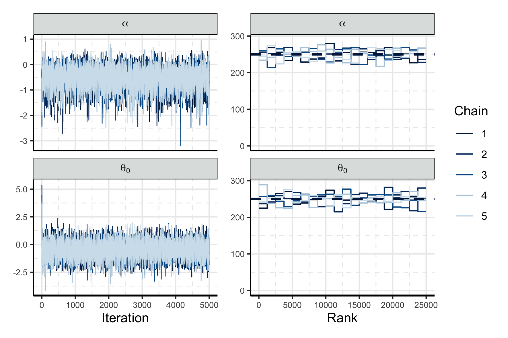

```{r setup, include = FALSE}
knitr::opts_chunk$set(echo = FALSE, comment = NA, out.width = "99%", fig.align = "center", auto_pdf = TRUE)
```

# Introduction

- Considering multiple, diverse data presents a substantial challenge for statisticians [@donnat_bayesian_2020].
    - If the data differ in structure, contain different types of measurements, or target related but non-identical populations of interest, then specifying a coherent joint model for each source of data presents a substantial challenge.
    - A more feasible approach may be to specify, and validate, individual submodels for each source of data, then combine 

- Computation for multiple models is also challenging
    - The computational effort required to fit a complex, multi-response model may prove prohibitive.
    - If instead we consider the submodel as the minimum computational unit, we may be able to parallelise certain aspects of the computation, and use less expensive computational techniques for some submodels.
    - The melding framework also allows us to reuse the submodel computation when targeting the bigger joint model.
    - In a sense we would like to do Sequential importance sampling / refine our estimates, without needing to re-evaluate the submodels.
    - Also like to better understand each submodel, and each submodels contribution to the join model.

- Applied researchers often collect multiple disparate data sets, and wish to combine them after the fact
    - Describe why and what they do
    - We are presenting a more formal, general form of the things that are done already

- Markov melding introduction
    - @goudie_joining_2019 introduced Markov melding, a methodology for combining probabilistic models in a principled way. 
    - The aforementioned applied research does not always fit into the Markov melding methodology, which explicitly requires all $\Nm$ submodels to have the same quantity $\phi$ in common. 
    - In the applications we consider, we have a number of submodels that share quantities in a pair wise manner. <!-- Not clear what this means, cut straight to next sentence -->
    - Specifically, our examples contain 3 submodels $\pd_{\modelindex}, \modelindex = 1 \ldots, 3$; where submodel 1 and 2 share a common quantity $\phi_{1 \cap 2}$, and submodel 2 and 3 share a common quantity $\phi_{2 \cap 3}$. 
    - We will demonstrate that Markov melding, as introduced in @goudie_joining_2019, _can produce a melded model that may not be the one of interest_?, and we devise an extension to the melded model that permits the desired model combination.

    <!-- Figure \ref{fig:intro-dag} contains a DAG representation of the relationship between submodels, where nodes in the DAG are submodels, and edges are quantities common to the submodels. they connect.

    \input{tex-input/introduction/0001-intro-dag.tex} -->

<!-- - Why do we need new methodology? What problem are we solving. -->

- Other advantages to modularised inference
    - understand submodels
    - use multiple software packages, which means we can reuse other computation
    - reuse posterior samples

# Example introduction

- We will now outline two applications that combine three submodels in the manner described in the introduction.

## An Integrated population model for little owls

- RG: _I guess this is a splitting example?_
    - It's not really either? If we take the IPM as the joint model of interest then it is a splitting example. But the ecologists define IPMs as "products of independent" submodels -- so we are joining submodels that they are already joining.
 
Integrated population models (IPMs) [@zipkin_synthesizing_2018] allow for precise estimation of population level quantities.
@schaub_local_2006 and @abadi_estimation_2010 use an IPM to estimate fecundity, immigration, and yearly survival rates for a population of little owls.
The collect and model three types of data: capture-recapture data $Y_{1}$ and capture-recapture submodel $\pd_{1}$, population counts $Y_{2}$ and count data submodel $\pd_{2}$, and nest-record data $Y_{3}$ and fecundity submodel $\pd_{3}$.
Importantly, $\pd_{1}$ has a parameter $\phi_{1 \cap 2}$ in common with $\pd_{2}$, and $\pd_{2}$ further has another parameter $\phi_{2 \cap 3}$ in common with $\pd_{3}$.
Because of the shared parameters, we can form the IPM as the product of these independent submodels.
This model combination step is prudent; no single source of data is sufficient to estimate all quantities of interest to the desired precision.
Figure \ref{fig:owls-simple-dag} is a simplified DAG of the IPM, showing the relationship between the three submodels.
We will show that this example, and IPMs in general, can be expressed in the Markov melding framework developed in Section \ref{model-specification}.

\input{tex-input/owls-example/0001-owls-simple-dag.tex}

## Survival analysis with longitudinal data and uncertain event times

- Interesting because it is a case where it is typical to consider the event / long submodels separately
- There is some work on uncertain event times as well, so the idea is definitely practical.
- Do we need a dag? Might be nice for consistency?

# Model specification

Our intention is to combine submodels into a specific joint model which we call the _chained melded model_[^chained].
Explicitly, we consider $\modelindex = 1, \ldots, \Nm$ submodels each with distinct data $Y_{\modelindex}$ and parameters $\psi_{\modelindex}$.
Additionally, each submodel shares some quantity in common with adjacent submodels $\phi_{\modelindex \cap \modelindex'}$, where $\modelindex \neq \modelindex'$.
By adjacent we mean related the manner depicted in Figure \ref{fig:owls-simple-dag}, where $\pd_{1}$ is adjacent to $\pd_{2}$ because they have $\phi_{1 \cap 2}$ in common.
Our particular interest is in the $\Nm = 3$ submodel case, where submodels $\pd_{1}(\phi_{1 \cap 2}, \psi_{1}, Y_{1})$ and $\pd_{2}(\phi_{1 \cap 2}, \phi_{2 \cap 3}, \psi_{2}, Y_{2})$ have $\phi_{1 \cap 2}$ in common, and $\pd_{2}(\phi_{1 \cap 2}, \phi_{2 \cap 3}, \psi_{2}, Y_{2})$ and $\pd_{3}(\phi_{2 \cap 3}, \psi_{3}, Y_{3})$ both contain $\phi_{2 \cap 3}$.
In this way, the submodels are connected in a manner akin to a chain.
<!-- TODO: -->The appendix contains the more general $\Nm$-model case.
Each submodel is assumed to be a valid joint density function for all constituent quantities, and all submodel conditionals exist with appropriate support.

[^chained]: _"Chained graphs"_ were considered by @lauritzen_chain_2002, however they are unrelated to our proposed model. We use "chained" to emphasise the nature of the relationships between submodels.

## Chained melded model

We begin by defining the chained melded model in terms of submodel conditional distributions
\input{tex-input/multiple-phi/0010-melded-model-cond.tex}
where the specification of each submodel is conditional on the quantities it has in common with adjacent submodels, and we impose a joint prior for $(\phi_{1 \cap 2}, \phi_{2 \cap 3})$ which we will return to momentarily.
However, these conditional distributions of are not always analytically tractable.
Each conditional distribution can be written in terms of the submodel joint density and appropriate marginal, and we rewrite the right hand side of Equation \eqref{eqn:melded-model-cond} as
\input{tex-input/multiple-phi/0012-melded-model-full.tex}
We refer to Equation \eqref{eqn:melded-model-full} as the melded model, and note that it is proportional to the melded posterior $\pd_{\text{meld}}(\phi_{1 \cap 2}, \phi_{2 \cap 3}, \psi_{1}, \psi_{2}, \psi_{3} \mid Y_{1}, Y_{2}, Y_{3})$.

## Pooled prior

Completely specifying \eqref{eqn:melded-model-full} requires forming an appropriate joint prior for $(\phi_{1 \cap 2}, \phi_{2 \cap 3})$.
Markov melding proceeds by pooling [@ohagan_uncertain_2006] the submodel priors to form such a prior, denoted $\pd_{\text{pool}}$.
We will do the same, however we have the additional complication that $\phi_{1 \cap 2}$ and $\phi_{2 \cap 3}$ may have different supports.
Consequently, we extend linear and logarithmic pooling to handle marginals with different supports, to produce a valid density for $\pd_{\text{pool}}(\phi_{1 \cap 2}, \phi_{2 \cap 3})$.

Throughout we assume that $\pd_{1}(\phi_{1 \cap 2}), \pd_{2}(\phi_{1 \cap 2}, \phi_{2 \cap 3})$, and $\pd_{2}(\phi_{2 \cap 3})$ are normalised, integrable probability density functions, that $\pd_{2}(\phi_{1 \cap 2}, \phi_{2 \cap 3})$ admits proper marginals for $\pd_{2}(\phi_{1 \cap 2})$ and $\pd_{2}(\phi_{2 \cap 3})$, and proper conditionals for $\pd_{2}(\phi_{1 \cap 2} \mid \phi_{2 \cap 3})$ and $\pd_{2}(\phi_{2 \cap 3} \mid \phi_{1 \cap 2})$.
For simplicity we will also assume that $\phi_{1 \cap 2} \in \mathbb{R}^{d_{1}}$ and $\phi_{2 \cap 3} \in \mathbb{R}^{d_{2}}$, and the supports of $\pd_{1}(\phi_{1 \cap 2}), \pd_{2}(\phi_{1 \cap 2}, \phi_{2 \cap 3})$, and $\pd_{2}(\phi_{2 \cap 3})$ are $\mathbb{R}^{d_{1}}, \mathbb{R}^{d_{1}} \times \mathbb{R}^{d_{2}}$, and $\mathbb{R}^{d_{2}}$ respectively.

#### Linear pooling

We propose the following two-step linear pooling approach.
The first step forms intermediary pooling densities via standard linear pooling, using appropriate marginals with common support
\input{tex-input/multiple-phi/0054-silly-linear-solution.tex}
In step two we form the pooled prior as the product of the intermediaries
\input{tex-input/multiple-phi/0055-silly-linear-overall.tex}
Equation \eqref{eqn:silly-linear-overall} implies that our linear pooling process will always produce a pooled prior with no correlation between $\phi_{1 \cap 2}$ and $\phi_{2 \cap 3}$, which may be undesirable.
It is possible to induce correlation between independent marginal distributions via copulas [@nelsen_introduction_2006] and other techniques [@lin_recent_2014], but these methods are less intuitive than capturing dependence in the pooling process.

#### Logarithmic pooling.

A multiplicative alternative to linear pooling is logarithmic pooling.
We define the logarithmically pooled prior to be 
\input{tex-input/multiple-phi/0050-pooled-prior-overall.tex}
This is a valid probability density function for $\pd_{\text{pool}}(\phi_{1 \cap 2}, \phi_{2 \cap 3})$, due to our assumption that all prior marginal distributions are proper. 
Unlike linear pooling, correlation present in $\pd_{2}(\phi_{1 \cap 2}, \phi_{2 \cap 3})$ will persist in $\pd_{\text{pool}}$.


### Pooling weights

Choosing values for the pooling weights ($\lambda$) is an important step in specifying $\pd_{\text{pool}}$.
To understand how $\lambda$ and the choice of pooling method impacts $\pd_{\text{pool}}$, we pool some simple marginal distributions and visualise the result. 
We recommend producing such prior predictive visualisations as part of a Bayesian workflow [@gelman_bayesian_2020], to ensure the pooled prior is fit for purpose.

Specifically, we pool the following marginal normal distributions
\input{tex-input/multiple-phi/0061-marginal-gaussian-example.tex}
where $\text{N}(\phi; \mu, \sigma^{2})$ is the normal density function with mean $\mu$ and standard deviation $\sigma$.
The two dimensional density function $\pd_{2}$ has an additional parameter $\rho$, which controls the intra-submodel marginal correlation.
We set $\mu_{1} = -2.5, \mu_{2} = \left[\mu_{2, 1} \,\, \mu_{2, 2}\right]' = \left[0 \,\, 0\right]', \mu_{3} = 2.5, \sigma_{1}^{2} = \sigma_{2}^{2} = \sigma_{3}^{2} = 1$ and $\rho = 0.8$.
In the logarithmic case we set $\lambda_{1} = \lambda_{3}$ and parameterise $\lambda_{2} = 1 - 2\lambda_{1}$, so that $\lambda_{1} + \lambda_{2} + \lambda_{3} = 1$ whilst limiting ourselves to varying only $\lambda_{1}$.
Similarly, in the linear case we set $\lambda_{1, 1} = \lambda_{2, 2} = \lambda_{1}$ and $\lambda_{1, 2} = \lambda_{2, 1} = 1 - 2 \lambda_{1}$.

Figure \ref{fig:pooled_densities_plot} displays the estimate of $\pd_{\text{pool}}$, and its constituent marginals, for 5 evenly spaced values of $\lambda_{1} \in [0, 0.5]$.
For both pooling methods, as $\lambda_{1}$ increases, the contributions of $\pd_{1}(\phi_{1 \cap 2})$ and $\pd_{3}(\phi_{2 \cap 3})$ increase. 
As expected, using linear pooling produces a $\pd_{\text{pool}}$ with no correlation, due to the additive form of Equations \eqref{eqn:silly-linear-solution-1} and \eqref{eqn:silly-linear-solution-2}.
A large, near-flat plateau is visible in the $\lambda_{1} = 0.25$ case, which is a result of the mixture of four, 2-D normal distributions that linear pooling produces in this example.
The logarithmic pooling process produces a more concentrated prior for small values of $\lambda_{1}$.
Correlation is preserved for all $\lambda_{1} \neq 0.5$, and Appendix \ref{log-pooling-gaussian-densities} analytically shows that $\lambda_{2}$ controls the quantity of correlation present in $\pd_{\text{pool}}$ in this setting./

```{r pooled_densities_plot, fig.cap = "Contour plots of $\\pd_{\\text{pool}}$ (red) under logarithmic and linear pooling (left and right column respectively). The values of $\\lambda_{1}$ are indicated in the plot titles, and the constituent marginal densities are shown in blue."}
knitr::include_graphics("plots/pooling-tests/version-two.pdf")
```

# Coherency of the chained melded model

A reasonable requirement for a modular inference method is that the final posterior distribution should not, at least theoretically, depend on the order in which data are observed or integrated into the model.
In the context of belief distributions, @bissiri_general_2016 call this property 'coherence', which we will co-opt.
Specifically, in the $\Nm = 3$ case, it seems desirable that the chained melded model be the same if either $\pd_{1}$ or $\pd_{3}$ are integrated with submodel $\pd_{2}$ first.
We will show that the form proposed in Equation \eqref{eqn:melded-model-full} satisfies this property, whilst the model produced by applying the melding method of @goudie_joining_2019 is, in general, sensitive to the order of integration.
    <!-- 
        - should we also check p(13)2?
            - (13)2 is the same as original melding with \phi = (\phi_{1 \cap 2}, \phi_{2 \cap 3}),
            - but the strategy doesn't generalise to higher $M$ (M = 4 immediately disproves)

        - say we had 9 models, and the first three formed \pd_{1}, the second three formed \pd_{2} and the remaining $\pd_{3}$. Would we apply melding here twice? No, we would think about this as chained melding with M = 9 models.
    -->

## Applying Markov melding twice

Denote the original melding operator with $\circledast$. 
Its output is 
\input{tex-input/noncommutativity/0005-def-usual-melded-model.tex}
where $\pd_{\text{pool}}^{12}(\phi_{1 \cap 2}) = g^{12}(\pd_{1}(\phi_{1 \cap 2}), \pd_{2}(\phi_{1 \cap 2}))$ for some pooling function $g^{12}$.
We denote the parameter space of the output as $\boldsymbol{\Theta}_{12} = (\phi_{1 \cap 2}, \phi_{2 \cap 3}, \psi_{1}, \psi_{2}, Y_{1}, Y_{2})$, so that any prior marginal distribution of $\pd_{\text{meld}}^{12}$ can be derived by integrating out the irrelevant components of $\boldsymbol{\Theta}_{12}$.
For example,  
\input{tex-input/noncommutativity/0006-example-melded-marginal-definition.tex}
where $\boldsymbol{\Theta}_{12} \setminus \phi_{2 \cap 3}$ is $\boldsymbol{\Theta}_{12}$ without $\phi_{2 \cap 3}$.

To integrate third submodel, we apply the original operator to $\pd_{\text{meld}}^{12}$ and $\pd_{3}$
\input{tex-input/noncommutativity/0007-iterated-application-melding.tex}
so that the parentheses in the superscript of $\pd_{\text{meld}}^{(12)3}$ indicate the order in which the submodels are melded.
As before we define $\pd_{\text{pool}}^{(12)3}(\phi_{2 \cap 3}) = g^{(12)3}(\pd_{\text{meld}}^{12}(\phi_{2 \cap 3}), \pd_{3}(\phi_{2 \cap 3}))$, but for a potentially different choice of pooling function $g^{(12)3}$.

It will be convenient to consider the following, expanded form of Equation \eqref{eqn:iterated-application-melding-two}
\input{tex-input/noncommutativity/0013-expanded-double-melded-model.tex}
and the equivalent expression for $\pd_{\text{meld}}^{1(23)}$, which we derive by careful inspection of the superscripts
\input{tex-input/noncommutativity/0018-symmetric-expanded-double-melded-model.tex}

## Does melding twice produce the same model as the chained melded model?

For Equations \eqref{eqn:expanded-double-melded-model} and \eqref{eqn:symmetric-expanded-double-melded-model} to be equal to the model defined in Equation \eqref{eqn:melded-model-full}, the following equalities must hold:
\input{tex-input/noncommutativity/0040-coinciding-equalities.tex}
It is clear from Equation \eqref{eqn:coinciding-equalities-one} that one necessary condition is for $\phi_{1 \cap 2}$ and $\phi_{2 \cap 3}$ to be _a priori_ independent in $\pd_{2}$.

### Melded marginal equality

By inspecting Equation \eqref{eqn:coinciding-equalities-one} we note the additional necessary condition that $\pd_{\text{meld}}^{12}(\phi_{2 \cap 3}) = \pd_{2}(\phi_{2 \cap 3})$.
To see when this is true, consider the following derivation
\input{tex-input/noncommutativity/0015-verify-dictatorial-pooling.tex}
Hence, for $\pd_{\text{meld}}^{12}(\phi_{2 \cap 3}) = \pd_{2}(\phi_{2 \cap 3})$ to hold we require $\pd_{\text{pool}}^{12}(\phi_{1 \cap 2}) = \pd_{2}(\phi_{1 \cap 2})$.
This is _dictatorial pooling_, where one submodel's prior marginal is used as a prior in the melded model.
An identical argument can be used to show that $\pd_{\text{meld}}^{23}(\phi_{1 \cap 2}) = \pd_{2}(\phi_{1 \cap 2})$ requires the equivalent choice of dictatorial pooling for $\phi_{2 \cap 3}$, i.e. $\pd_{\text{pool}}^{23}(\phi_{2 \cap 3}) = \pd_{2}(\phi_{2 \cap 3})$.

### Pooling equality

Without any loss of generality, we examine only the $\pd_{\text{pool}}^{12}(\phi_{1 \cap 2}) \pd_{\text{pool}}^{(12)3}(\phi_{2 \cap 3}) = \pd_{\text{pool}}(\phi_{1 \cap 2}, \phi_{2 \cap 3})$ equality in Equation \eqref{eqn:coinciding-equalities-two} for further necessary conditions.
There are three decisions to be made about the method of pooling used on the right hand side (RHS) of this equality:

1. Form $\pd_{\text{pool}}(\phi_{1 \cap 2}, \phi_{2 \cap 3})$ via the logarithmic pooling method of Equation \eqref{eqn:pooled-prior-overall}.
    
    Logarithmic pooling results in a RHS proportional to $\pd_{1}(\phi_{1 \cap 2})^{\lambda_{1}} \pd_{2}(\phi_{1 \cap 2}, \phi_{2 \cap 3})^{\lambda_{2}} \pd_{3}(\phi_{2 \cap 3})^{\lambda_{3}}$.
    Hence both $g^{12}$ and $g^{(12)3}$ are logarithmic pooling functions; if either were a linear pooling function we would get more than one term, and if either were dictatorial the left hand side (LHS) would exclude either $\pd_{1}(\phi_{1 \cap 2})$ or $\pd_{3}(\phi_{2 \cap 3})$.
    Thus,
    \input{tex-input/noncommutativity/0041-pooling-equality-rhs-log.tex}
    for arbitrary positives weights $\lambda_{\cdot}$.
    Equation \eqref{eqn:pooling-equality-rhs-log} holds iff $\pd_{2}(\phi_{1 \cap 2}, \phi_{2 \cap 3}) = \pd_{2}(\phi_{1 \cap 2})\pd_{2}(\phi_{2 \cap 3})$ and $\pd_{\text{meld}}^{12}(\phi_{2 \cap 3}) = \pd_{2}(\phi_{2 \cap 3})$. 
    We have shown earlier that is only true if dictatorial pooling is used for $g^{12}$.
    But if $g^{12}$ is dictatorial, then the LHS of Equation \eqref{eqn:pooling-equality-rhs-log} would not contain a $\pd_{1}(\phi_{1 \cap 2})$ term, which is a contradiction.
    Hence, Equation \eqref{eqn:pooling-equality-rhs-log} is not true in general.

    A special case of logarithmic pooling is that of product of experts, where $g^{12}(\pd_{1}(\phi_{1 \cap 2}), \pd_{2}(\phi_{1 \cap 2})) = \pd_{1}(\phi_{1 \cap 2})\pd_{2}(\phi_{1 \cap 2})$ and $g^{(12)3}(\pd_{\text{meld}}^{12}(\phi_{2 \cap 3}), \pd_{3}(\phi_{2 \cap 3})) = \pd_{\text{meld}}^{12}(\phi_{2 \cap 3})\pd_{3}(\phi_{2 \cap 3})$.
    In this specific instance all prior terms cancel, and only terms containing data remain in the melded model, so Equation \eqref{eqn:pooling-equality-rhs-log} is trivially true (both sides are equal to 1).

2. From $\pd_{\text{pool}}(\phi_{1 \cap 2}, \phi_{2 \cap 3})$ via the linear pooling method of Equations \eqref{eqn:silly-linear-solution-1} -- \eqref{eqn:silly-linear-overall}.

    If linear pooling is used then the RHS contains 4 terms.
    Thus both $g^{12}$ and $g^{1(23)}$ are linear -- all other combinations of pooling functions produce fewer than four terms -- and results in
    \input{tex-input/noncommutativity/0042-pooling-equality-rhs-lin.tex}
    Equation \eqref{eqn:pooling-equality-rhs-lin} again requires $\pd_{\text{meld}}^{12}(\phi_{2 \cap 3}) = \pd_{2}(\phi_{2 \cap 3})$, which we have shown to only be possible under dictatorial pooling.
    Thus we arrive at the same contradiction as before.

3. Use dictatorial pooling.
    
    There are two valid dictatorial pooling choices for the RHS:

    i. Set $\pd_{\text{pool}}(\phi_{1 \cap 2}, \phi_{2 \cap 3}) = \pd_{2}(\phi_{1 \cap 2}, \phi_{2 \cap 3})$.

        If one chooses $g^{12}(\pd_{1}(\phi_{1 \cap 2}), \pd_{2}(\phi_{1 \cap 2})) = \pd_{2}(\phi_{1 \cap 2})$ and $g^{(12)3}(\pd_{\text{meld}}^{12}(\phi_{2 \cap 3}), \pd_{3}(\phi_{2 \cap 3})) = \pd_{\text{meld}}^{12}(\phi_{2 \cap 3})$, then Equation \eqref{eqn:coinciding-equalities-two} simplifies to $\pd_{2}(\phi_{1 \cap 2}) \pd_{\text{meld}}^{12}(\phi_{2 \cap 3}) = \pd_{2}(\phi_{1 \cap 2}, \phi_{2 \cap 3})$, which is true iff the prior independence assumption is satisfied.
        Additionally, we require $\pd_{\text{meld}}^{12}(\phi_{2 \cap 3}) = \pd_{2}(\phi_{2 \cap 3})$, which as we have noted, is only true if $g^{12}$ is dictatorial.
        In this case, unlike previous cases, $g^{12}$ is exactly the dictatorial pooling function we require.

    i. Set $\pd_{\text{pool}}(\phi_{1 \cap 2}, \phi_{2 \cap 3}) = \pd_{1}(\phi_{1 \cap 2}) \pd_{3}(\phi_{2 \cap 3})$.

        Satisfying Equation \eqref{eqn:coinciding-equalities-two} is possible in this case if $g^{12}(\pd_{1}(\phi_{1 \cap 2}), \pd_{2}(\phi_{1 \cap 2})) = \pd_{1}(\phi_{1 \cap 2})$ and $g^{(12)3}(\pd_{\text{meld}}^{12}(\phi_{2 \cap 3}), \pd_{3}(\phi_{2 \cap 3})) = \pd_{3}(\phi_{2 \cap 3})$.

So in general, applying the original melding operator twice does not result in the same model as \eqref{eqn:melded-model-full}, except in cases where $\phi_{1 \cap 2}$ and $\phi_{2 \cap 3}$ are a priori independent in $\pd_{2}$ and specific forms of dictatorial pooling are used.

## Is the original operator commutative? 

Commutativity of the original operator would imply that $(\pd_{1} \circledast \pd_{2}) \circledast \pd_{3} = \pd_{1} \circledast (\pd_{2} \circledast \pd_{3})$.
By carefully considering the indices in Equation \eqref{eqn:expanded-double-melded-model} and \eqref{eqn:symmetric-expanded-double-melded-model}, we find that the original melding operator is only commutative if 
\input{tex-input/noncommutativity/0016-commutativity-condition.tex}
which implies the following equalities
\input{tex-input/noncommutativity/0014-orig-melding-commutative-equalities.tex}
Showing one of the equalities in Equation \eqref{eqn:orig-melding-commutative-equalities-1} and \eqref{eqn:orig-melding-commutative-equalities-2} implies its partner equality is also true. 
Consider the first equality
\input{tex-input/noncommutativity/0017-pooling-equality.tex}
Assume that $g^{12}$ and $g^{1(23)}$ are both linear or logarithmic pooling functions.
For Equation \eqref{eqn:pooling-equality} to be true, $\pd_{2}(\phi_{1 \cap 2}) = \pd_{\text{meld}}^{23}(\phi_{1 \cap 2})$, which is the same result we require in Equation \eqref{eqn:orig-melding-commutative-equalities-2}.
We have already shown that this is only true when using certain forms of dictatorial pooling.
Hence, the original operator is commutative under in the same settings in which applying the original melding operator twice results in the chained melded model.
 
# Posterior estimation

We now present two multi-stage MCMC methods for generating samples from the melded posterior.
By employing a multi-stage strategy we can avoid evaluating all submodels simultaneously.
This is desirable in situations where simultaneously evaluating the submodel terms is computationally infeasible or otherwise undesirable, whilst evaluating the prior marginal distributions is possible and relatively inexpensive.
The first sampler operates sequentially, accruing and refining samples by considering one submodel at a time.
The second parallelises parts of the sampling process, and has the potential to produce a sample, usable for inference, from the melded posterior in less time than the sequential method.

## Sequential sampler

Stage one ($s_{1}$) of the sequential sampler targets terms from submodel $\pd_{1}$. 
The target is expanded in stage two ($s_{2}$) to also include $\pd_{2}$ terms, finally to include $\pd_{3}$ terms and $\pd_\text{pool}$ in stage three ($s_{3}$).
An overview of this target broadening process is displayed in Figure \ref{fig:seq-sampler-dag}
\input{tex-input/multi-stage-sampler/0001-seq-sampler-dag.tex}
    
#### Stage one

Mathematically, stage one of the sequential sampler targets
\input{tex-input/multi-stage-sampler/0020-stage-one-target.tex}
using a generic proposal kernel for both $\phi_{1 \cap 2}$ and $\psi_{1}$. 
The corresponding acceptance probability for a proposed update from $(\phi_{1 \cap 2}, \psi_{1})$ to $(\phi_{1 \cap 2}^{*}, \psi_{1}^{*})$ is
\input{tex-input/multi-stage-sampler/0021-stage-one-acceptance-probability.tex}

#### Stage two

The stage two target augments the stage one target by including the second submodel and corresponding prior marginal distribution,
\input{tex-input/multi-stage-sampler/0030-stage-two-target.tex}
A Metropolis-within-Gibbs strategy is employed, where the stage one samples are used as a proposal for $\phi_{1 \cap 2}$, whilst a generic proposal kernel is used for $\psi_{2}$ and $\phi_{2 \cap 3}$.
Thus the proposal distributions for $\phi_{1 \cap 2}^{*}$ and $(\phi_{2 \cap 3}^{*}, \psi_{2}^{*})$ are 
\input{tex-input/multi-stage-sampler/0031-stage-two-gibbs-updates.tex}
The acceptance probability for this proposal strategy is
\input{tex-input/multi-stage-sampler/0032-stage-two-acceptance-probabilities.tex}
Our judicious choice of proposal distribution has resulted in a cancellation in Equation \eqref{eqn:stage-two-acceptance-probabilities-one} which removes all terms related to $\pd_{1}$.
Similarly, all terms related to $\pd_{1}$ are constant -- hence cancel -- in Equation \eqref{eqn:stage-two-acceptance-probabilities-two}.
This eliminates any need to re-evaluate the first submodel.

#### Stage three

In stage three we target the full melded posterior
\input{tex-input/multi-stage-sampler/0044-stage-three-target.tex}
The target has now been broadened to include terms from the third submodel and the pooled prior.
Again, we employ a Metropolis-within-Gibbs sampler, with proposals drawn such that
\input{tex-input/multi-stage-sampler/0045-stage-three-gibbs-updates.tex} 
which leads to acceptance probabilities of
\input{tex-input/multi-stage-sampler/0046-stage-three-acceptance-probabilities.tex}
The informed choice of proposal distribution for ($\phi_{1 \cap 2}, \phi_{2 \cap 3}, \psi_{1}, \psi_{2}$) has allowed us to target the full melded posterior without needing to evaluate all submodels simultaneously.  

## Parallel sampler

We now devise a strategy where stage one samples submodels 1 and 3 in parallel. Stage two reuses these samples in a Metropolis-within-Gibbs sampler, which targets the full melded posterior.
The stage specific targets are displayed in Figure \ref{fig:parallel-dag}.

\input{tex-input/dc-sampler/0001-parallel-dag.tex}

#### Stage one

Two independent, parallel sampling processes occur in stage one.
Submodels one and three are targeted
\input{tex-input/dc-sampler/0021-stage-one-targets.tex}
using submodel-specific transition kernels, leading to acceptance probabilities of
\input{tex-input/dc-sampler/0022-stage-one-acceptance-probs.tex}
which can be computed independently of one another.

#### Stage two

Stage two targets the melded posterior of Equation \eqref{eqn:melded-model-full} using a Metropolis-within-Gibbs sampler, where the proposals are distributed according to
\input{tex-input/dc-sampler/0031-stage-two-proposals.tex}
The acceptance probabilities for these updates are
\input{tex-input/dc-sampler/0032-stage-two-acceptance.tex}
Note that all stage two acceptance probabilities only contain terms from the second submodel and the pooled prior.

## Normal approximations to submodel components

Normal approximations are commonly employed to summarise submodels for subsequent use in more complex models.
Suppose we employ such an approximation to summarise the prior and posterior of $\phi_{1 \cap 2}$ and $\phi_{2 \cap 3}$ under $\pd_{1}$ and $\pd_{3}$ respectively.
In addition, assume that

- Such approximations are appropriate for $\pd_{1}(\phi_{1 \cap 2}), \pd_{1}(\phi_{1 \cap 2} \mid Y_{1}), \pd_{3}(\phi_{2 \cap 3})$, and $\pd_{3}(\phi_{2 \cap 3} \mid Y_{3})$.
- We are not interested in $\psi_{1}$ and $\psi_{3}$, and can integrate them out of all relevant densities.
- We employ dictatorial pooling and choose $\pd_{2}(\phi_{1 \cap 2}, \phi_{2 \cap 3})$ as the authoritative prior.

The latter two assumptions imply that the melded posterior of interest is proportional to
\input{tex-input/multiple-normal-approximation/0010-normal-approx-melded-posterior-target.tex}

In parallel, sample the prior and (sub)posterior of $\pd_{1}$ and $\pd_{3}$ and use these samples to approximate, e.g $\pd_{1}(\phi_{1 \cap 2} \mid Y_{1})$ with a normal density that has mean $\widehat{\mu}_{1}$ and covariance matrix $\widehat{\Sigma}_{1}$. 
Denote the subposterior approximation $\widehat{\pd}_{1}(\phi_{1 \cap 2} \mid \widehat{\mu}_{1}, \widehat{\Sigma}_{1})$ and the prior approximation $\pd_{1}(\phi_{1 \cap 2}) \approx \widehat{\pd}_{1}(\phi_{1 \cap 2} \mid \widehat{\mu}_{1, 0}, \widehat{\Sigma}_{1, 0}) = \text{N}(\widehat{\mu}_{1, 0}, \widehat{\Sigma}_{1, 0})$. 
Equivalent approximations and parameters exist for $\pd_{3}$.
The approximate melded posterior is thus
\input{tex-input/multiple-normal-approximation/0020-normal-approximation-approximate-target.tex}
The product of independent normal densities is an unnormalised multivariate normal density with independent components, so we rewrite Equation \eqref{eqn:normal-approximation-approximate-target} as
\input{tex-input/multiple-normal-approximation/0030-normal-approx-nu-de-form.tex}
Finally, the ratio of normal densities is also an unnormalised normal density, and hence Equation \eqref{eqn:normal-approx-nu-de-form} simplifies to
\input{tex-input/multiple-normal-approximation/0040-final-normal-approx.tex}
If instead we opt for product-of-experts pooling, all $\mu_{\text{de}}$ and $\Sigma_{\text{de}}$ terms disappear from the parameter definitions in Equation \eqref{eqn:final-normal-approx}.
Standard MCMC methods can then be used to sample from the approximate melded posterior.

# Examples

## Little owls

We now return to the integrated population model (IPM) for the little owls introduced in Section \ref{an-integrated-population-model-for-little-owls}.
Because the population count model includes a parameter also contained in the nest-record model, and has two parameters in common with the capture-recapture model, the IPM can be viewed as a melded model, as described in Section \ref{melded-model}.
Viewing the IPM as a melded model allows us to use the parallel sampler described in Section \ref{parallel-sampler}.

### Submodels

@finke_efficient_2019 consider a number of variations on the original model of @schaub_local_2006 and @abadi_estimation_2010.
We consider variant from @finke_efficient_2019 with the highest marginal likelihood.
Before we detail the specifics of our chosen model, we need to introduce some notation. 
Data and parameters are stratified into two age-groups $a \in \{J, A\}$ where $J$ denotes juvenile owls and $A$ adults, Two sexes $s \in \{M, F\}$, and observations occur at times $t \in \{1, \ldots, T\}$, for $T = 25$.

#### Capture recapture: $\pd_{1}$

Capture-recapture data pertain to owls that are captured, tagged, and released at time $t$.
These individuals are then recaptured at time $u$, for $t + 1 < u < T + 1$, or not recaptured before the conclusion of the study, in which case $u = T + 1$. 
Define $M_{a, s, t, u}$ as the number of owls last observed at time $t$, recaptured at time $u$, of sex $s$, and age-group $a$.
These observations are then aggregated into age-group and sex specific matrices $\boldsymbol{M}_{a, s}$, with $T$ rows and $T + 1$ columns.
Let $R_{a, s, t} = \sum_{u = 1}^{T + 1} \boldsymbol{M}_{a, s, t, u}$ be the number of owls observed at time $t$ and then released, i.e. a vector containing the row-wise sum of the entries in $\boldsymbol{M}_{a, s}$.
The multinomial likelihood is
\input{tex-input/owls-example/0010-capture-recapture-submodel.tex}
with probabilities $\boldsymbol{Q}_{a, s, t} = \{Q_{a, s, t, u}\}_{u = 1}^{T + 1}$ such that
\input{tex-input/owls-example/0011-multinomial-probabilities.tex}

#### Count data model: $\pd_{2}$ 

To estimate population abundance, a two level model is used.
One level models the observed (counted) number of females at each point in time, with a second, latent process modelling the total number of females in population.
Denote the total number of juvenile and adult females in the population at time $t$ as $\boldsymbol{x}_{t} = \left[x_{J, t}, x_{A, t}\right]$.
The latent, population level model is 
\input{tex-input/owls-example/0020-count-data-submodel.tex}
Initial population sizes $(x_{J, 1}, x_{A, 1})$ are a priori uniformly distributed over $\{0, 1, \ldots, 50\}$.
The observation level model is  
\input{tex-input/owls-example/0021-observation-process.tex}

#### Fecundity: $\pd_{3}$

The fecundity submodel considers the number of breeding females at time $t$, $N_{t}$, and the number of chicks produced that survive and leave the nest $n_{t}$.
A Poisson model is employed, with fecundity (reproductive) rate $\rho$
\input{tex-input/owls-example/0030-fecundity-submodel.tex}
 
#### Parameterisation and melding quantities

@abadi_estimation_2010 parameterise the time dependent quantities via linear predictors, to minimise the number of parameters in the submodels.
However, our choice to use the 'best' model of @finke_efficient_2019 renders many of the quantities independent of time.
The specific parameterisation we employ is
\input{tex-input/owls-example/0040-parameterisation-info.tex}
thus the quantities common to the submodels are $\phi_{1 \cap 2} = (\alpha_{0}, \alpha_{2})$ and $\phi_{2 \cap 3} = \rho$.
Our definition of $\phi_{1 \cap 2}$ does not include $\alpha_{1}$ as it is male specific and does not exist in $\pd_{2}$.
To align the notation of this example with the melding notation we define, for all permitted values of $a, s$ and $t$, $Y_{1} = \boldsymbol{M}_{a, s}$, $\psi_{1} = \pi_{s, t}$; $Y_{2} = y_{t}$, $\psi_{2} = (\boldsymbol{x}_{t}, \eta, \text{sur}_{t}, \text{imm}_{t})$; and $Y_{3} = (N_{t}, n_{t})$, $\psi_{3} = \varnothing$.
We use the priors of @abadi_estimation_2010 for the parameters in each submodel.
The components of $\alpha$ present in $\pd_{1}$ and $\pd_{2}$ are assigned independent $\text{N}(0, 100^2)$ priors which are truncated to $[-10, 10]$. 
A $\text{U}(0, 10)$ prior is assigned to $\rho$ in $\pd_{2}$ and $\pd_{3}$.

Completing the specification of $\pd_{\text{meld}}$ requires us to choose $\pd_\text{pool}(\phi_{1 \cap 2}, \phi_{2 \cap 3})$.
So that we can appropriately compare the melded posterior with the IPM posterior $\pd_{\text{meld}}$ we opt for product-of-experts pooling: $\pd_\text{pool}(\phi_{1 \cap 2}, \phi_{2 \cap 3}) \propto \pd_{1}(\phi_{1 \cap 2}) \pd_{2}(\phi_{1 \cap 2}, \phi_{2 \cap 3}) \pd_{3}(\phi_{2 \cap 3})$.

- _Should I also run a variant that forms $\pd_{\text{pool}}(\phi_{1 \cap 2}, \phi_{2 \cap 3})$ via one of our pooling methods?_

### Posterior estimation 

We estimate the melded posterior using both the Normal approximation and parallel sampler.
This allows us to use pre-existing implementations of the submodels.
Specifically, the capture-recapture and count data submodels are written in BUGS [@lunn_bugs_2009], and the subposterior of the former is sampled via `rjags` [@plummer_rjags_2018]. 
The fecundity submodel is written in Stan [@carpenter_stan_2017] and sampled via `rstan` [@stan_development_team_rstan_2020].
We reuse the count data BUGS implementation for stage two of the multi-stage sampler, and implement the Metropolis-within-Gibbs sampler specified in Section \ref{parallel-sampler} via `Nimble` [@de_valpine_programming_2017] and its `R` interface [@nimble_development_team_nimble_2019].
A slightly modified version of the count data submodel used for the Normal approximation, which is also run through `rjags`.
Code for this example is available at https://github.com/hhau/melding-owls-example.

### Results

```{r phi_subpost, fig.cap = "Subposterior credible intervals for $\\phi_{1 \\cap 2} = (\\alpha_{0}, \\alpha_{2})$ and $\\phi_{2 \\cap 3} = \\rho$ from the original integrated population model $\\pd_{\\text{ipm}}$, the melded posterior using the parallel sampler $\\pd_{\\text{meld}}$, the melded posterior using the normal approximation $\\widehat{\\pd}_{\\text{meld}}$, and the individual submodels $\\pd_{1}, \\pd_{2}$, and $\\pd_{3}$. Intervals are 50\\%, 80\\%, 95\\%, and 95\\% wide."}
knitr::include_graphics("plots/owls-example/subposteriors.pdf")
```

```{r phi_qq_compare, fig.cap = "Quantile-Quantile plot of ($\\phi_{1 \\cap 2}, \\phi_{2 \\cap 3}$) for the IPM posterior (y-axis) and melded posterior (x-axis). The empirical quantiles are displayed as a solid red line, and the optimal quantile is shown as a dashed black line. The melded posterior quantiles obtained using the Normal approximation are plotted as a dot-dash blue line."}
knitr::include_graphics("plots/owls-example/orig-meld-qq-compare.pdf")
```
We empirically validate our methodology and sampler by comparing the melded posterior samples to the original IPM posterior.
Results are compared to a long run, 6 chains of $2 \times 10^5$ iterations each, of the original IPM code which we treat as the 'truth'.
The results obtained from our sampler are indistinguishable from the original IPM.
Figure \ref{fig:phi_subpost} depicts the posterior credible intervals [@gabry_bayesplot_2021; @kay_tidybayes_2020] for the melded quantities, and we are particular interested in the agreement between $\pd_{\text{meld}}$ $\pd_{\text{IPM}}$.
We further compare the IPM and melded posteriors via the QQ plots in Figure \ref{fig:phi_qq_compare}, and again see near identical results.
Trace plots, rank plots, and numerical convergence measures [@vehtari_rank-normalization_2020-1] for both stages of the parallel sampling process are presented in Appendix \ref{diagnostics-for-the-owls-example}.

Our sampling process gives back identical results to that of the original IPM.
It does so whilst combining a number of different Bayesian inference methods and implementations.
By no means is this the only combination of tools that could be used, it is merely illustrative of the idea developed here: we can use the output from one model to target some larger model, without needing to reimplement said model in a different language or framework.
It is also an example of estimating an intricate model without ever simultaneously evaluating all components of the model, a useful property for large, complicated models.

- _should we also compare to the normal approximation in this simple setting_?.

## Uncertain event times in joint longitudinal and survival models.

- What are we considering here?:
    - We now consider _jointly_? modelling longitudinal and survival data, with the added complication that the event times (_and censoring indicators_?) are uncertain, model derived quantities.

- Why ?:
    - Standard survival analyses consider the event times and censoring indicators as known, fixed quantities.
    However, in some settings the survival times are contaminated with nontrivial measurement error [@gu_semiparametric_2015; @meier_discrete_2003; @oh_considerations_2018; @snapinn_survival_1998;@wang_integrative_2020], or are derived from a, possibly highly complex, model for some other measurable quantity of the individual [see @lee_threshold_2006 for a review; and @szczesniak_dynamic_2020 for recent application].
    Integrating the output of such models into standard parametric or Cox proportional hazards survival models is challenging, but, we argue,  made less complicated by the melding framework of Section \ref{model-specification}.

    - The integration of complex regression models into survival models is routine in the Joint modelling framework [@rizopoulos_joint_2012].
    Such model complexity is often warranted due to the wide variety of behaviours of the longitudinal process. 
    The associated computational cost motivates two stage estimation procedures [@ye_semiparametric_2008; @mauff_joint_2020] which reduce the computation required.
    Such two stage processes are, in effect, considering a separate submodel for the longitudinal data, and we do the same in our example.

    - We argue that considering the models for the event times and longitudinal process separately is not an unreasonable modelling choice, and choosing to unite them through the survival model comprises an application of our melding methodology.

    _Need to think about where to put this?_
    However, as @mauff_joint_2020 note, commonly employed versions of the two-stage estimation process produce biased results. 
    In @mauff_joint_2020 this bias is removed via importance sampling with appropriate weights, which is similar to our two stage sampler in Section

- How?:

    - We consider a synthetic setting, where data are simulated from the submodels we specify.
        -> why? 
        - This is to keep the example simple enough so that we can clearly see how all the parts relate to the bits of the methodology.
            - Our event time model is obviously a lot less complicated than all the first hitting time models / latent stoch process models.
        - Also because actual survival data are difficult to model appropriately (many censoring types, complicated dependencies on the longitudinal process), often contain missing data, and myriad other complications.

### Submodels

#### First submodel

- _needs censoring_

The first submodel describes and observable process, where we assume an event occurs when the process crosses some threshold.
Consider individuals $i = 1, \ldots, N$ for whom we record $j = 1, \ldots, J_{i}$ measurements $z_{i, j}$ at times $t_{i, j}$, further denoting $\boldsymbol{z}_{i} = (z_{i, 1}, \ldots, z_{i, J_{i}})$ and $\boldsymbol{t}_{i}$ analogously.
We fit the following hierarchical intercept and slope model
\input{tex-input/surv-example/0020-submodel-one-model.tex}
where $\text{N}_{-}$ denotes a normal distribution truncated to $(-\infty, 0]$.
Individuals are said to experience the event of interest $T_{i}$ when their fitted model crosses some threshold $\kappa$, which is to say $T_{i} = (\kappa -\beta_{0, i})\mathop{/} \beta_{1, i}$, and it is for this reason we constrain all $\beta_{1, i}$ and, $\mu_{\beta_{1}}$ to be less than zero. 
We will later simulate data such that $\kappa < \beta_{0, i}$ to ensure $T_{i} > 0$ for all individuals.

Figure \ref{fig:submodel_one_synthetic_plot} displays the simulated data and fitted model, which we have truncated to $t \in [0, 1]$ (_this is because I am intending to introduce censoring at $t=1$_).
We have set $\kappa = 0.2$, and depict the subposterior $\pd_{1}(\phi_{1 \cap 2} \mid Y_{1})$ via the blue uncertainty intervals.

To align this submodel with our notation we denote this submodels data $Y_{1} = (\boldsymbol{t}_{1}, \ldots, \boldsymbol{t}_{N}, \boldsymbol{z}_{1}, \ldots, \boldsymbol{z}_{N})$ and the event times $\phi_{1 \cap 2} = (T_{1}, \ldots, T_{N})$, with $\psi_{1}$ defined to be all model parameters in Equation \eqref{eqn:submodel-one-model}.

```{r submodel_one_synthetic_plot, fig.cap = "First submodel. The 80\\% credible interval for each individuals event distribution, if the event occurs for that individual, is displayed in blue and is truncated to $t \\in [0, 1]$. The threshold $\\kappa$ is displayed as the horizontal dashed line. Individuals the truly have the event occur are denoted by a solid mean regression line, whilst individuals that do not have the event occur have a dotted line"}
knitr::include_graphics("plots/surv-example/submodel-one-posterior.pdf")
```

#### Second submodel

- _needs censoring_

Our second submodel is a standard parametric Weibull survival model with rate $\gamma$.
Say we observe a baseline covariate $w_{i}$ for each individual.
We define the hazard and survival probabilities at time $t$
\input{tex-input/surv-example/0030-submodel-two-hazard-general.tex}
where $\theta_{0}$ is an intercept, $\theta_{1}$ is the regression parameter for the baseline covariate, and $\alpha$ quantifies the strength of the association between the event time and the fitted value from the longitudinal model $m_{i}(t)$, which we will define momentarily.
The likelihood is proportional to $h_{i}(t)S_{i}(t)$ (_will change if we censor_).
We complete the model by specifying the following priors
\input{tex-input/surv-example/0033-surv-model-priors.tex}
where $\overline{T}$ is the log of the crude event rate, in line with @brilleman_bayesian_2020.
Note that the model in Equation $\eqref{eqn:surv-model-priors}$ is written in terms of generic event time $t$, but we will consider the uncertain even times for each individual $T_{i}$ from submodel 1.

In melding notation we have $Y_{3} = (w_{1}, \ldots, w_{N})$, and $\psi_{2} = (\gamma, \theta_{0}, \theta_{1}, \alpha)$. The common quantities, $\phi_{1 \cap 2}$ and $\phi_{2 \cap 3}$ are defined in previous and following sections respectively.

#### Third submodel

To avoid numerical integration in the second submodel, we model the single longitudinal process via a hierarchical intercept model, using different notation to distinguish it from submodel 1.
Specifically, we collect $k = 1, \ldots, K$ longitudinal observations for each individual $x_{i, k}$.
The model is
\input{tex-input/surv-example/0040-submodel-three-model.tex}
and we define $m_{i}(t) = \eta_{i}$. 

In our notation we denote $Y_{3} = \boldsymbol{X} = (\boldsymbol{x}_{1}, \ldots, \boldsymbol{x}_{N}), \, \phi_{2 \cap 3} = \boldsymbol{\eta} = (\eta_{1}, \ldots, \eta_{N})$ and $\psi_{3} = (\mu_{\eta}, \sigma_{\eta}, \sigma_{x})$.

- general motivation.
    - Ideally we'd have this model be some function of $t$.
    - In lieu of that, we consider this model to be representative of some individual specific, yet constant over the time period of interest, longitudinal process. One possible example may be blood pressure during hospital stay, where the reason for hospital admission is not, primarily, related to cardiovascular status.
    - More general, time dependent forms of $m_{i}(t)$ are possible.

#### Pooled prior:

- What are we going to do about it?
- exchangeable individuals means the prior marginals are $\pd_{1}(\phi_{1 \cap 2})^{N}$ and $\pd_{3}(\phi_{2 \cap 3})^{N}$.
- What on earth is $\pd_{2}(\phi_{1 \cap 2}, \phi_{2 \cap 3})$?
    - particularly $\pd_{2}(\phi_{1 \cap 2})$, the prior distribution for the event times and indicators in the survival model? 
    - there is a suite a methodology for simulating realistic event times from a survival model i.e. @crowther_simulating_2013. Can we repurpose this to sample from the prior?
        - Or, we can be lazy and use MCMC as $N$ is small.
- Just do PoE and not worry about it.

### Simulation details

- the data is simulated slight differently than the models may suggest, because we need to do the event submodel first, but also associate said events with the longitudinal process.

### Results and discussion for this example.

- see diagnostics in appendix 
- can't learn any thing about $\phi_{1 \cap 2}$ in this framework, but $\psi_{2}$ more appropriately quantifies the uncertainty than ? Assuming a mean value for $\phi_{1 \cap 2}$ from $\pd_{1}$? What should we be comparing to here.

```{r phi_12_contraction, fig.cap = "The distribution of $\\phi_{1 \\cap 2}$ after stage one and two. There's no contraction in this distribution because we can't learn about $\\psi_{2}$ and $\\phi_{1 \\cap 2}$ simultaneously. That or I haven't put enough information into $Y_{2}$ and $Y_{3}$."}
knitr::include_graphics("plots/surv-example/phi-12-inter-stage-comparison.pdf")
```

```{r phi_23_contraction, fig.cap = "Similar story for $\\phi_{2 \\cap 3}$"}
knitr::include_graphics("plots/surv-example/phi-23-inter-stage-comparison.pdf")
```

#### Contraction 

- idea here is that we can actually learn something about the even times /longitudinal process from the other parts?

```{r contraction_plot, fig.cap = "Inter-stage posterior standard deviations for the common quantities."}
knitr::include_graphics("plots/surv-example/phi-inter-stage-posterior-sd.pdf")
```

#### Comparison to point estimate propagation

- posterior median is the only point estimate that makes sense in this situation (mean/mode not well defined for a mixture of discrete / continuous components)

```{r psi_2_comparion, fig.cap = "Comparison of $\\psi_{2}$ using melding and propagating the subposterior median of $\\phi_{1 \\cap 2}$ and $\\phi_{2 \\cap 3}$ alone into stage two."}
knitr::include_graphics("plots/surv-example/psi-2-method-comparison.pdf")
```


# Discussion

## Thoughts on modelling increasingly complex phenomena as a combination of constituent models

## Advantages

- better understand submodels, and components thereof
    - priors / prior predictive distributions / posterior predictive distributions / posterior pathologies therein
- mostly re use existing implementations
- refines other components of submodels, where as using parametric approximation to subposterior as a prior in latter models does not.

## Disadvantages

- Submodels may conflict with each other
    - Though we wouldn't have detected this if we could directly evaluate the joint.
- submodels may be practically unidentifiable
- Not all intermediary distributions/outputs are meaningful, depends on what we choose to sample at what stage. 

## Sequential vs parallel sampler vs Normal approximation vs other estimation techniques?

## Why can't we do melding twice (need better name for section)

- Astute reader may ask why we cannot apply Markov melding twice - the answer is that ordering matters.   
    - Explaining why relies on too much notation for an introduction, and requires us to have introduced the new melded model.
    - It feels like a very weird detour to take before looking at examples, so I guess this has to go in the discussion? 
    - Maybe it should just be an appendix, with a brief note in the main text 
   
    - Get text tidy from earlier version.


## Conflict

- Hopefully I'll address this in the next chapter

## fundamental issues with modular methods

- The issue in original markov melding that we point out in Section 4 points to a much larger tension, that bayesian inference is only coherent once you know the joint model you wish to use in the last stage of modelling
    - This isn't true, PoE is still coherent 
    - issue is with prior specification in the absence of other models, which is then too concentrated / in appropriate when other, related models are postulated.
        - same issue discussed in Section 4.4.3 of @jacob_better_2017-1.


# Conclusion 


<!-- -------------------- END OF MAIN BODY OF DOCUMENT -------------------- -->
\newpage

<!-- The {-} tag here suppresses the section numbering. -->
# Bibliography {-}

<!-- This makes pandoc-citeproc put the references before the end of document. -->
<div id="refs"></div>

\newpage

<!-- Now switch to alphabetical numbering for the appendix, and reset the counter. -->
\renewcommand{\thesection}{\Alph{section}}
\setcounter{section}{0}

# General $\Nm$ case of the melded model, pooled priors.

## Model

Denote $\boldsymbol{\phi} = (\phi_{1 \cap 2}, \ldots, \phi_{\Nm - 1 \cap \Nm}), \boldsymbol{\psi} = (\psi_{1}, \ldots, \psi_{\Nm})$, and $\boldsymbol{Y} = (Y_{1}, \ldots, Y_{\Nm})$.
The $\Nm$ model chained melded model is 
\input{tex-input/multiple-phi/0011-melded-model-general.tex}

## Pooled prior

#### Linear pooling

The general $\Nm$ model linear pooled prior is
\input{tex-input/multiple-phi/0080-M-model-linear-pooling.tex}
where, for $\modelindex \neq 1$,
\input{tex-input/multiple-phi/0081-M-model-linear-pooling-marg.tex}

#### Logarithmic pooling

The general $\Nm$ model logarithmic pooled prior is
\input{tex-input/multiple-phi/0090-M-model-logarithmic-pooling.tex}

# Log pooling Gaussian densities

We can precisely compute $\pd_{\text{pool}}$ when logarithmically pooling Gaussian densities.
Noting that, in the one dimensional case, $\text{N}(\phi; \mu, \sigma^2)^{\lambda_{\modelindex}} = \text{N}(\phi; \mu, \frac{\sigma^2}{\lambda_{\modelindex}})$, we use the results of @bromiley_products_2003 and write
\input{tex-input/multiple-phi/0070-log-pooling-gaussian.tex}
hence $\pd_{\text{pool}}(\phi_{1 \cap 2}, \phi_{2 \cap 3}) = \text{N}(\left[\phi_{1 \cap 2} \,\, \phi_{2 \cap 3}\right]^{\top}\hspace{-0.5em};\, \mu_{\text{log}}, \, \Sigma_{\text{log}})$.
The choice of $\lambda_{2}$ is critical; by controlling the contribution of $\pd_{2}$ to $\pd_{\text{pool}}$, $\lambda_{2}$ controls the degree of correlation present in the latter.
The left hand column of Figure \ref{fig:pooled_densities_plot} illustrates this phenomena.
When $\lambda_{1} = \lambda_{3} = 0 \implies \lambda_{2} = 1$, all correlation in $\pd_{2}$ is present in $\pd_{\text{pool}}$.
The correlation decreases for increasing values of $\lambda_{1}$ until $\lambda_{1} = \lambda_{3} = 0.5 \implies \lambda_{2} = 0$, where no correlation persists.

# Diagnostics for the owls example

## Stage one diagnostics

\input{tex-input/owls-example/appendix-info/0010-stage-one-diagnostics.tex}

```{r stage_one_mcmc_trace_capture_recapture, fig.cap = "Stage one trace plot of $\\phi_{1 \\cap 2}$ in the capture recapture submodel."}
knitr::include_graphics("plots/owls-example/stage-one-diagnostics-capture-recapture.png")
```

```{r stage_one_mcmc_trace_fecundity, fig.cap = "Stage one trace plot of $\\phi_{2 \\cap 3}$ in the fecundity submodel."}
knitr::include_graphics("plots/owls-example/stage-one-diagnostics-fecundity.png")
```

## Stage two diagnostics

\input{tex-input/owls-example/appendix-info/0020-stage-two-diagnostics.tex}

```{r stage_two_mcmc_diags, fig.cap = "Stage two trace and rank plots of $\\phi_{1 \\cap 2}$ and $\\phi_{2 \\cap 3}$."}
knitr::include_graphics("plots/owls-example/stage-two-diagnostics.png")
```

# Diagnostics for the Survival example

## Stage one diagnostics

### Numerical diagnostics

\input{tex-input/surv-example/0080-submodel-one-numeric-diags.tex}
\input{tex-input/surv-example/0081-submodel-three-numeric-diags.tex}

### Visual diagnostics

```{r stage_one_submodel_one_diag, fig.cap = "Stage one trace and rank plots for the parameters in both $\\psi_{1}$ and $\\phi_{1 \\cap 2}$ with the worst $\\widehat{R}$ and $N_{\\text{eff}}$"}

```

```{r stage_one_submodel_three_diag, fig.cap = "Stage one trace and rank plots for the parameters in both $\\psi_{3}$ and $\\phi_{2 \\cap 3}$ with the worst $\\widehat{R}$ and $N_{\\text{eff}}$"}

```

## Stage two diagnostics

### Numerical diagnostics

\input{tex-input/surv-example/0090-stage-two-phi-12-diag.tex}
\input{tex-input/surv-example/0091-stage-two-phi-23-diag.tex}
\input{tex-input/surv-example/0092-stage-two-psi-2-diag.tex}

### Visual diagnostics

```{r surv_ex_stage_two_diag_phi_12, fig.cap = "Stage two trace and rank plots for the parameters in $\\boldsymbol{\\phi}_{1 \\cap 2}$ with the worst $\\widehat{R}$ and $N_{\\text{eff}}$"}
knitr::include_graphics("plots/surv-example/stage-two-phi-12-diags.png")
```

```{r surv_ex_stage_two_diag_phi_23, fig.cap = "Stage two trace and rank plots for the parameters in $\\boldsymbol{\\phi}_{2 \\cap 3}$ with the worst $\\widehat{R}$ and $N_{\\text{eff}}$"}
knitr::include_graphics("plots/surv-example/stage-two-phi-23-diags.png")
```

```{r surv_ex_stage_two_diag_psi_2, fig.cap = "Stage two trace and rank plots for the parameters in $\\boldsymbol{\\psi}_{2}$ with the worst $\\widehat{R}$ and $N_{\\text{eff}}$"}

```

# Markov melding is sensitive to the order in which the submodels are considered

- Maths / argument goes here, in text sentence goes something like "A possible two-step approach for combining these models is to apply Markov melding to submodels 1 and 2 in step one, then apply it again to the result of step one and submodel 3. However, as we show in Appendix \ref{the-right-appendix-name}, this result of this process is dependent on whether one considers submodels 1 and 2 in step one, or submodels 2 and 3. This dependence is undesirable, and to address it we now develop a modified version of markov melding that is order insensitive."
- I think the lingo to use here is that it is 'incoherent, insofar as observing Y_{1}, Y_{2}, and Y_{3}' in any order should lead to the same posterior