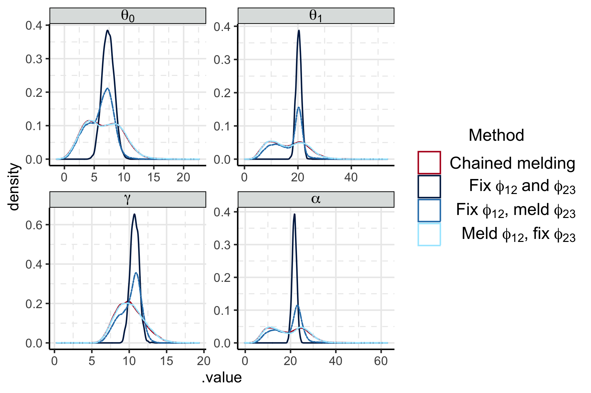

```{r setup, include = FALSE, cache = FALSE, message = FALSE, warning = FALSE, comment = NA}
options(width = 9999)
knitr::opts_chunk$set(echo = TRUE, cache = TRUE)
```


# Comparison to melding hybrid estimates

- Compared chained melding to the point estimate approximation and the hybrids
- Seems like the bulk of the uncertainty comes from the uncertain event time? But there is still more uncertainty when the event times are fixed and the other things vary? I am missing something here.

```{r prop, fig.cap = "Posterior of $\\psi_{2}$ under melding and propagating the subposterior medians"}

```

# Making the longitudinal model linear in time again

- Whilst investigating the above I realised I could make the 'longitudinal model' actually longitudinal model again.
- Which is to say, the third submodel is now 

\begin{equation}
\begin{gathered}
  x_{i, k} = \eta_{0, i} + \eta_{1, i} \tau_{i, k} + \zeta_{i, k}  \\
  \eta_{0, i} \sim \text{N}(\mu_{\eta, 0}, \sigma^{2}_{\eta, 0}), \,\,
  \eta_{0, i} \sim \text{N}(\mu_{\eta, 1}, \sigma^{2}_{\eta, 1}), \,\,
  \zeta_{i, k} \sim \text{N}(0, \sigma^{2}_{x}), \\
  \mu_{\eta, 0} \sim \text{N}(1, 1^2), \,\,
  \mu_{\eta, 1} \sim \text{N}(1, 1^2), \\
  \sigma^{2}_{\eta, 0} \sim \text{LogNormal}(0, 1^2), \,\,
  \sigma^{2}_{\eta, 1} \sim \text{LogNormal}(0, 1^2), \,\,
  \sigma^{2}_{x} \sim \text{LogNormal}(0, 1^2),
\end{gathered}
\label{eqn:submodel-three-model}
\end{equation}

- The combination of censoring and parametrising the integrand stabilises the computation.
- The down side is that the mixing is terrible at the time/iteration increased such that stage two now takes 1.75 hours, up from 10 mins.
- There is poor mixing of the event times in stage two

```{r stage_two_mixing_phi_12}
knitr::include_graphics("../plots/surv-example/stage-two-phi-12-diags.png")
```

- which leads to very poor mixing in of $\psi_{2}$

```{r stage_two_mixing_psi_2}
knitr::include_graphics("../plots/surv-example/stage-two-psi-2-diags.png")
```

- I could probably run this over the weekend / put on long jobs queue on the HPC?