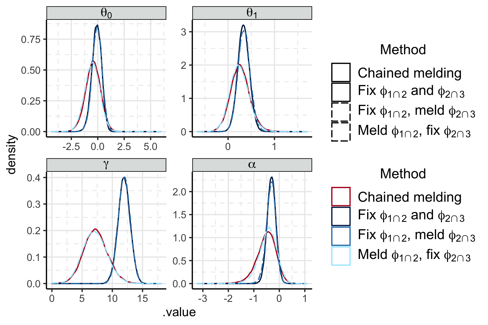

```{r setup, include = FALSE, cache = FALSE, message = FALSE, warning = FALSE, comment = NA}
options(width = 9999)
knitr::opts_chunk$set(echo = TRUE, cache = TRUE)
```


# Comparison to point estimate

- comparing chained melding to the point estimate approximation and the hybrids
- Seems like the bulk of the uncertainty comes from the uncertain event time? But there is still more uncertainty when the event times are fixed and the other things vary? I am missing something here.

```{r prop, fig.cap = "Posterior of $\\psi_{2}$ under melding and propagating the subposterior medians"}

```
