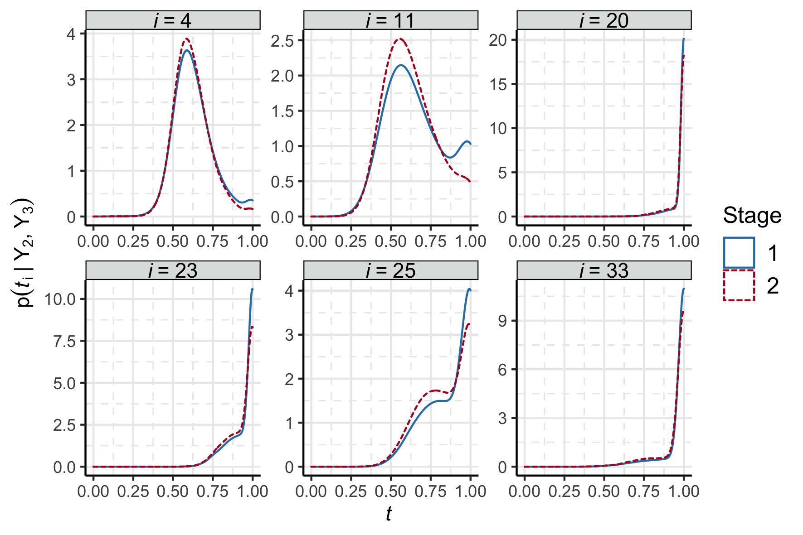
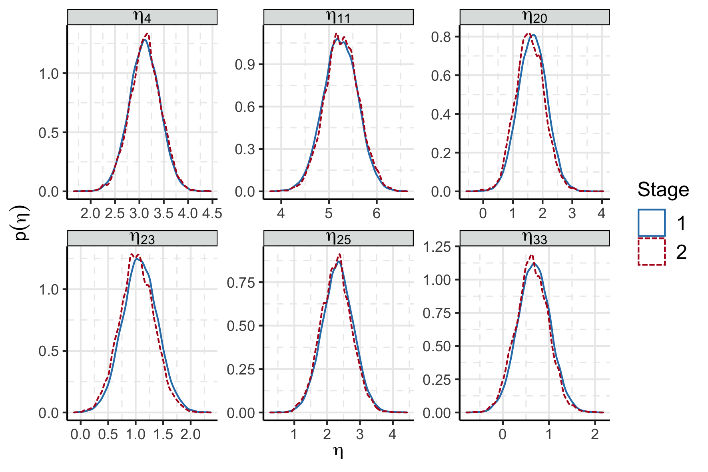
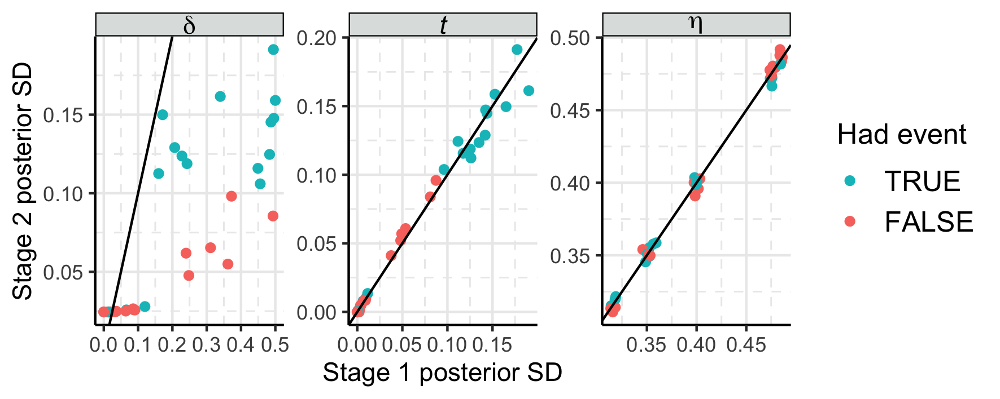

```{r setup, include = FALSE, cache = FALSE, message = FALSE, warning = FALSE, comment = NA}
options(width = 9999)
knitr::opts_chunk$set(echo = TRUE, cache = TRUE)
```

- Event time model now censors at $t = 1$, and the survival submodel now incorporates this censoring.
- Some exploratory tests into I-splines for the event time submodel tests
    - Definitely possible, requires post-processing in R as finding the event time requires numerical optimisation
- Rewrote section 4 on Model coherency. I definitely want this section in the thesis chapter, but I'm not sure what purpose it serves in the paper?
    - I also think this might be wrong / not at all interesting. Equation (20) is trivially true under prior independence (as long as $\pd_{\text{pool}^{12}}$ integrates to 1, which it should by construction?) in which case any pooling method works, and the binary is "the methods are the same and commutative if there is prior independence and not if there isn't", which isn't awfully interesting?


# Inter stage contraction

- I've spent some time trying to get more inter stage contraction.
- So far this has involved slightly turning up $N$ to 36 (number of patients), increasing the strength of the signal in $Y_{2}$, and adding additional noise to $Y_{3}$ so that the stage one estimate of $\phi_{2 \cap 3}$ is a bit wider.
    - Turning up $N$ a lot ($N = 200$) doesn't help
- I can get a little contraction for the even times ($t$) / indicators ($\delta$), but nothing for the longitudinal model parameters.
    - Intuitively I could somewhat understand this -- if the longitudinal model was some complex spline thing, why should the fit of that model be affected by the event data? It's just doing regression. But mathematically / the Bayesian premise is that everything should concentrate eventually.

```{r phi_12_contraction, fig.cap = "The distribution of $\\phi_{1 \\cap 2}$ after stage one and two."}

```
```{r phi_23_contraction, fig.cap = "Stage one and two posterior distributions for $\\phi_{2 \\cap 3}$"}

```

- We can better visualise the contraction by looking at the posterior standard deviation for each component of $\phi_{1 \cap 2}$ and $\phi_{2 \cap 3}$ at each stage.

```{r contraction_plot, fig.cap = "Inter-stage posterior standard deviations for the common quantities. Points below the line show contraction."}

```

- There is definitely contraction in the event indicators $\delta$ -- for those where there is uncertainty whether they do/don't experience the event (unlikely to be any contraction for the definitive cases).
- There is also some very weird grouping in the $\beta_{0}$ case. At first I thought this was an MCMC artefact, but there are 4 groups using 5 chains.
    - I've just realised they correspond to the number of observations each individual has (Each individual has either 2, 3, 4, or 5 observations with equal probability).

# Comparison to point estimate

- We can now also compare the melding process to the posterior obtained by propagating the posterior median of ($\phi_{1 \cap 2}, \phi_{2 \cap 3}$) into "stage two". 

```{r prop, fig.cap = "Posterior of $\\psi_{2}$ under melding and propagating the subposterior medians"}
knitr::include_graphics("../plots/surv-example/psi-2-method-comparison.png")
```

- I think the posterior median is the only point estimate that makes sense to use? The posterior mean of the event indicator is clearly nonsense, and the posterior mode of a mixture of mixture of continuous and discrete components is seems wrong?
- Either way, we see that propagating a point estimate (unsurprisingly) understates the uncertainty, overstates the effect size, and misses a mode.

