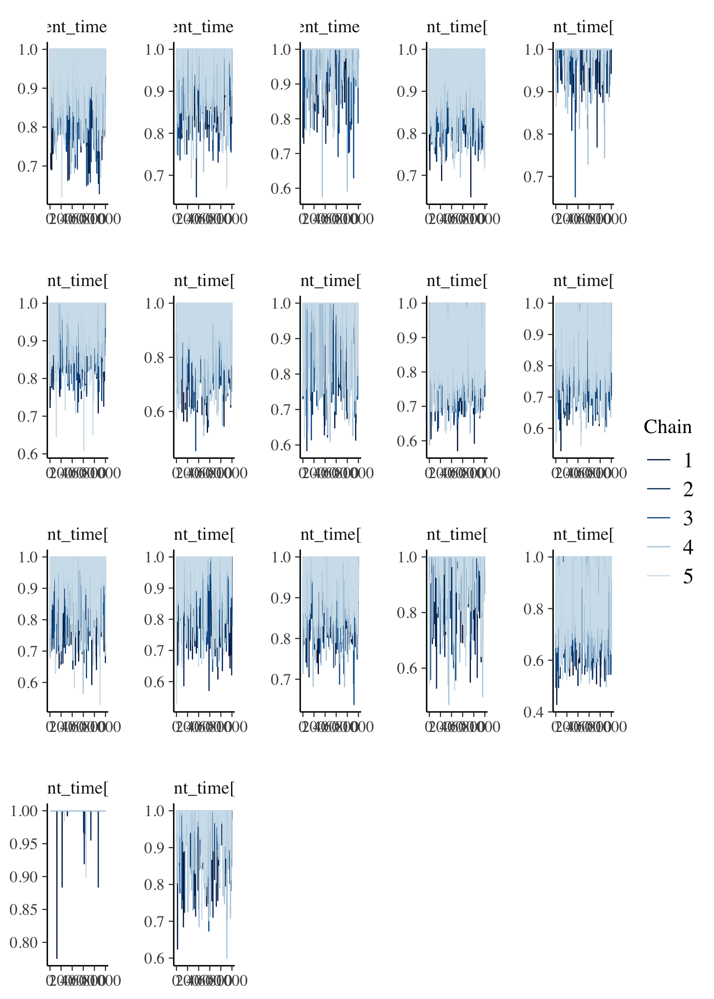

```{r setup, include = FALSE, cache = FALSE, message = FALSE, warning = FALSE, comment = NA}
options(width = 9999)
knitr::opts_chunk$set(echo = TRUE, cache = TRUE)
```
\newcommand{\pd}{\text{p}}

# Testing / thinking notes 

- Some testing shows that the low acceptance is because the event indicator changes from $0 \rightarrow 1$ or $1 \rightarrow 0$ for too many individuals at the same time, causing huge differences in the log-posterior

# Multi stage sampling component at a time.

- Assume that $\phi_{2 \cap 3}$ is fixed, and we are only melding $\pd_{1}$ and $\pd_{2}$.
- Assume we're doing product of experts, so that we don't have to think about prior marginals.
- In stage 1 we have sampled the survival model subposterior 
\[
  \pd_{1}(\phi_{1 \cap 2}, \psi_{1} \mid Y_{1}) \propto \pd_{1}(\phi_{1 \cap 2}, \psi_{1}, Y_{1})
\]
- Note that $\phi_{1 \cap 2} = (\{T_{1}, \delta_{1}\}, \{T_{2}, \delta_{2}\}, \ldots, \{T_{N}, \delta_{N}\})$.
- The target is $\pd_{\text{meld}}(\phi_{1 \cap 2}, \psi_{1}, \psi_{2}, \mid Y_{1}, Y_{2}, \phi_{2 \cap 3})$.
- The high level plan is to do MH-within-Gibbs for $(\phi_{1 \cap 2}, \psi_{1} \mid \psi_{2})$ and $(, )\psi_{2} \mid \phi_{1 \cap 2}, \psi_{1})$.
- We can sample $\psi_{2}$ in this latter step using any MCMC method we like.
- In our case $\phi_{1 \cap 2}$ has moderate dimension, so we'd like to update it component at a time, to increase the mixing speed of the Markov chain.

## Step 1 of $N$ -- updating individual 1 and $\psi_{1}$

- I think we have to update $\psi_{1}$ in the first step of the scan, otherwise this doesn't make any sense
- The proposal distribution is proportional to $\pd_{1}(\phi_{1 \cap 2}, \psi_{1}, Y_{1})$
- The target is proportional to $\pd_{1}(\phi_{1 \cap 2}, \psi_{1}, Y_{1})\pd_{2}(\phi_{1 \cap 2}, \phi_{2 \cap 3}, \psi_{2}, Y_{2})$.
- Say we are at time $t - 1$ and we are in the process of producing a sample for time $t$.
- In this first step of the scan we will update $\{T_{1}, \delta_{1}\}$ and $\psi_{1}$.
- The acceptance probability is
  \begin{equation}
  \frac {
    \pd_{1}(\{T_{1}^{*}, \delta_{1}^{*}\}, \{T_{2}, \delta_{2}\}, \ldots, \{T_{N}, \delta_{N}\}, \psi_{1}^{*}, Y_{1})
    \pd_{2}(\{T_{1}^{*}, \delta_{1}^{*}\}, \{T_{2}, \delta_{2}\}, \ldots, \{T_{N}, \delta_{N}\}, \phi_{2 \cap 3}, \psi_{2}, Y_{2})
  } {
    \pd_{1}(\{T_{1}, \delta_{1}\}, \{T_{2}, \delta_{2}\}, \ldots, \{T_{N}, \delta_{N}\}, \psi_{1}, Y_{1})
    \pd_{2}(\{T_{1}, \delta_{1}\}, \{T_{2}, \delta_{2}\}, \ldots, \{T_{N}, \delta_{N}\}, \phi_{2 \cap 3}, \psi_{2}, Y_{2})
  }
  \frac{
    \pd_{1}(\{T_{1}, \delta_{1}\}, \{T_{2}, \delta_{2}\}, \ldots, \{T_{N}, \delta_{N}\}, \psi_{1}, Y_{1})
  } {
    \pd_{1}(\{T_{1}^{*}, \delta_{1}^{*}\}, \{T_{2}, \delta_{2}\}, \ldots, \{T_{N}, \delta_{N}\}, \psi_{1}^{*}, Y_{1})
  }
  \end{equation}
- This proposal is precisely that obtained by drawing a random sample/index from the stage one samples and using it as a proposal for $\psi_{1}$ and $\{T_{1}, \delta_{1}\}$ alone.
- All $\pd_{1}$ terms here are identical, thus cancelling in the acceptance probability calculations.
- This leaves us with
  \begin{equation}
  \frac {
    \pd_{2}(\{T_{1}^{*}, \delta_{1}^{*}\}, \{T_{2}, \delta_{2}\}, \ldots, \{T_{N}, \delta_{N}\}, \phi_{2 \cap 3}, \psi_{2}, Y_{2})
  } {
    \pd_{2}(\{T_{1}, \delta_{1}\}, \{T_{2}, \delta_{2}\}, \ldots, \{T_{N}, \delta_{N}\}, \phi_{2 \cap 3}, \psi_{2}, Y_{2})
  }
  \end{equation}
- We can exploit the fact that $\psi_{2}$ is fixed at this moment, $\psi_{2 \cap 3}$ and $Y_{2}$ are always fixed, and the structure of our model[^checked] so that the acceptance probability reduces down to:
  \begin{equation}
    \alpha(\{T_{1}^{*}, \delta_{1}^{*}\}, \psi_{1}^{*}, \{T_{1}, \delta_{1}\}, \psi_{1}) =
    \frac{
      \pd_{2}(\{T_{1}^{*}, \delta_{1}^{*}\} \mid \phi_{2 \cap 3}, \psi_{2}, Y_{2})
    } {
      \pd_{2}(\{T_{1}, \delta_{1}\} \mid \phi_{2 \cap 3}, \psi_{2}, Y_{2})
    }
    = 
    \frac {
      \left(
        (T_{1}^{*})^{\gamma - 1} \exp\{\alpha \eta_{1, 1} T_{1}^{*}\} 
      \right)^{\delta^{*}_{1}}    
      \exp\left\{
        -\int_{0}^{T_{1}^{*}} u^{\gamma - 1} \exp\{\alpha \eta_{1, 1} u\}\text{d}u 
      \right\}
    } {
      \left(
        T_{1}^{\gamma - 1} \exp\{\alpha \eta_{1, 1} T_{1}\}
      \right)^{\delta_{1}}
      \exp\left\{
        -\int_{0}^{T_{1}} u^{\gamma - 1} \exp\{\alpha \eta_{1, 1} u\}\text{d}u 
      \right\}
    }
  \end{equation}
- Note that this means the acceptance probabilities for $\psi_{1}$ entirely depend on the acceptance probability of $\{T_{1}, \delta_{1}\}$. If individual 1 is a definite event/non-event, then we will lean nothing more about $\psi_{1}$.
- Say we accept $\{T_{1}^{*}, \delta_{1}^{*}\}, \psi_{1}^{*}$. To ensure these accepted samples are distinct in the next step, I will denote them $\{T_{1}^{[t]}, \delta_{1}^{[t]}\}, \psi_{1}^{[t]}$

[^checked]: I have done the maths for this elsewhere

## Step 2 to $N$ -- updating all other individuals one-at-a-time

- We will now try and update individual 2: $\{T_{2}, \delta_{2}\}$.
- We will do so by randomly sampling a $\{T_{2}^{*}, \delta_{2}^{*}\}$ from the stage one samples.
- The acceptance probability here is 
  \begin{equation}
    \frac {
      \pd_{1}(\{T_{1}^{[t]}, \delta_{1}^{[t]}\}, \{T_{2}^{*}, \delta_{2}^{*}\}, \ldots, \{T_{N}, \delta_{N}\}, \psi_{1}^{[t]}, Y_{1})
      \pd_{2}(\{T_{1}^{[t]}, \delta_{1}^{[t]}\}, \{T_{2}^{*}, \delta_{2}^{*}\}, \ldots, \{T_{N}, \delta_{N}\}, \phi_{2 \cap 3}, \psi_{2}, Y_{2})
    } {
      \pd_{1}(\{T_{1}^{[t]}, \delta_{1}^{[t]}\}, \{T_{2}, \delta_{2}\}, \ldots, \{T_{N}, \delta_{N}\}, \psi_{1}^{[t]}, Y_{1})
      \pd_{2}(\{T_{1}^{[t]}, \delta_{1}^{[t]}\}, \{T_{2}, \delta_{2}\}, \ldots, \{T_{N}, \delta_{N}\}, \phi_{2 \cap 3}, \psi_{2}, Y_{2})
    }
    \frac{
      \pd_{1}(\{T_{1}, \delta_{1}\}, \{T_{2}, \delta_{2}\}, \ldots, \{T_{N}, \delta_{N}\}, \psi_{1}, Y_{1})
    } {
      \pd_{1}(\{T_{1}, \delta_{1}\}, \{T_{2}^{*}, \delta_{2}^{*}\}, \ldots, \{T_{N}, \delta_{N}\}, \psi_{1}, Y_{1})
    }
  \end{equation}
- The thing to note here is that the stage one proposal is __not__ the same as the stage one term in the stage two target.
- However, because $\phi_{1 \cap 2}$ is a model derived quantity we can exploit the conditional independence $\pd_{1}(\phi_{1 \cap 2}, \psi_{1}, Y_{1}) = \pd_{1}(\{T_{1}, \delta_{1}\} \mid \psi_{1}, Y_{1}) \cdots \pd_{1}(\{T_{N}, \delta_{N}\} \mid \psi_{1}, Y_{1}) \pd_{1}(\psi_{1}, Y_{1})$.
- Thus, 
  \begin{equation}
    \frac {
      \pd_{1}(\{T_{1}^{[t]}, \delta_{1}^{[t]}\}, \mid \psi_{1}^{[t]}, Y_{1})  
      \pd_{1}(\{T_{2}^{*}, \delta_{2}^{*}\}, \mid \psi_{1}^{[t]}, Y_{1})
      \cdots 
      \pd_{1}(\{T_{N}, \delta_{N}\} \mid \psi_{1}^{[t]}, Y_{1})
      \pd_{1}(\psi_{1}^{[t]}, Y_{1})
      \pd_{2}(\{T_{1}^{[t]}, \delta_{1}^{[t]}\}, \{T_{2}^{*}, \delta_{2}^{*}\}, \ldots, \{T_{N}, \delta_{N}\}, \phi_{2 \cap 3}, \psi_{2}, Y_{2})
    } {
      \pd_{1}(\{T_{1}^{[t]}, \delta_{1}^{[t]}\}, \mid \psi_{1}^{[t]}, Y_{1})  
      \pd_{1}(\{T_{2}, \delta_{2}\}, \mid \psi_{1}^{[t]}, Y_{1})
      \cdots 
      \pd_{1}(\{T_{N}, \delta_{N}\} \mid \psi_{1}^{[t]}, Y_{1})
      \pd_{1}(\psi_{1}^{[t]}, Y_{1})
      \pd_{2}(\{T_{1}^{[t]}, \delta_{1}^{[t]}\}, \{T_{2}, \delta_{2}\}, \ldots, \{T_{N}, \delta_{N}\}, \phi_{2 \cap 3}, \psi_{2}, Y_{2})
    }
    \frac{
      \pd_{1}(\{T_{1}, \delta_{1}\} \mid \psi_{1}, Y_{1}) 
      \pd_{1}(\{T_{2}, \delta_{2}\} \mid \psi_{1}, Y_{1})
      \cdots 
      \pd_{1}(\{T_{N}, \delta_{N}\} \mid \psi_{1}, Y_{1})
      \pd_{1}(\psi_{1}, Y_{1})
    } {
      \pd_{1}(\{T_{1}, \delta_{1}\} \mid \psi_{1}, Y_{1}) 
      \pd_{1}(\{T_{2}^{*}, \delta_{2}^{*}\} \mid \psi_{1}, Y_{1})
      \cdots 
      \pd_{1}(\{T_{N}, \delta_{N}\} \mid \psi_{1}, Y_{1})
      \pd_{1}(\psi_{1}, Y_{1})
    }
  \end{equation}
- Which, as we hoped, simplifies to:
  \begin{equation}
    \frac {
      \pd_{1}(\{T_{2}^{*}, \delta_{2}^{*}\}, \mid \psi_{1}^{[t]}, Y_{1})
      \pd_{2}(\{T_{1}^{[t]}, \delta_{1}^{[t]}\}, \{T_{2}^{*}, \delta_{2}^{*}\}, \ldots, \{T_{N}, \delta_{N}\}, \phi_{2 \cap 3}, \psi_{2}, Y_{2})
    } {
      \pd_{1}(\{T_{2}, \delta_{2}\}, \mid \psi_{1}^{[t]}, Y_{1})
      \pd_{2}(\{T_{1}^{[t]}, \delta_{1}^{[t]}\}, \{T_{2}, \delta_{2}\}, \ldots, \{T_{N}, \delta_{N}\}, \phi_{2 \cap 3}, \psi_{2}, Y_{2})
    }
    \frac{
      \pd_{1}(\{T_{2}, \delta_{2}\} \mid \psi_{1}, Y_{1})
    } {
      \pd_{1}(\{T_{2}^{*}, \delta_{2}^{*}\} \mid \psi_{1}, Y_{1})
    }\\
    = 
    \frac {
      \pd_{2}(\{T_{1}^{[t]}, \delta_{1}^{[t]}\}, \{T_{2}^{*}, \delta_{2}^{*}\}, \ldots, \{T_{N}, \delta_{N}\}, \phi_{2 \cap 3}, \psi_{2}, Y_{2})
    } {
      \pd_{2}(\{T_{1}^{[t]}, \delta_{1}^{[t]}\}, \{T_{2}, \delta_{2}\}, \ldots, \{T_{N}, \delta_{N}\}, \phi_{2 \cap 3}, \psi_{2}, Y_{2})
    }
  \end{equation}
- As we saw in the previous section, we can condition on $\phi_{2 \cap 3}, \psi_{2}, Y_{2}$ and further simplify this to
  \begin{equation}
    \alpha(\{T_{2}^{*}, \delta_{2}^{*}\}, \{T_{2}, \delta_{2}\}, ) =
    \frac{
      \pd_{2}(\{T_{2}^{*}, \delta_{2}^{*}\} \mid \phi_{2 \cap 3}, \psi_{2}, Y_{2})
    } {
      \pd_{2}(\{T_{2}, \delta_{2}\} \mid \phi_{2 \cap 3}, \psi_{2}, Y_{2})
    }
    = 
    \frac {
      \left(
        (T_{2}^{*})^{\gamma - 1} \exp\{\alpha \eta_{2, 1} T_{2}^{*}\} 
      \right)^{\delta^{*}_{2}}
      \exp\left\{
        -\int_{0}^{T_{2}^{*}} u^{\gamma - 1} \exp\{\alpha \eta_{2, 1} u\}\text{d}u 
      \right\}
    } {
      \left(
        T_{2}^{\gamma - 1} \exp\{\alpha \eta_{2, 1} T_{2}\}
      \right)^{\delta_{2}}
      \exp\left\{
        -\int_{0}^{T_{2}} u^{\gamma - 1} \exp\{\alpha \eta_{2, 1} u\}\text{d}u 
      \right\}
    }
  \end{equation}
- Note that we could not update $\psi_{1}$ in this second step because we would end up with a $\pd_{1}(\{T_{1}^{[t]}, \delta_{1}^{[t]}\} \mid \psi_{1}^{{*}})$ term that would not cancel with the $\pd_{1}(\{T_{1}, \delta_{1}\} \mid \psi_{1}^{{*}})$ term in the proposal.
- There is nothing special about individual 1 -- we could update any individual in step 1 (random scan Gibbs), it's just that we need to update $\psi_{1}$ in the first step of the scan.
    - Indeed this seems like the best idea.

# Implementation notes

- This should probably be a function? Should it be it's own stan file?
  - yes, why not -- useful in a number of settings
- How do we avoid losing all the gains from simplifying the evaluation to parameter packing/unpacking?
  - These are fairly insignificant

# Results

- Very happy:

```{r new_mixing_plots}
 
 ```
