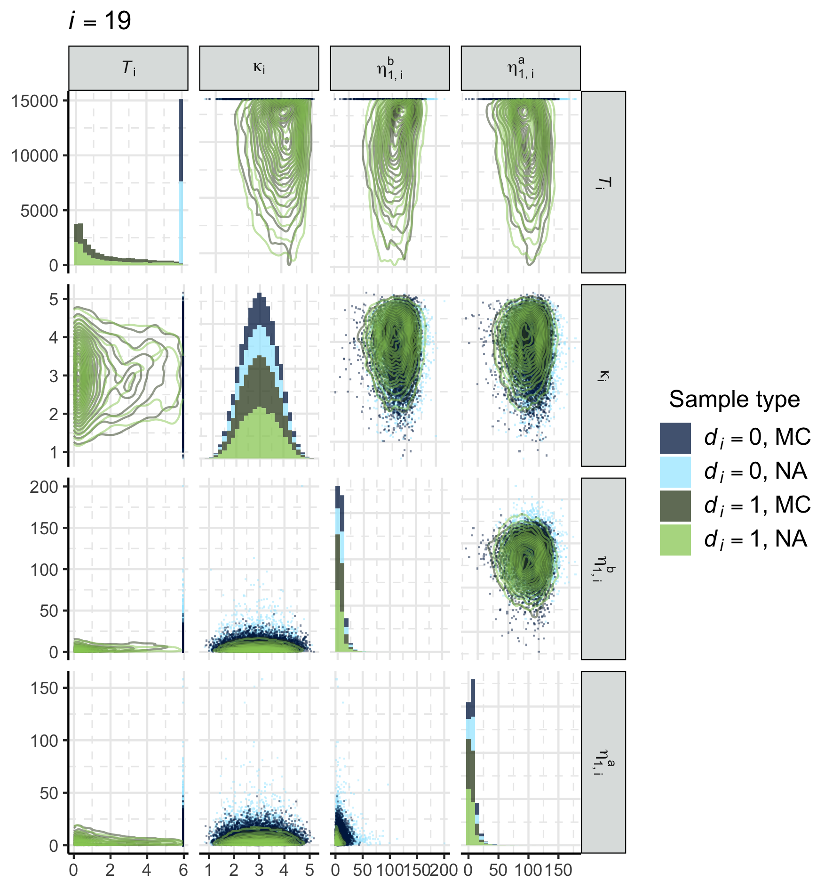

<!--
Rscript -e 'rmarkdown::render("rmd-reports/2021-05-06_survival-pooling.rmd")'
-->

```{r setup, include = FALSE, cache = FALSE, message = FALSE, warning = FALSE, comment = NA}
options(width = 9999)
knitr::opts_chunk$set(
  echo = FALSE, cache = FALSE, fig.align = 'center')
```

# Models

There are $i = 1, \ldots, N$ individuals (icustays) in the data set.
Each individual is admitted to the ICU at time $0$, and is discharged or dies at time $C_{i}$.
See appendix \ref{cohort-selection-criteria} for information on $N$ and how the individuals were selected from MIMIC-III.

## P/F ratio model (B-spline): $\pd_{1}$

Each individual has P/F ratio observations $z_{i, j}$ at times $t_{i, j}$, with $j = 1, \ldots, J_{i}$.
For each individual denote the vector of observations $\boldsymbol{z}_{i} = (z_{i, 1}, \ldots, z_{i, J_{i}})$ and observation times $\boldsymbol{t}_{i} = (t_{i, 1}, \ldots, t_{i, J_{i}})$.
To improve computational performance, we standardise the P/F data for each individual such that $z_{i, j} = \frac{\tilde{z}_{i, j} - \overline{z}_{i}}{\hat{s}_{i}}$, where $\tilde{z}_{i, j}$ is the underlying unstandardised observation with mean $\overline{z}_{i}$ and standard deviation $\hat{s}_{i}$.
Similarly we rescale the threshold for respiratory failure: $\tau_{i} = \frac{300 - \overline{z}_{i}}{\hat{s}_{i}}$.

We choose to model the P/F ratio using a B-spline of degree 3, with 2 boundary knots and 7 internal knots, and do not include an intercept column in the spline basis.
The internal knots are evenly spaced between the two boundary knots at $\min(\boldsymbol{t_{i}})$ and $\max(\boldsymbol{t_{i}})$.
These choices result in $k = 1, \ldots, 10$ spline basis terms per individual, with coefficients $\zeta_{i, k}$ where $\boldsymbol{\zeta}_{i} = (\zeta_{i, 1}, \ldots, \zeta_{i, 10})$.
We denote the individual specific B-spline basis evaluated at time $t_{i, j}$ as $B_{i}(t_{i, j}) \in \mathbb{R}_{+} \cup \{0\}$ so that the submodel can be written as
\begin{equation}
  z_{i, j} = \beta_{0, i} + B_{i}(t_{i, j})\boldsymbol{\zeta}_{i} + \varepsilon_{i, j}
\end{equation}
BROAD COMMENT ON PRIOR CHOICES EG WEAKLY INFORMATIVE?
\begin{equation}
  \beta_{0, i} \sim \text{N}(0, 1^2), \,\, \varepsilon_{i, j} \sim t_{5}(0, \omega), \,\,  \omega \sim \text{N}_{+}(0, 1^2).
\end{equation}
For the spline basis coefficients we set $\zeta_{i, 1} \sim \text{N}(0, 0.5^2)$, and for $k = 2, \ldots, 10$ we employ a random-walk prior $\zeta_{i, k} \sim \text{N}(\zeta_{i, k - 1}, 0.5^2)$.

If a solution to the following optimisation problem exists, then we conclude that a respiratory failure event $d_{i} = 1$ occurred at event time $T_{i}$.
\begin{equation}
  T_{i} = \min_{t} \left\{
    \tau_{i} = \beta_{0, i} + B_{i}(t)\boldsymbol{\zeta}_{i}
    \mid
    t \in [\max(0, \min(\boldsymbol{t_{i}})), \max(\boldsymbol{t_{i}})]
  \right\},
  \label{eqn:event_time_model_def}
\end{equation}
We use a standard multiple root finder [@soetaert_rootsolve_2020] to obtain a solution.
If there are no roots then the individual died or was discharged before respiratory failure occurred so we set $T_{i} = C_{i}$ and $d_{i} = 0$.


We define $\phi_{1 \cap 2} = (\{T_{i}, d_{i}\}_{i = 1}^{N})$ noting that $\pd_{1}(\phi_{1 \cap 2}) = \prod_{i = 1}^{N}\pd_{1, i}(T_{i}, d_{i})$.
It is also important to note that $\pd_{1, i}(T_{i}, d_{i})$ conditions on each individual's length of stay (in specifying the location of the knots), as well as the range, mean, and standard deviation of the P/F data (by standardising the $\tilde{z}_{i, j}$).
The analytic form of $\pd_{1, i}(T_{i}, d_{i})$ is not available and must be estimated, which we discuss in Section \ref{estimating-submodel-prior-marginal-distributions}.

To align with our chained melding notation we define $Y_{1} = (\{\boldsymbol{z}_{i}, \boldsymbol{t}_{i}\}_{i = 1}^{N})$ and $\psi_{1} = (\{\beta_{0, i}, \boldsymbol{\zeta}_{i}\}_{i = 1}^{N}, \omega)$.
THINK YOU HAVE FORGOTTEN EPSILON?

## Cumulative fluid model (piecewise linear) $\pd_{3}$

We model the 24-hourly cumulative fluid balance data $x_{i, l}$ (in litres) at times $u_{i, l}$, $l = 1, \ldots, L_{i}$.
The cumulative data are derived from the raw fluid balance observations[^fluidobs].
We denote the complete vector of observations by $\boldsymbol{x}_{i} = (x_{i, 1}, \ldots, x_{i, L_{i}})$ and times by $\boldsymbol{u}_{i} = (u_{i, 1}, \ldots, u_{i, L_{i}})$.

We assume a piecewise linear model, with slope $\eta_{1, i}^{b}$ before the breakpoint at time $\kappa_{i}$, and slope $\eta_{1, i}^{a}$ after the breakpoint.
\begin{equation}
  x_{i, l} = \eta_{0, i} + \eta^{b}_{1, i}(u_{i, l} - \kappa_{i})\boldsymbol{1}_{\{u_{i, l} < \kappa_{i}\}} + \eta^{a}_{1, i}(u_{i, l} - \kappa_{i})\boldsymbol{1}_{\{u_{i, l} \geq \kappa_{i}\}} + \epsilon_{i, l} \\
   \label{eqn:piecewise-fluid-model}
\end{equation}

The parameters for the gamma prior for $\eta^{b}_{1, i}$ and $\eta^{a}_{1, i}$ are obtained by assuming that the 2.5-, 50-, and 97.5- percentiles are at 0.5, 5, and 20 [@belgorodski_rriskdistributions_2017].
A slope of $0.5$ (i.e. the change in cumulative fluid balance per day) is unlikely but possible due to missing data; a slope of $20$ is also unlikely but possible as extremely unwell patients can have very high respiratory rates and thus require large fluid inputs.
\begin{equation}
\begin{gathered}
  \eta^{b}_{1, i} \sim \text{Gamma}(1.53, 0.24), \,\, \eta^{a}_{1, i} \sim \text{Gamma}(1.53, 0.24), \\
  \epsilon_{i, l} \sim \text{N}(0, \sigma^{2}_{x}),  \,\, \sigma_{x} \sim \text{N}_{+}(0, 5^2).
\end{gathered}
\end{equation}

The prior for the breakpoint $\kappa_{i}$ is derived as follows.
Define $u_{i, (1)} = \min(\boldsymbol{u}_{i})$ and $u_{i, (n)} = \max(\boldsymbol{u}_{i})$, with $r_{i} = u_{i, (n)} - u_{i, (1)}$.
We reparameterise the breakpoint by noting that $\kappa_{i} = \kappa^{\text{raw}}_{i}r_{i} + u_{i, (1)}$, where $\kappa^{\text{raw}} \in [0, 1]$.
We then set $\kappa^{\text{raw}}_{i} \sim \text{Beta}(5, 5)$ to regularise the breakpoint towards the middle of each individual's stay in ICU.
This is crucial to ensure the submodel is identifiable when there is little evidence of a breakpoint in the data.

Specifying a prior for $\eta_{0, i}$, the cumulative fluid balance at $\kappa_{i}$, is difficult because it depends on the length of stay.
Instead, we reparameterise so that $\eta_{0, i}$ is a function of the y-intercept $\eta_{0, i}^{\text{raw}}$.
\begin{equation}
  \eta_{0, i} =
    (\eta_{0, i}^{\text{raw}} + \eta^{b}_{1, i} \kappa_{i}) \boldsymbol{1}_{\{0 < \kappa_{i}\}} +
    (\eta_{0, i}^{\text{raw}} + \eta^{a}_{1, i} \kappa_{i}) \boldsymbol{1}_{\{0 \geq \kappa_{i}\}}
\end{equation}
We place a $\text{LogNormal}(1.61, 0.47^2)$ prior on $\eta_{0, i}^{\text{raw}}$.
These values are obtained assuming that, a priori, the $2.5\%, 50\%$, and $99\%$ percentiles of $\eta_{0, i}^{\text{raw}}$ are $0.5, 5$, and $15$ respectively [@belgorodski_rriskdistributions_2017].
This is a broad prior that reflects the numerous possible admission routes into the ICU.
We expect those admitted from the wards to have little pre-admission fluid data.
Those admitted from the operating theatre often have their in-theatre fluid input recorded after admission into the ICU, with no easy way to distinguish these records in the data.

To align with our melding notation we define $m_{i}(t) = \eta_{0, i} + \eta^{b}_{1, i}(t - \kappa_{i})\boldsymbol{1}_{\{t < \kappa_{i}\}} + \eta^{a}_{1, i}(t - \kappa_{i})\boldsymbol{1}_{\{t \geq \kappa_{i}\}}$, with $\phi_{2 \cap 3} = \left(\{\eta^{b}_{1, i}, \eta^{a}_{1, i}, \kappa_{i}\}_{i = 1}^{N}\right)$, $Y_{3} = (\{\boldsymbol{x}_{i}, \boldsymbol{u}_{i}\}_{i = 1}^{N})$, and $\psi_{3} = (\{\eta_{0, i}\}_{i = 1}^{N}, \sigma^{2}_{x})$.
Note that we have explicit, analytic priors for the components of $\phi_{2 \cap 3}$, and
\begin{equation}
  \pd_{3}(\phi_{2 \cap 3}) = \prod_{i = 1}^{N} \pd(\eta^{b}_{1, i}) \pd(\eta^{a}_{1, i}) \pd(\kappa_{i}), \,\, \text{with} \,\,\,
  \pd(\kappa_{i}) = \pd_{\kappa^{\text{raw}}_{i}}(\frac{\kappa_{i} - u_{i, (1)}}{r_{i}}) \frac{1}{r_{i}}
\end{equation}
by the change of variables formula.

[^fluidobs]: Details about the derivation of these values from the raw fluid data are contained in Appendix \ref{calculating-the-cumulative-fluid-balance-from-the-raw-fluid-data}.

## Survival submodel $\pd_{2}$

Individuals experience respiratory failure ($d_{i} = 1$) at time $T_{i}$, or are censored[^competerisks] $(d_{i} = 2, T_{i} = C_{i})$.
We assume a Weibull hazard with shape parameter $\gamma$ for the event times.
All individuals have $b = 1, \ldots, B$ baseline (time invariant) covariates $w_{i, b}$ with $\boldsymbol{w}_{i} = (1, w_{i, 1}, \ldots, w_{i, B})$(i.e. including an intercept term), and coefficient $\theta \in \mathbb{R}^{B + 1}$.
The hazard is assumed to be influenced by these covariates and the rate of increase $\frac{\partial}{\partial t} m_{i}(t)$ in the cumulative fluid balance.
The strength of the latter relationship is captured by $\alpha$.
Hence, the hazard is
\begin{gather}
  h_{i}(T_{i}) = \gamma T_{i}^{\gamma - 1} \exp\left\{\boldsymbol{w}_{i}\theta + \alpha \frac{\partial}{\partial T_{i}} m_{i}(T_{i})\right\} \\
  \frac{\partial}{\partial T_{i}} m_{i}(T_{i}) = \eta^{b}_{1, i}\boldsymbol{1}_{\{T_{i} < \kappa_{i}\}} + \eta^{a}_{1, i}\boldsymbol{1}_{\{T_{i} \geq \kappa_{i}\}},
\end{gather}
POSSIBLY THE RATE DEFINITION SHOULD GO IN PREVIOUS SECTION?

The survival probability $S_{i}(T_{i}) = \exp\{-\int_{0}^{T_{i}}h_{i}(u)\text{d}u\}$ has an analytic form, which we derive in Appendix \ref{analytic-form-for-the-survival-probability}
The likelihood for the submodel is
\begin{equation}
  \pd(T_{i}, d_{i} \mid \gamma, \boldsymbol{\theta}, \alpha, \kappa_{i}, \eta_{1, i}^{b}, \eta_{1, i}^{a}, \boldsymbol{w}_{i}) = h_{i}(T_{i})^{d_{i}} S_{i}(T_{i}), \\
\end{equation}
where we suppress the dependence on the parameters on the right hand side for brevity.

Our prior for $(\gamma, \alpha, \boldsymbol{\theta})$ must result in a plausible distribution for $\pd_{2, i}(T_{i} \mid d_{i} = 1)$, and a reasonable balance between $d_{i} = 1$ and $d_{i} = 0$ events.
The primary concern is unintentionally specifying a prior for which the bulk of $\pd_{2, i}(T_{i} \mid d_{i} = 1)$ is very close to zero.
In addition, certain extreme configurations of $(\gamma, \alpha, \boldsymbol{\theta})$ cause issues for the methodology of @crowther_simulating_2013, particularly the numerical root finding and numerical integration steps.
MENTION OF CROWTHER IS HARD TO UNDERSTAND AT THIS POINT, SINCE NEED TO SIMUALTE FROM PRIOR NOT YET EXPLAINED - IN ANY CASE, I THINK WE DONT NEED TO WORK TOO HARD TO EXPLAIN OUR DESIRE FOR A SENSIBLE PRIOR, SO COULD DROP CROWTHER ARGUMENT HERE?
We would like to rule out such extreme configurations a priori.
Ideally we would encode this information a joint prior for $(\gamma, \alpha, \boldsymbol{\theta})$, but specifying the appropriate correlation structure for these parameters is prohibitively challenging.
Instead we focus on specifying appropriate marginals for each of $\gamma, \alpha$, and $\boldsymbol{\theta}$, and create visual prior predictive checks [@gabry_visualization_2019; @gelman_bayesian_2020] to ensure the induced prior for $(T_{i}, d_{i})$ is acceptable.

Before justifying our chosen marginal priors is, we note that the $\exp\{\boldsymbol{x}_{i}\theta + \alpha \frac{\partial}{\partial T_{i}} m_{i}(T_{i})\}$ term implies that the priors for $\theta$ and $\alpha$ are on the log-scale.
Hence the magnitude of these parameters must be small, otherwise all event times would be very near zero or at infinity.
The non-symmetric effect of the transformation from the log scale also implies that symmetric priors are not obviously sensible.
From these observations we deduce that $\theta$ and $\alpha$ must not be too large in magnitude, however if they are negative then they can be slightly larger.
Hence, we specify the skew-normal priors detailed in Equation \eqref{eqn:surv-submodel-prior-def}, noting that the skewness parameter for $\alpha$ is smaller, because $\frac{\partial}{\partial T_{i}} m_{i}(T_{i})$ is strictly positive and typically between 0.5 and 20, whilst $\boldsymbol{w}_{i}$ is standardised to be approximately standard normal.
Lastly, if $\gamma$ is too far away from $1$ (in either direction), then the event times are very small either because the hazard increases rapidly ($\gamma \gg 1$), or because almost all of the cumulative hazard is in the neighbourhood of 0 ($\gamma \ll 1$).
We specify a gamma distribution for $\gamma$ with the $1$\textsuperscript{th}-, $50$\textsuperscript{th}-, and $99$\textsuperscript{th}-percentiles of $\pd_{2}(\gamma)$ are at $0.2, 1$, and $2$, allowing for a wide range of hazard shapes, but removing many of the extremes.

Our final priors are
\begin{equation}
\begin{gathered}
  \gamma \sim \text{Gamma}(9.05, 8.72), \, \,
  \alpha \sim \text{SkewNormal}(0, 0.5, -2), \\
  \theta_{1} \sim \text{N}(\hat{E}, 0.5^2), \, \,
  (\theta_{2}, \ldots, \theta_{B + 1}) \sim \text{SkewNormal}(0, 0.5, -1),
  \label{eqn:surv-submodel-prior-def}
\end{gathered}
\end{equation}
where $\hat{E}$ is the log of the crude event rate [@brilleman_bayesian_2020], and $\boldsymbol{I}_{p}$ is the $p \times p$ identity matrix.
We adopt the same priors as the cumulative fluid balance submodel for $\kappa_{i}, \eta_{1, i}^{b}$, and $\eta_{1, i}^{a}$.

[^competerisks]: The relationship between this model and the competing risks approach is discussed in Appendix \ref{a-comparison-with-the-competing-risk-approach}

# Estimating submodel prior marginal distributions

We must estimate $\pd_{1}(\phi_{1 \cap 2})$ and $\pd_{2}(\phi_{1 \cap 2}, \phi_{2 \cap 3})$.
Because these distributions are functions of discrete and continuous parameters, and some of the latter have different supports, standard kernel density estimation as suggested by @goudie_joining_2019 is inappropriate.
Instead we fit appropriate parametric mixture distributions using Monte Carlo samples from the priors.

## PF submodel

We approximate $\pd_{1}(\phi_{1 \cap 2})$ using a mixture of discrete and continuous distributions, with a discrete spike at $C_{i}$ for the censored events and a beta distribution for the (rescaled) event times.
Monte Carlo samples of $T_{i}$ and $d_{i}$ are obtained from $\pd_{1, i}(T_{i}, d_{i})$ by drawing $\beta_{0, i}$ and $\boldsymbol{\zeta}_{i}$ from their respective prior distributions and then solving \eqref{eqn:event_time_model_def}.
Denoting the estimated mixture weight $\widehat{\pi}_{i} \in [0, 1]$, the density estimate is
\begin{equation}
  \widehat{\pd}_{1, i}(T_{i}, d_{i}) =
    \widehat{\pi}_{i} \, \text{Beta}\left(\frac{T_{i}}{C_{i}}; \widehat{a}, \widehat{b}\right) \frac{1}{C_{i}} \boldsymbol{1}_{\{d_{i} = 1\}} +
    (1 - \widehat{\pi}_{i}) \boldsymbol{1}_{\{d_{i} = 2, T_{i} = C_{i}\}}
  \label{eqn:pf-event-time-prior-dist}
\end{equation}
where $\widehat{\pi}_{i}, \widehat{a}_{i}$ and $\widehat{b}_{i}$ are maximum likelihood estimates obtained using the prior samples.
Examples of $\widehat{\pd}_{1, i}(T_{i}, d_{i})$ for a subset of individuals are displayed in Figure \ref{fig:pf_prior_fit}.

```{r pf_prior_fit, fig.cap = "Fitted distribution (curve) and Monte Carlo samples drawn from the prior (histogram) for a subset of the individuals in the cohort. The height of the atom at $C_{i}$ (red bar) has been set to $1 - \\widehat{\\pi}_{i}$"}
knitr::include_graphics("../plots/mimic-example/pf-prior-plot-small.pdf")
```

## Survival submodel

Our estimate of $\pd_{2}(\phi_{1 \cap 2}, \phi_{2 \cap 3})$ relies on the fact that $\pd_{2}(\phi_{1 \cap 2}, \phi_{2 \cap 3}) = \prod_{i = 1}^{N}\pd_{2, i}(T_{i}, d_{i}, \kappa_{i}, \eta^{b}_{1, i}, \eta^{a}_{1, i})$.
As such we estimate $\pd_{2, i}(T_{i}, d_{i}, \kappa_{i}, \eta^{b}_{1, i}, \eta^{a}_{1, i})$ for each individual and take the product of these estimates.
Drawing samples from $\pd_{2, i}(T_{i}, d_{i}, \kappa_{i}, \eta^{b}_{1, i}, \eta^{a}_{1, i})$ is challenging: we use the approach proposed by @crowther_simulating_2013 as implemented in @brilleman_simulate_2021.
Inspecting the samples reveals correlation between $(T_{i}, d_{i})$ and $(\kappa_{i}, \eta^{b}_{1, i}, \eta^{a}_{1, i})$ that we would like to capture in our estimate.
To do so, we fit a mixture of multivariate normal distributions to transformations of the continuous parameters with support on $\mathbb{R}$,
\begin{equation}
  \tilde{T}_{i} = \text{Logit}\left(\frac{T_{i}}{C_{i}}\right), \quad
  \tilde{\kappa}_{i} = \text{Logit}\left(\frac{\kappa_{i} - u_{i, (1)}}{u_{i, (n)} - u_{i, (1)}}\right), \quad
  \tilde{\eta}^{b}_{1, i} = \log(\eta^{b}_{1, i}), \quad
  \tilde{\eta}^{a}_{1, i} = \log(\eta^{a}_{1, i}).
\end{equation}
The resulting density estimate, with estimated mixture weight $\widehat{\theta}_{i} \in [0, 1]$, is
\begin{align*}
  \widehat{\pd}_{2}(T_{i}, d_{i}, \kappa_{i}, \eta^{b}_{1, i}, \eta^{a}_{1, i}) =
    \Big[&(\widehat{\theta}_{i})
    \text{N}\left(\left[\tilde{T}_{i}, \tilde{\kappa}_{i}, \tilde{\eta}^{b}_{1, i}, \tilde{\eta}^{a}_{1, i} \right]^{\top}; \widehat{\mu}_{1, i}, \widehat{\Sigma}_{1, i} \right) \
    \boldsymbol{1}_{\{d_{i} = 1\}}
    + \\
    &(1 - \widehat{\theta}_{i})
    \text{N}\left(\left[\tilde{\kappa}_{i}, \tilde{\eta}^{b}_{1, i}, \tilde{\eta}^{a}_{1, i} \right]^{\top}; \widehat{\mu}_{0, i}, \widehat{\Sigma}_{0, i} \right) \
    \boldsymbol{1}_{\{d_{i} = 0, T_{i} = C_{i}\}} \Big]
    J_{i},
\end{align*}
where $\widehat{\theta}_{i}, \widehat{\mu}_{1, i}, \widehat{\Sigma}_{1, i}, \widehat{\mu}_{0, i}$, and $\widehat{\Sigma}_{0, i}$ are maximum likelihood estimates, and the Jacobian correction $J_{i}$ is
\begin{equation}
  J_{i} = \left[
    \left(
      \frac{1}{C_{i} - T_{i}} +
      \frac{1}{T_{i}}
    \right)^{d_{i}}
    \left(
      \frac{1}{u_{i, (n)} - \kappa_{i}} +
      \frac{1}{\kappa_{i} - u_{i, (1)}}
    \right)
    \left(
      \frac{1}{\eta^{b}_{1, i}}
    \right)
    \left(
      \frac{1}{\eta^{a}_{1, i}}
    \right)
  \right].
\end{equation}

We asses the fit of this estimate by drawing samples from $\widehat{\pd}_{2, i}(\phi_{1 \cap 2}, \phi_{2 \cap 3})$ and comparing them to the Monte Carlo samples drawn using `simsurv`.
Our visual assessment is displayed in Figure \ref{fig:surv_prior_plot_fit} for individual $i = 19$.
The normal approximation seems to fit the samples well, with the shape of $\pd_{2, i}(T_{i} \mid d_{i} = 1)$ closely matching that of the Monte Carlo samples, and with a similar mix of $d_{i} = 0$ and $d_{i} = 1$ samples.

```{r surv_prior_plot_fit, fig.cap = 'Monte Carlo (MC) samples from $\\pd_{2, i}(\\phi_{1 \\cap 2}, \\phi_{2 \\cap 3})$ obtained using \\texttt{simsurv} and samples from the fitted normal approximation (NA) for $i = 19$. The panels on the off diagonal elements contain a 2D kernel density estimate for $d_{i} = 1$ and the samples for $d_{i} = 0$. Diagonal and lower-triangular panels are on their original scales, whilst the upper-triangular panels are on the log scale.'}

```

# Other details

Because the correlation between $\phi_{1 \cap 2}$ and $\phi_{2 \cap 3}$ in $\pd_{2}(\phi_{1 \cap 2}, \phi_{2 \cap 3})$ is important, we do not consider linear pooling in this example.
We consider logarithmic pooling with $\lambda = (\frac{1}{3}, \frac{1}{3}, \frac{1}{3})$ and with $\lambda = (1, 1, 1)$ (product-of-experts).

- multi-stage sampler info
  - chains / iterations / diagnostics (TODO: automate the numerical ones / table)

# Results

- comparing against propagating the medians
- Bias, some increased variance, particularly for $\alpha$.

```{r psi_2_competing_risk_plot}
knitr::include_graphics('../plots/mimic-example/psi-2-method-comparison-small.pdf')
```

- TODO: try and get the KM picture working again

# Discussion

# Bibliography

<div id="refs"></div>

<!-- Now switch to alphabetical numbering for the appendix, and reset the counter. -->
\renewcommand{\thesubsection}{\Alph{subsection}}
<!-- \setcounter{section}{0} -->

# Appendix {-}

## Calculating the cumulative fluid balance from the raw fluid data

In the raw fluid data each patient has $\tilde{l} = 1, \ldots, \tilde{L}_{i}$ observations.
Each observation $\tilde{x}_{i, \tilde{l}}$ is typically a small fluid administration (e.g. an injection of some medicine in saline solution), or a fluid discharge (almost always urine excretion).
The observations have corresponding observation times $\tilde{u}_{i, \tilde{l}}$, with $\tilde{\boldsymbol{u}}_{i} = \{\tilde{u}_{i, 1}, \ldots, \tilde{u}_{i, \tilde{L}_{i}}\}$ and $\tilde{\boldsymbol{x}}_{i} = \{\tilde{x}_{i, 1}, \ldots, \tilde{x}_{i, \tilde{L}_{i}}\}$.
We code the fluid administrations/inputs as positive values, and the excretions/outputs as negative values.
Each patient has an enormous number of raw fluid observations $(L_{i} \ll \tilde{L}_{i})$ and it is computationally infeasible to consider them all at once.
Because the time scale of interest is typically a number of days, we aggregate the raw fluid observations into 24-hourly changes in fluid balance.
From these 24-hourly changes we calculate the cumulative fluid balance.

Mathematically, we define an ordered integer-vector of boundary values
\begin{equation}
  \boldsymbol{b}_{i} = (\lfloor \min\{\tilde{\boldsymbol{u}}_{i}\} \rfloor,  \lfloor \min\{\tilde{\boldsymbol{u}}_{i}\} \rfloor + 1, \ldots, \lceil \max\{\tilde{\boldsymbol{u}}_{i}\} \rceil),
\end{equation}
noting that $\dim(\boldsymbol{b}_{i}) = L_{i} + 1$.
The raw fluid observations are then divided up into $L_{i}$ subsets of $\{\tilde{\boldsymbol{x}}_{i}, \tilde{\boldsymbol{u}}_{i}\}$ based on which boundary values the observation falls in between:
\begin{equation}
  B_{i, l} = \left\{
    \{\tilde{\boldsymbol{x}}_{i}, \tilde{\boldsymbol{u}}_{i}\}
    \mid
    b_{i, l} \leq \tilde{\boldsymbol{u}}_{i} < b_{i, l + 1}
  \right\},
\end{equation}
for $l = 1, \ldots, L_{i}$.
Denote $N^{B}_{i, l} = \lvert B_{i, l} \rvert \mathop{/} 2$ (dividing by two as $B_{i, l}$ contains both the observation and the observation time).
The $l$\textsuperscript{th} 24-hourly fluid change $\Delta_{i, l}$ and corresponding observation time $u_{i, l}$ can then be computed as
\begin{equation}
  \Delta_{i, l} = \sum_{s = 1}^{N^{B}_{i, l}} \tilde{x}_{i, s}, \,\, \text{s.t.} \,\, \tilde{x}_{i, s} \in B_{i, l}, \qquad
  u_{i, l} = \frac{1}{N^{B}_{i, l}} \sum_{s = 1}^{N^{B}_{i, l}} \tilde{u}_{i, s}, \,\, \text{s.t.} \,\, \tilde{u}_{i, s} \in B_{i, l}.
\end{equation}
Finally, the 24-hourly cumulative fluid balance data are computed by $x_{i, l} = \sum_{s = 1}^{l} \Delta_{i, s}$, and we assume they too are observed at $u_{i, l}$.

## A comparison with the competing risk approach

An alternative approach is to consider a competing risks model for $\pd_{2}$, where each individual experiences either the respiratory failure event or the competing, non-independent event of death or discharge [see Chapter 8 of @kalbfleisch_statistical_2002 for an introduction].
However, issues arise due to the difference in supports between $\pd_{1}(\phi_{1 \cap 2})$ and $\pd_{2}(\phi_{1 \cap 2})$; aligning the supports requires conditioning on $C_{i}$ (the length of stay) in $\pd_{2}$.
Conditional on $C_{i}$, the death or discharge event can only happen at a known, fixed time, which violates the competing risk assumption (that each event can occur at any moment in time the individual is exposed to both risks).
In light of this, we feel that it is more correct to consider the time of death or discharge as a censoring time.
Standard survival analyses arguments show us that these approaches are equivalent subject to certain assumptions.
However, one key these arguments make is that the survival times and indicators $(T_{i}, d_{i})$ must be known/fixed quantities.
This assumption is not valid in our example, and below we show why this invalidates the usual equivalence between the competing risk and censoring approaches.

Suppose that each individual $i$ experiences one of $d_{i} = 1, 2$ competing risks.
We observe $\{T_{i}, d_{i}\}$, where $d_{i} = 1$ indicates that individual $i$ experienced respiratory failure at time $T_{i}$.
If $d_{i} = 2$ then individual $i$ expired or was discharged at time $T_{i}$, noting that this event must occur at time $C_{i}$.
Each cause-specific hazard has parameters $\theta_{d_{i}}$ and we denote the hazard $h_{i, d_{i}}(t \mid \theta_{d_{i}}, \boldsymbol{w}_{i})$.
Denote $\boldsymbol{\theta} = (\theta_{1}, \theta_{2})$ and assume only one such event can occur at a time so that
\begin{gather}
  h_{i}(T_{i} \mid \boldsymbol{\theta}, \boldsymbol{w}_{i}) = \sum_{d_{i} \in \{1, 2\}} h_{i, d_{i}}(T_{i} \mid \theta_{d_{i}}, \boldsymbol{w}_{i}), \\
  \begin{aligned}
  H_{i}(T_{i} \mid \boldsymbol{\theta}, \boldsymbol{w}_{i})
    &= \int_{0}^{T_{i}} \sum_{d_{i} \in \{1, 2\}} h_{i, d_{i}}(u \mid \theta_{d_{i}}, \boldsymbol{w}_{i}) \text{d}u \\
    &= \sum_{d_{i} \in \{1, 2\}} \int_{0}^{T_{i}} h_{i, d_{i}}(u \mid \theta_{d_{i}}, \boldsymbol{w}_{i}) \text{d}u \\
    &= \sum_{d_{i} \in \{1, 2\}} H_{i, d_{i}}(T_{i} \mid \theta_{d_{i}}, \boldsymbol{w}_{i}),
  \end{aligned} \\
  S_{i}(T_{i} \mid \boldsymbol{\theta}, \boldsymbol{w}_{i})
    = \exp\left\{-H_{i}(T_{i} \mid \boldsymbol{\theta}, \boldsymbol{w}_{i})\right\}
    = \exp\left\{-\sum_{d_{i} \in \{1, 2\}} H_{i, d_{i}}(T_{i} \mid \theta_{d_{i}}, \boldsymbol{w}_{i})\right\}.
\end{gather}
As per Equation (8.8) in @kalbfleisch_statistical_2002 the likelihood function for a specific individual is
\begin{align*}
  \pd(T_{i}, d_{i} \mid \boldsymbol{\theta}, \boldsymbol{w}_{i})
    &= h_{i, d_{i}}(T_{i} \mid \theta_{d_{i}}, \boldsymbol{w}_{i}) S_{i}(T_{i} \mid \boldsymbol{\theta}, \boldsymbol{w}_{i}) \\
    &= h_{i, d_{i}}(T_{i} \mid \theta_{d_{i}}, \boldsymbol{w}_{i}) \exp\left\{-\sum_{d_{i} \in \{1, 2\}} H_{i, d_{i}}(T_{i} \mid \theta_{d_{i}}, \boldsymbol{w}_{i})\right\}.
\end{align*}

It is now necessary to assume

- that there are no shared elements in $\theta_{1}$ and $\theta_{2}$ and they are a priori independent,
- that $\theta_{2}$ is not of interest, i.e. we wish to integrate/marginalise $\theta_{2}$ out of the likelihood.

The model (given covariates $\boldsymbol{w}_{i}$) is

\begin{equation}
  \pd(T_{i}, d_{i}, \boldsymbol{\theta} \mid \boldsymbol{w}_{i}) =
    \pd(T_{i}, d_{i} \mid \boldsymbol{\theta}, \boldsymbol{w}_{i})\pd(\boldsymbol{\theta}).
\end{equation}

We are interested in the following marginal

\begin{equation}
  \pd(T_{i}, d_{i}, \theta_{1} \mid \boldsymbol{w}_{i})
  = \int \pd(T_{i}, d_{i}, \boldsymbol{\theta} \mid \boldsymbol{w}_{i}) \text{d}\theta_{2}
  = \int h_{i, d_{i}}(T_{i} \mid \theta_{d_{i}}, \boldsymbol{w}_{i}) S_{i}(T_{i} \mid \boldsymbol{\theta}, \boldsymbol{w}_{i}) \pd(\theta_{1}) \pd(\theta_{2}) \text{d}\theta_{2}.
\end{equation}
If $d_{i} = 1$
\begin{equation}
  \pd(T_{i}, d_{i}, \theta_{1} \mid \boldsymbol{w}_{i})
  = h_{i, 1}(T_{i} \mid \theta_{1}, \boldsymbol{w}_{i}) S_{i, 1}(T_{i} \mid \theta_{1}, \boldsymbol{w}_{i}) \pd(\theta_{1}) \int S_{i, 2}(T_{i} \mid \theta_{2}, \boldsymbol{w}_{i}) \pd(\theta_{2}) \text{d} \theta_{2},
  \label{eqn:competing-risks-deriv-one}
\end{equation}
and if $d_{i} = 2$
\begin{equation}
  \pd(T_{i}, d_{i}, \theta_{1} \mid \boldsymbol{w}_{i})
  = S_{i, 1}(T_{i} \mid \theta_{1}, \boldsymbol{w}_{i}) \pd(\theta_{1}) \int h_{i, 2}(T_{i} \mid \theta_{2}, \boldsymbol{w}_{i}) S_{i, 2}(T_{i} \mid \theta_{2}, \boldsymbol{w}_{i}) \pd(\theta_{2}) \text{d} \theta_{2}.
  \label{eqn:competing-risks-deriv-two}
\end{equation}
Standard survival analyses consider $T_{i}$ as data.
Under this assumption the integrals in \eqref{eqn:competing-risks-deriv-one} and \eqref{eqn:competing-risks-deriv-two} are constants that do not depend on the parameters of interest, and can be ignored when maximising the likelihood for $\theta_{1}$.
The remaining components of \eqref{eqn:competing-risks-deriv-one} and \eqref{eqn:competing-risks-deriv-two} comprise the likelihood that would be obtained by considering all non $d_{i} = 1$ events as censored.
However, in our case $T_{i}$ is a parameter, and hence the integrals are non-ignorable functions of $T_{i}$.
This implies that the censoring model and the competing risks model are not equivalent, which we see in practice when comparing the posterior distributions for $\theta_{1}$ under both models.

## Analytic form for the survival probability

The hazard at arbitrary time $t$ is

\begin{gather*}
  h_{i}(t) = \gamma t^{\gamma - 1} \exp\left\{\boldsymbol{x}_{i}\theta + \alpha \frac{\partial}{\partial t} m_{i}(t)\right\} \\
  m_{i}(t) = \eta_{0, i} + \eta^{b}_{1, i}(t - k_{i})\boldsymbol{1}_{\{t < k_{i}\}} + \eta^{a}_{1, i}(t - k_{i})\boldsymbol{1}_{\{t \geq k_{i}\}} \\
  \frac{\partial}{\partial t} m_{i}(t) = \eta^{b}_{1, i}\boldsymbol{1}_{\{t < k_{i}\}} + \eta^{a}_{1, i}\boldsymbol{1}_{\{t \geq k_{i}\}}.
\end{gather*}

Then, for $t > k_{i}$, the cumulative hazard is

\begin{align*}
  \int_{0}^{t} h_{i}(u) \text{d}u
  &= \int_{0}^{t}
    \gamma u^{\gamma - 1}
    \exp\left\{
      \boldsymbol{x}_{i}\theta +
      \alpha \eta^{b}_{1, i}\boldsymbol{1}_{\{u < k_{i}\}} +
      \alpha \eta^{a}_{1, i}\boldsymbol{1}_{\{u \geq k_{i}\}}
    \right\}
    \text{d}u \\
  &= \gamma \exp\{\boldsymbol{x}_{i}\theta\}
    \int_{0}^{t}
      u^{\gamma - 1}
      \exp\left\{
        \alpha \eta^{b}_{1, i}\boldsymbol{1}_{\{u < k_{i}\}} +
        \alpha \eta^{a}_{1, i}\boldsymbol{1}_{\{u \geq k_{i}\}}
      \right\}
    \text{d}u \\
  &= \gamma \exp\{\boldsymbol{x}_{i}\theta\}
    \left[
      \int_{0}^{k_{i}}
        u^{\gamma - 1}
        \exp\left\{
          \alpha \eta^{b}_{1, i}
        \right\}
      \text{d}u
      +
      \int_{k_{i}}^{t}
        u^{\gamma - 1}
        \exp\left\{
          \alpha \eta^{a}_{1, i}
        \right\}
      \text{d}u
    \right] \\
  &= \exp\{\boldsymbol{x}_{i}\theta\}
    \left[
      \exp\left\{
        \alpha \eta^{b}_{1, i}
      \right\}
      k_{i}^{\gamma}
      +
      \exp\left\{
        \alpha \eta^{a}_{1, i}
      \right\}
      (t^{\gamma} - k_{i}^{\gamma})
    \right]
\end{align*}

and for $t < k_{i}$

\begin{align*}
  \int_{0}^{t} h_{i}(u) \text{d}u
  &= \gamma \exp\{\boldsymbol{x}_{i}\theta\}
    \left[
      \int_{0}^{t}
        u^{\gamma - 1}
        \exp\left\{
          \alpha \eta^{b}_{1, i}
        \right\}
      \text{d}u
    \right] \\
  &= \exp\{\boldsymbol{x}_{i}\theta\}
    \left[
      \exp\left\{
        \alpha \eta^{b}_{1, i}
      \right\}
      t_{i}^{\gamma}
    \right] \\
  &= t_{i}^{\gamma} \exp\{\boldsymbol{x}_{i}\theta + \alpha \eta^{b}_{1, i}\}.
\end{align*}
The survival probabilities are defined with appropriately for $t > k_{i}$ and $t < k_{i}$ as $S_{i}(t) = \exp\{-\int_{0}^{t} h_{i}(u) \text{d}u\}$.

## Cohort selection criteria

This appendix details the cohort selection criteria and our rationale for them.
In the text we speak of the $i$\textsuperscript{th} individual.
This is because in our final data set (the data that results from applying the following criteria) we are dealing with unique individuals, however some individuals in MIMIC have multiple ICU stays.
In this appendix $i$ represents a single stay in ICU.

1. Each ICU stay must have at least 12 PF observations ($z_{i, j}$ with $J_{i} \geq 12$), with the first 6 being greater than 350.
    - This is to ensure we have enough data to fit a B-spline with 7 internal knots. The restriction on the first 6 observations is to avoid selecting those who have already started to experience respiratory failure prior to ICU admission.
1. The time between any 2 consecutive PF observations cannot exceed 2 days.
    - This is because some data are aggregated into a single ICU stay when they perhaps should be two or more stays.
1. There must be sufficient temporal overlap between the fluid data and the PF data. Specifically,
  \begin{equation}
    \frac{
      \max\left\{0, \min\left[\max(\boldsymbol{t_{i}}), \max(\boldsymbol{u_{i}})\right] - \max\left[\min(\boldsymbol{t_{i}}), \min(\boldsymbol{u_{i}})\right]\right\}
    } {
      \max\left[\max(\boldsymbol{t_{i}}), \max(\boldsymbol{u_{i}})\right] - \min\left[\min(\boldsymbol{t_{i}}), \min(\boldsymbol{u_{i}})\right]
    }
    > 0.9
    \label{eqn:overlap-def}
  \end{equation}
    - The numerator of \eqref{eqn:overlap-def} is strictly positive, and the denominator ensures that the quantity is bounded between 0 and 1.
    - We cannot investigate the relationship between the rate of fluid intake and respiratory failure if the latter occurs without sufficient fluid data surrounding the event.

## Baseline covariate information

The baseline covariate vector $\boldsymbol{w}_{i}$ contains the median of the measurements taken in the first 24 hours of the ICU stay, which are then stardardised, of the following covariates: Anion gap, Bicarbonate, Creatinine, Chloride, Glucose, Hematocrit, Hemoglobin, Platelet, Partial thromboplastin time, International normalized ratio, Prothrombin time, Sodium, blood Urea nitrogen, White blood cell count, Age at ICU admission, and Sex.
