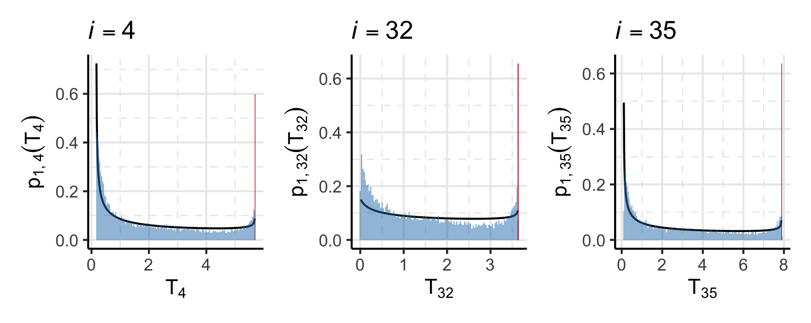

<!--
Rscript -e 'rmarkdown::render("rmd-reports/2021-05-06_survival-pooling.rmd")'
-->

```{r setup, include = FALSE, cache = FALSE, message = FALSE, warning = FALSE, comment = NA}
options(width = 9999)
knitr::opts_chunk$set(
  echo = FALSE, cache = FALSE, fig.align = 'center')
```

# Models

There are $i = 1, \ldots, N$ individuals (icustays) in the data set.
Each individual is admitted to the ICU at time $0$, and is discharged or expires at time $C_{i}$.

## P/F ratio model (B-spline): $\pd_{1}$

Each individual has $j = 1, \ldots, J_{i}$ P/F ratio observations $z_{i, j}$ at times $t_{i, j}$ where $\boldsymbol{z}_{i} = (z_{i, 1}, \ldots, z_{i, J_{i}})$ and $\boldsymbol{t}_{i} = (t_{i, 1}, \ldots, t_{i, J_{i}})$.
We choose to model the P/F ratio using a B-spline of degree 3, with 2 boundary knots and 7 internal knots, and do not include an intercept column in the spline basis.
The lower boundary knot is placed at $\min(\boldsymbol{t_{i}})$ and the upper boundary knot is placed at $\max(\boldsymbol{t_{i}})$.
The internal knots are evenly spaced between the two boundary knots.
These choices result in $k = 1, \ldots, 10$ spline basis terms per individual, with coefficients $\zeta_{i, k}$ where $\boldsymbol{\zeta}_{i} = (\zeta_{i, 1}, \ldots, \zeta_{i, 10})$.
We denote the individual specific B-spline basis evaluated at time $t_{i, j}$ as $B_{i}(t_{i, j}) \in \left\{\mathbb{R}_{+} \cup \{0\}\right\}^{10}$.

An individual's P/F data are standardised to improve computational performance.
That is to say we actually observe $\tilde{z}_{i, j}$, which are then rescaled by each individual's mean $\overline{z}_{i}$ and standard deviation $\hat{s}_{i}$ such that $z_{i, j} = \frac{\tilde{z}_{i, j} - \overline{z}_{i}}{\hat{s}_{i}}$.
The threshold for respiratory failure is rescaled for each individual, i.e. $\tau_{i} = \frac{300 - \overline{z}_{i}}{\hat{s}_{i}}$.

We write the submodel
\begin{equation}
\begin{gathered}
  z_{i, j} = \beta_{0, i} + B_{i}(t_{i, j})\boldsymbol{\zeta}_{i} + \varepsilon_{i, j} \\
  \beta_{0, i} \sim \text{N}(0, 1^2), \,\, \varepsilon_{i, j} \sim t_{5}(0, \omega), \,\,  \omega \sim \text{N}_{+}(0, 1^2).
\end{gathered}
\end{equation}
For the spline basis coefficients $\boldsymbol{\zeta}_{i}$, when $k = 1$ we set $\zeta_{i, 1} \sim \text{N}(0, 0.5^2)$, and for $k = 2, \ldots, 10$ we employ a random-walk smoothing prior[^smoothing] $\zeta_{i, k} \sim \text{N}(\zeta_{i, k - 1}, 0.5^2)$.

Individuals experience either the respiratory failure event denoted $d_{i} = 1$, or the death or discharge event $d_{i} = 2$.
The respiratory failure event time $T_{i}$ is defined as the solution to the following optimisation problem
\begin{equation}
  T_{i} = \min_{t} \left\{
    \tau_{i} = \beta_{0, i} + B_{i}(t)\boldsymbol{\zeta}_{i}
    \mid
    t \in [\max(0, \min(\boldsymbol{t_{i}})), \max(\boldsymbol{t_{i}})]
  \right\},
  \label{eqn:event_time_model_def}
\end{equation}
where solutions to $\tau_{i} = \beta_{0, i} + B_{i}(t)\boldsymbol{\zeta}_{i}$ are obtained using the multiple root finder of @soetaert_rootsolve_2020.
If there are no roots then we assume the individual experiences the death or discharge event, and set $T_{i} = C_{i}$ and $d_{i} = 2$.

We define $\phi_{1 \cap 2} = (\{T_{i}, d_{i}\}_{i = 1}^{N})$, which implies $\pd_{1}(\phi_{1 \cap 2}) = \prod_{i = 1}^{N}\pd_{1}(T_{i}, d_{i})$.
Note that $\pd_{1}(T_{i}, d_{i})$ implicitly conditions on each individual's length of stay, as well as the range, mean, and standard deviation of the P/F data.
The analytic form of $\pd_{1}(T_{i}, d_{i})$ is not available.
Instead, I think we should scale the samples of $T_{i}$ by dividing by $C_{i}$ so that they lie in $[0, 1]$, then fit a mixture of a point mass at $1$ and a beta
distribution (possibly a mixture of two betas?).
Fitting a KDE to samples from such a mixture seems unwise.

To align the notation of \eqref{eqn:event_time_model_def} with the melding notation, we define $Y_{1} = (\{\boldsymbol{z}_{i}, \boldsymbol{t}_{i}\}_{i = 1}^{N})$ and $\psi_{1} = (\{\beta_{0, i}, \boldsymbol{\zeta}_{i}\}_{i = 1}^{N}, \omega)$.

[^smoothing]: This doesn't impart as much smoothing as I thought it would, so we could reduce the inter-coefficient prior variance substantially.


## Cumulative fluid model (piecewise linear) $\pd_{3}$

Each individual has $l = 1, \ldots, L_{i}$ 24-hourly fluid balance observations[^fluidobs], which are used to compute the cumulative fluid balance data $x_{i, l}$ with with $\boldsymbol{x}_{i} = (x_{i, 1}, \ldots, x_{i, L_{i}})$.
These data are 'observed' at times $u_{i, l}$ with $\boldsymbol{u}_{i} = (u_{i, 1}, \ldots, u_{i, L_{i}})$.
We assume a piecewise linear model for the cumulative fluid balance data.
This model is linear with slope $\eta_{1, i}^{b}$ before the breakpoint at time $\kappa_{i}$, and linear with slope $\eta_{1, i}^{a}$ after the breakpoint.
Mathematically,
\begin{gather}
  x_{i, l} = \eta_{0, i} + \eta^{b}_{1, i}(u_{i, l} - \kappa_{i})\boldsymbol{1}_{\{u_{i, l} < \kappa_{i}\}} + \eta^{a}_{1, i}(u_{i, l} - \kappa_{i})\boldsymbol{1}_{\{u_{i, l} \geq \kappa_{i}\}} + \epsilon_{i, l}
  \label{eqn:piecewise-fluid-model-one}\\
  \eta^{b}_{1, i} \sim \text{N}(5000, 1000^2), \,\, \eta^{a}_{1, i} \sim \text{N}(5000, 1000^2), \\
  \epsilon_{i, l} \sim \text{N}(0, \sigma^{2}_{x}),  \,\, \sigma_{x} \sim \text{N}_{+}(0, 500^2).
\end{gather}

The prior for the breakpoint $\kappa_{i}$ is derived using the following steps.
Define $u_{i, (1)} = \min(\boldsymbol{u}_{i})$ and $u_{i, (n)} = \max(\boldsymbol{u}_{i})$, with $r_{i} = u_{i, (n)} - u_{i, (1)}$.
We reparameterise the breakpoint by noting that $\kappa_{i} = \kappa^{\text{raw}}_{i}r_{i} + u_{i, (1)}$, where $\kappa^{\text{raw}} \in [0, 1]$.
We then set $\kappa^{\text{raw}}_{i} \sim \text{Beta}(5, 5)$ to regularise the breakpoint towards the middle of each individual's stay in ICU.
This is crucial to ensure the submodel is identifiable when there is no evidence of a breakpoint in the data.

Specifying a prior for $\eta_{0, i}$ is difficult because $\eta_{0, i}$ is the cumulative fluid balance at $\kappa_{i}$, and thus depends on the length of stay.
Instead, we reparameterise $\eta_{0, i}$ to be a function of the y-intercept $\eta_{0, i}^{\text{raw}}$
\begin{equation}
  \eta_{0, i} =
    (\eta_{0, i}^{\text{raw}} + \eta^{b}_{1, i} \kappa_{i}) \boldsymbol{1}_{\{0 < \kappa_{i}\}} +
    (\eta_{0, i}^{\text{raw}} + \eta^{a}_{1, i} \kappa_{i}) \boldsymbol{1}_{\{0 \geq \kappa_{i}\}}.
\end{equation}
We place a $\text{LogNormal}(8.52, 0.47^2)$ prior on $\eta_{0, i}^{\text{raw}}$.
These values are obtained using the `rriskDistributions` package [@belgorodski_rriskdistributions_2017] assuming that, a priori, the $2.5\%, 50\%$, and $99\%$ percentiles of $\eta_{0, i}^{\text{raw}}$ are $500, 5000$, and $15000$ respectively.
This is a broad prior, that reflects the diverse admission routes into ICU
We expect those admitted from the wards to have little pre-admission fluid data.
Those admitted from the operating theatre often have their in-theatre fluid input recorded after admission into the ICU, with no easy way to distinguish these records in the data.

To completely align with our melding notation we define $m_{i}(t) = \eta_{0, i} + \eta^{b}_{1, i}(t - \kappa_{i})\boldsymbol{1}_{\{t < \kappa_{i}\}} + \eta^{a}_{1, i}(t - \kappa_{i})\boldsymbol{1}_{\{t \geq \kappa_{i}\}}$, and $\phi_{2 \cap 3} = \left(\{\eta^{b}_{1, i}, \eta^{a}_{1, i}, \kappa_{i}\}_{i = 1}^{N}\right)$.
Note that we have explicit, analytic priors for the components of $\phi_{2 \cap 3}$.
Hence,
\begin{equation}
  \pd_{3}(\phi_{2 \cap 3}) = \prod_{i = 1}^{N} \pd(\eta^{b}_{1, i}) \pd(\eta^{a}_{1, i}) \pd(\kappa_{i}), \,\, \text{with} \,\,\,
  \pd(\kappa_{i}) = \pd_{\kappa^{\text{raw}}_{i}}(\frac{\kappa_{i} - u_{i, (1)}}{r_{i}}) \frac{1}{r_{i}}
\end{equation}
by the change of variables formula.
Also define $Y_{3} = (\{\boldsymbol{x}_{i}, \boldsymbol{u}_{i}\}_{i = 1}^{N})$ and $\psi_{3} = (\{\eta_{0, i}\}_{i = 1}^{N}, \sigma^{2}_{x})$.

[^fluidobs]: How these are derived from the raw fluid data is detail for the appendix. The fluid times are the average of the non-zero input/output event chart-times.

## Competing risks survival model $\pd_{2}$

Individuals experience one of two competing events: respiratory failure ($d_{i} = 1$), or death or discharge $(d_{i} = 2)$.
The competing risks framework [see @kalbfleisch_statistical_2002 for an introduction] requires hazards that are specific to each type of event.
We use a Weibull hazard with shape parameter $\gamma_{1}$ for the respiratory failure (RF) event times, and assume a constant hazard $\gamma_{2}$ for the death or discharge (DD) event times.
Denote $\boldsymbol{\gamma} = (\gamma_{1}, \gamma_{2})$.
All individuals have $b = 1, \ldots, B$ baseline (time invariant) covariates $w_{i, b}$ with $\boldsymbol{w}_{i} = (1, w_{i, 1}, \ldots, w_{i, B})$(i.e. including an intercept term), and coefficient $\theta \in \mathbb{R}^{B + 1}$.
The RF hazard is assumed to be influenced by these covariates and the rate of increase in the cumulative fluid balance.
The strength of the latter relationship is captured by $\alpha$.
Hence, the RF hazard is
\begin{gather}
  h_{i, 1}(T_{i}) = \gamma_{1} T_{i}^{\gamma_{1} - 1} \exp\left\{\boldsymbol{w}_{i}\theta + \alpha \frac{\partial}{\partial T_{i}} m_{i}(T_{i})\right\} \\
  \frac{\partial}{\partial T_{i}} m_{i}(T_{i}) = \eta^{b}_{1, i}\boldsymbol{1}_{\{T_{i} < \kappa_{i}\}} + \eta^{a}_{1, i}\boldsymbol{1}_{\{T_{i} \geq \kappa_{i}\}},
\end{gather}
and the DD hazard is $h_{i, 2}(T_{i}) = \gamma_{2}$.
The RF cumulative hazard $H_{i, 1}(T_{i})$ is, for $T_{i} > \kappa_{i}$,
\begin{equation}
  H_{i, 1}(T_{i})
  = \int_{0}^{T_{i}} h_{i, 1}(u) \text{d}u
  = \exp\{\boldsymbol{w}_{i}\theta\}
    \left[
      \exp\left\{
        \alpha \eta^{b}_{1, i}
      \right\}
      \kappa_{i}^{\gamma}
      +
      \exp\left\{
        \alpha \eta^{a}_{1, i}
      \right\}
      (T_{i}^{\gamma} - \kappa_{i}^{\gamma})
    \right],
\end{equation}
and for $T_{i} < \kappa_{i}$
\begin{equation}
  H_{i, 1}(T_{i})
  = \int_{0}^{T_{i}} h_{i}(u) \text{d}u
  = T_{i}^{\gamma} \exp\{\boldsymbol{w}_{i}\theta + \alpha \eta^{b}_{1, i}\}.
\end{equation}
The hazard-specific survival functions are $S_{i, d_{i}}(T_{i}) = \exp\{-H_{i, d_{i}}(t)\}$, and the overall survival probability is
\begin{equation}
  S_{i}(T_{i}) = \exp\left\{-\sum_{d_{i} \in \{1, 2\}} H_{i, d_{i}}(T_{i})\right\}.
\end{equation}
Because there are no censored event times, the likelihood for this competing risks model is
\begin{equation}
  \pd(T_{i}, d_{i} \mid \boldsymbol{\gamma}, \boldsymbol{\theta}, \alpha, \kappa_{i}, \eta_{1, i}^{b}, \eta_{1, i}^{a}, \boldsymbol{w}_{i}) = h_{i, d_{i}}(T_{i}) S_{i}(T_{i}), \\
\end{equation}
where we suppress the dependence on the parameters on the right hand side for brevity.
Our priors are
\begin{equation}
  \boldsymbol{\gamma} \sim \text{N}_{+}(0, \boldsymbol{I}_{2}), \, \,
  \theta_{1} \sim \text{N}(\hat{E}, 1^2), \, \,
  (\theta_{2}, \ldots, \theta_{B + 1}) \sim \text{N}(0, \boldsymbol{I}_{B}), \, \,
  \alpha \sim \text{N}(0, 1^2),
  \label{eqn:surv-submodel-prior-def}
\end{equation}
where $\hat{E}$ is the log of the crude event rate [@brilleman_bayesian_2020], and $\boldsymbol{I}_{p}$ is the $p \times p$ identity matrix.
We adopt the same priors as the cumulative fluid balance submodel for $\kappa_{i}, \eta_{1, i}^{b}$, and $\eta_{1, i}^{a}$.

# Sampling the priors

The prior for $\phi_{2 \cap 3}$ under the third submodel has a known analytic form $\pd_{3}(\phi_{2 \cap 3})$.
However, we must estimate $\pd_{1}(\phi_{1 \cap 2})$ and $\pd_{2}(\phi_{1 \cap 2}, \phi_{2 \cap 3})$.

## PF submodel

Samples of $T_{i}$ and $d_{i}$ are obtained from the prior predictive distribution $\pd_{1}(T_{i}, d_{i})$.
We use a spike-and-slab mixture distribution, with a delta distribution at $C_{i}$ for the death/discharge events, and a beta distribution for the rescaled respiratory event times.
\begin{equation}
  \widehat{\pd_{1}}(T_{i}, d_{i}) =
    \boldsymbol{1}_{\{d_{i} = 1\}} (\widehat{\pi}_{i}) \frac{1}{\beta\left(\widehat{a}_{i}, \widehat{b}_{i}\right)} \left(\frac{T_{i}}{C_{i}}\right)^{\widehat{a}_{i} - 1} \left(1 - \frac{T_{i}}{C_{i}}\right)^{\widehat{b}_{i} - 1} \frac{1}{C_{i}} +
    \boldsymbol{1}_{\{d_{i} = 2, T_{i} = C_{i}\}} (1 - \widehat{\pi}_{i})
  \label{eqn:pf-event-time-prior-dist}
\end{equation}
where $\widehat{\pi}_{i}, a_{i}$ and $b_{i}$ are maximum likelihood estimates using the prior predictive samples.

## Sampling the event times under the survival model

- Use @beyersmann_simulating_2009 and `simsurv` the latter is not working for me at the moment. I suspect overly wide priors are to blame.


# Competing risk model results

These are similar to before, but there is less difference between the method

```{r psi_2_competing_risk_plot}
knitr::include_graphics('../plots/mimic-example/psi-2-method-comparison-small.pdf')
```


# Pooling the priors

Once we have expressions or estimates of the prior marginal distributions, we need to:

- Decide what type of pooling to use (probably all of them and compare)
- Choose pooling weights, and run some kind of prior predictive check?
- Apportion the pooled prior over the stages of the multi-stage sampler, and which stage to divide by the marginals.

# Cohort selection criteria

The individuals in our data are included based

# Bibliography

<div id="refs"></div>

<!-- Now switch to alphabetical numbering for the appendix, and reset the counter. -->
\renewcommand{\thesection}{\Alph{section}}
\setcounter{section}{0}

# Appendix

## Why the censoring / competing risk approaches are not the same

Patients who expire or are discharged are not actually censored.
Instead, they experience the competing, non-independent event of death/discharge.

Suppose that each individual $i$ experiences one of $d_{i} = 1, 2$ competing risks.
We observe $\{T_{i}, d_{i}\}$, where $d_{i} = 1$ indicates that individual $i$ experienced respiratory failure at time $T_{i}$.
If $d_{i} = 2$ then individual $i$ expired or was discharged at time $T_{i}$, noting that this event must occur at time $C_{i}$.
Each cause-specific hazard has parameters $\theta_{d_{i}}$ and we denote the hazard $h_{i, d_{i}}(t \mid \theta_{d_{i}}, \boldsymbol{w}_{i})$.
Denote $\boldsymbol{\theta} = (\theta_{1}, \theta_{2})$ and assume only one such event can occur at a time so that
\begin{gather}
  h_{i}(T_{i} \mid \boldsymbol{\theta}, \boldsymbol{w}_{i}) = \sum_{d_{i} \in \{1, 2\}} h_{i, d_{i}}(T_{i} \mid \theta_{d_{i}}, \boldsymbol{w}_{i}), \\
  \begin{aligned}
  H_{i}(T_{i} \mid \boldsymbol{\theta}, \boldsymbol{w}_{i})
    &= \int_{0}^{T_{i}} \sum_{d_{i} \in \{1, 2\}} h_{i, d_{i}}(u \mid \theta_{d_{i}}, \boldsymbol{w}_{i}) \text{d}u \\
    &= \sum_{d_{i} \in \{1, 2\}} \int_{0}^{T_{i}} h_{i, d_{i}}(u \mid \theta_{d_{i}}, \boldsymbol{w}_{i}) \text{d}u \\
    &= \sum_{d_{i} \in \{1, 2\}} H_{i, d_{i}}(T_{i} \mid \theta_{d_{i}}, \boldsymbol{w}_{i}),
  \end{aligned} \\
  S_{i}(T_{i} \mid \boldsymbol{\theta}, \boldsymbol{w}_{i})
    = \exp\left\{-H_{i}(T_{i} \mid \boldsymbol{\theta}, \boldsymbol{w}_{i})\right\}
    = \exp\left\{-\sum_{d_{i} \in \{1, 2\}} H_{i, d_{i}}(T_{i} \mid \theta_{d_{i}}, \boldsymbol{w}_{i})\right\}.
\end{gather}
As per Equation (8.8) in @kalbfleisch_statistical_2002 the likelihood function for a specific individual is
\begin{align*}
  \pd(T_{i}, d_{i} \mid \boldsymbol{\theta}, \boldsymbol{w}_{i})
    &= h_{i, d_{i}}(T_{i} \mid \theta_{d_{i}}, \boldsymbol{w}_{i}) S_{i}(T_{i} \mid \boldsymbol{\theta}, \boldsymbol{w}_{i}) \\
    &= h_{i, d_{i}}(T_{i} \mid \theta_{d_{i}}, \boldsymbol{w}_{i}) \exp\left\{-\sum_{d_{i} \in \{1, 2\}} H_{i, d_{i}}(T_{i} \mid \theta_{d_{i}}, \boldsymbol{w}_{i})\right\}.
\end{align*}

It is now necessary to assume

- that there are no shared elements in $\theta_{1}$ and $\theta_{2}$ and they are a priori independent,
- that $\theta_{2}$ is not of interest, i.e. we wish to integrate/marginalise $\theta_{2}$ out of the likelihood.

The model (given covariates $\boldsymbol{w}_{i}$) is

\begin{equation}
  \pd(T_{i}, d_{i}, \boldsymbol{\theta} \mid \boldsymbol{w}_{i}) =
    \pd(T_{i}, d_{i} \mid \boldsymbol{\theta}, \boldsymbol{w}_{i})\pd(\boldsymbol{\theta}).
\end{equation}

We are interested in the following marginal

\begin{equation}
  \pd(T_{i}, d_{i}, \theta_{1} \mid \boldsymbol{w}_{i})
  = \int \pd(T_{i}, d_{i}, \boldsymbol{\theta} \mid \boldsymbol{w}_{i}) \text{d}\theta_{2}
  = \int h_{i, d_{i}}(T_{i} \mid \theta_{d_{i}}, \boldsymbol{w}_{i}) S_{i}(T_{i} \mid \boldsymbol{\theta}, \boldsymbol{w}_{i}) \pd(\theta_{1}) \pd(\theta_{2}) \text{d}\theta_{2}.
\end{equation}
If $d_{i} = 1$
\begin{equation}
  \pd(T_{i}, d_{i}, \theta_{1} \mid \boldsymbol{w}_{i})
  = h_{i, 1}(T_{i} \mid \theta_{1}, \boldsymbol{w}_{i}) S_{i, 1}(T_{i} \mid \theta_{1}, \boldsymbol{w}_{i}) \pd(\theta_{1}) \int S_{i, 2}(T_{i} \mid \theta_{2}, \boldsymbol{w}_{i}) \pd(\theta_{2}) \text{d} \theta_{2},
  \label{eqn:competing-risks-deriv-one}
\end{equation}
and if $d_{i} = 2$
\begin{equation}
  \pd(T_{i}, d_{i}, \theta_{1} \mid \boldsymbol{w}_{i})
  = S_{i, 1}(T_{i} \mid \theta_{1}, \boldsymbol{w}_{i}) \pd(\theta_{1}) \int h_{i, 2}(T_{i} \mid \theta_{2}, \boldsymbol{w}_{i}) S_{i, 2}(T_{i} \mid \theta_{2}, \boldsymbol{w}_{i}) \pd(\theta_{2}) \text{d} \theta_{2}.
  \label{eqn:competing-risks-deriv-two}
\end{equation}
Standard survival analyses consider $T_{i}$ as data.
Under this assumption the integrals in \eqref{eqn:competing-risks-deriv-one} and \eqref{eqn:competing-risks-deriv-two} are constants that do not depend on the parameters of interest, and can be ignored in the partial-likelihood.
The remaining components of \eqref{eqn:competing-risks-deriv-one} and \eqref{eqn:competing-risks-deriv-two} comprise the likelihood that would be obtained by considering all non $d_{i} = 1$ events as censored.
However, in our case $T_{i}$ is a parameter, and hence the integrals are non-ignorable functions of $T_{i}$.

- If $d_{i} = 2$, then $T_{i}$ is 'fixed' at $C_{i}$.
- The type-indicator $d_{i}$ is now a parameter, where as the censoring indicator before was a function of the known length-of-stay and the observed event time.
- It's probably easiest to explicitly model the death/discharge event and opt for a piecewise constant hazard.
    - In this case, the likelihood is really just a mixture of an exponential distribution and a Weibull distribution, where the covariates only affect the scale parameter of the Weibull distribution.

## It is not possible to plot a normalised version of Equation \eqref{eqn:pf-event-time-prior-dist}

Because of limitations in `ggplot2`.
Here is an incorrectly normalised version, for a small number of individuals.

```{r pf_prior_plot}

```
