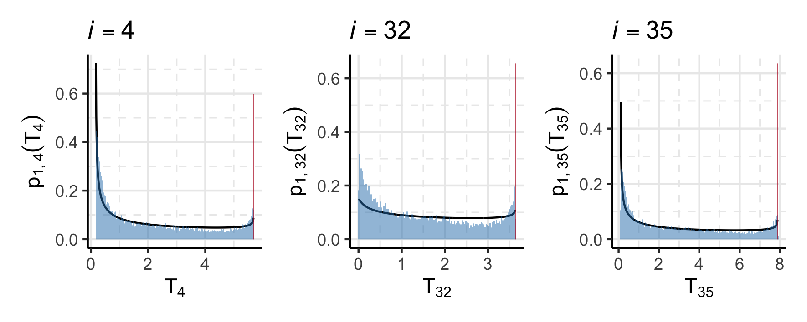

\newcommand{\pd}{\text{p}}

<!--
Rscript -e 'rmarkdown::render("rmd-reports/2021-06-02_prior-sampling.rmd")'
-->

```{r setup, include = FALSE, cache = FALSE, message = FALSE, warning = FALSE, comment = NA}
options(width = 9999)
knitr::opts_chunk$set(
  echo = FALSE, cache = FALSE, fig.align = 'center')
```

# Switching to litres for the fluid data

- Switching to litres, and tweaking the priors on $\phi_{2 \cap 3}, \psi_{2}, \psi_{3}$ broke the two stage sampler some what, and I'm not entirely sure why yet. (See $i = 32, 34, 36$)

```{r}
knitr::include_graphics('../plots/mimic-example/full-stage-two-phi-23-trace.png')
```

- This is better than it has been, but still fails a lot of the numerical diagnostic tests.
- This could possibly be alleviated by running many more iterations (in both stage one and two) in a final run.
- Moved on to pooling variations because this might come out in the wash.

# Sampling and estimating $\pd_{1}(\phi_{1 \cap 2})$

- This was more of a pain than I thought due to the exact $0$s and $1$s that arise due to rescaling and the definition of the death / discharge event.
- Plotting these was also quite tricky, the normalisation is a bit of a pain.
- The fitted mixture (point mass + 1 beta) fits _okay_, sometimes (see $i = 32$) it can be difficult to fit it with a single beta, but two betas is a massive pain to fit.

```{r beta_mix}

```

# Sampling and estimating $\pd_{2}(\phi_{1 \cap 2}, \phi_{2 \cap 3})$

- Sampling from this is very non-trivial and requires quite tight priors for the parameters of the survival submodel.
- The actual event time is influenced by a complex interaction of all of the parameters, and it is hard to get anything that is marginally uniform for $T_{i}$.
    - The death / discharge event is kind of a probabilistic upper bound on the event time. Without a prior that makes it very small a priori, many events occur quite close to $T_{i} = 0$.
- The samples are the transformed (a mixture of scaled-logit and log transformed) to an unconstrained space, where we fit a full-rank normal approximation.
- This can produce some good fits:
```{r p2_good_fit}
knitr::include_graphics('../plots/mimic-example/temp-pairs/pairs-04.png')
```
- Sometimes the optimizer fails, particularly when the samples are imbalanced
- Throwing more prior samples into the optimizer might be helpful, because I suspect the wacky output is due to class imbalance.
    - More samples are unhelpful.
    - Current 'solution' is a `while` loop that restarts the optimiser at new initial values. (seems to work though).
- At the moment, I am not sampling the event types in the correct way [@beyersmann_simulating_2009], but our setting is not really competing risks in a way -- the second event can only happen at the _known_ time of death/discharge, and for the supports of $\pd_{1}(\phi_{1 \cap 2})$ and $\pd_{2}(\phi_{1 \cap 2})$ to match, the survival submodel needs to know about the length of stay.
    - The 'correct' way to do this makes no sense in our situation.

# Todos

- Figure out why I can't get the logarithmic pooled prior version to work (some where there is a bad assumption about the lower bound on the event times).
    - Sporadic initialisation error?
- Type out maths for the transformations and the jacobians.
- Collapse this example into text