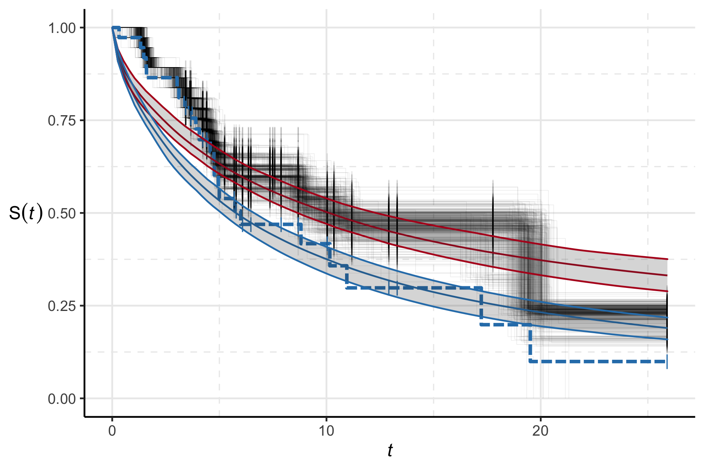

<script src="js/hideAll.js"></script>

\newcommand{\pd}{\text{p}}

<!--
Rscript -e 'rmarkdown::render("rmd-reports/2021-06-15_diagnosis-issues.rmd")'
-->

```{r setup, include = FALSE, cache = FALSE, message = FALSE, warning = FALSE, comment = NA}
options(width = 9999)
knitr::opts_chunk$set(
  echo = FALSE,
  cache = TRUE,
  fig.align = 'center',
  fig.width = 12,
  fig.height = 7,
  out.extra = 'class="plot"'
)
```

```{css, echo = FALSE}
.showopt {
  background-color: #004c93;
  color: #FFFFFF;
  width: 100px;
  height: 20px;
  text-align: center;
  vertical-align: middle !important;
  float: left;
  font-family: sans-serif;
  border-radius: 8px;
}

.showopt:hover {
    background-color: #dfe4f2;
    color: #004c93;
}

pre.plot {
  background-color: white !important;
}
```

```{r defs_includes, message = FALSE, warning = FALSE, comment = NA, cache = FALSE}
suppressPackageStartupMessages(library(dplyr))

source("../scripts/common/plot-settings.R")

log_full_psi_2 <- readRDS('../rds/mimic-example/stage-two-log-psi-2-samples.rds')
log_full_phi_23 <- readRDS('../rds/mimic-example/stage-two-log-phi-23-samples.rds')
log_full_phi_12 <- readRDS('../rds/mimic-example/stage-two-log-phi-12-samples.rds')

breakpoint_names <- dimnames(log_full_phi_23)[[3]] %>%
  grep(pattern = 'breakpoint', x = ., value = TRUE)

eta_before_names <- dimnames(log_full_phi_23)[[3]] %>%
  grep(pattern = '\\,1\\]', x = ., value = TRUE)

eta_after_names <- dimnames(log_full_phi_23)[[3]] %>%
  grep(pattern = '\\,2\\]', x = ., value = TRUE)

event_time_names <- dimnames(log_full_phi_12)[[3]] %>%
  grep(pattern = 'time', x = ., value = TRUE)

event_indicator_names <- dimnames(log_full_phi_12)[[3]] %>%
  grep(pattern = 'indicator', x = ., value = TRUE)

```

# Strange comparison plot

- When comparing PoE and Log pooling, with different parameters fixed our not, the results are quite strange (the following plot is for $\alpha$ only):

```{r psi_2_compare_alpha_only, out.width = '100%', out.height = '200%', cache = FALSE}
knitr::include_graphics('../plots/mimic-example/psi-2-alpha-only-compare.pdf')
```

- We will see in a moment that these strange results are because the convergence of almost all of the multi stage samplers is poor.
- I am also not sure about the point estimate row at the moment, because getting a multivariate equivalent of the median is a nontrival task.
- Whilst the prior row is correct for the original submodel, and the point estimate row, is not the prior for $\alpha$ in any of the melding rows, so it seems a little confusing to juxtapose them?

# Reference, fitted values plot

- This plot is included so we can see why the event times or fluid model parameters are what they are

```{r fit_plot, cache.extra = paste0(tools::md5sum('../plots/mimic-example/combined-pf-fluid-fit-plot.png'), collapse = '')}
knitr::include_graphics('../plots/mimic-example/combined-pf-fluid-fit-plot.png')
```


# Stage 1

```{r stage_one_reads, cache.extra = paste0(tools::md5sum(c('../rds/mimic-example/submodel-1-event-times-samples-array.rds', '../rds/mimic-example/submodel-3-fluid-samples-array.rds')), collapse = '')}
stage_one_phi_12_samples <- readRDS('../rds/mimic-example/submodel-1-event-times-samples-array.rds')
stage_one_phi_23_samples <- readRDS('../rds/mimic-example/submodel-3-fluid-samples-array.rds')
```

## Submodel 1 - PF

### $\phi_{1 \cap 2}$

#### Event times $T_{i}$

```{r stage_one_phi_12_times, cache.extra = paste0(tools::md5sum(c('../rds/mimic-example/submodel-1-event-times-samples-array.rds')), collapse = '')}
mcmc_trace(stage_one_phi_12_samples[, , event_time_names])
```

#### Event indicators $d_{i}$

```{r stage_one_phi_12_indicators, cache.extra = paste0(tools::md5sum(c('../rds/mimic-example/submodel-1-event-times-samples-array.rds')), collapse = '')}
mcmc_trace(stage_one_phi_12_samples[, , event_indicator_names])
```

## Submodel 3 - Fluids

### $\phi_{2 \cap 3}$

#### Breakpoint $\kappa$

```{r stage_one_phi_23_breakpoints, cache.extra = paste0(tools::md5sum(c('../rds/mimic-example/submodel-3-fluid-samples-array.rds')), collapse = '')}
mcmc_trace(stage_one_phi_23_samples[, , breakpoint_names])
```

#### Slope before $\eta_{1, i}^{b}$

- ~~something up with `eta_slope[7, 1]`~~

```{r stage_one_phi_23_eta_befores, cache.extra = paste0(tools::md5sum(c('../rds/mimic-example/submodel-3-fluid-samples-array.rds')), collapse = '')}
mcmc_trace(stage_one_phi_23_samples[, , eta_before_names])
```

#### Slope after $\eta_{1, i}^{a}$

```{r stage_one_phi_23_eta_afters, cache.extra = paste0(tools::md5sum(c('../rds/mimic-example/submodel-3-fluid-samples-array.rds')), collapse = '')}
mcmc_trace(stage_one_phi_23_samples[, , eta_after_names])
```

# Stage 2

## PoE

- Now that I've pruned some of the weird fluid observations, all the PoE variants work well.

### None (full melding)

```{r stage_two_poe_none_fixed_reads, cache.extra = paste0(tools::md5sum(c('../rds/mimic-example/stage-two-poe-psi-2-samples.rds', '../rds/mimic-example/stage-two-poe-phi-12-samples.rds', '../rds/mimic-example/stage-two-poe-phi-23-samples.rds')), collapse = '')}
stage_two_poe_none_fixed_psi_2_samples <- readRDS('../rds/mimic-example/stage-two-poe-psi-2-samples.rds')
stage_two_poe_none_fixed_phi_12_samples <- readRDS('../rds/mimic-example/stage-two-poe-phi-12-samples.rds')
stage_two_poe_none_fixed_phi_23_samples <- readRDS('../rds/mimic-example/stage-two-poe-phi-23-samples.rds')
```

#### $\phi_{1 \cap 2}$

##### Event times $T_{i}$

```{r stage_two_poe_none_fixed_times, cache.extra = paste0(tools::md5sum(c('../rds/mimic-example/stage-two-poe-phi-12-samples.rds')), collapse = '')}
mcmc_trace(stage_two_poe_none_fixed_phi_12_samples[, , event_time_names])
```

##### Event indicators $d_{i}$

```{r stage_two_poe_none_fixed_indicators, cache.extra = paste0(tools::md5sum(c('../rds/mimic-example/stage-two-poe-phi-12-samples.rds')), collapse = '')}
mcmc_trace(stage_two_poe_none_fixed_phi_12_samples[, , event_indicator_names])
```

#### $\phi_{2 \cap 3}$

##### Breakpoint $\kappa$

```{r stage_two_poe_none_fixed_breakpoints, cache.extra = paste0(tools::md5sum(c('../rds/mimic-example/stage-two-poe-phi-23-samples.rds')), collapse = '')}
mcmc_trace(stage_two_poe_none_fixed_phi_23_samples[, , breakpoint_names])
```

##### Slope before $\eta_{1, i}^{b}$

```{r stage_two_poe_none_fixed_eta_befores, cache.extra = paste0(tools::md5sum(c('../rds/mimic-example/stage-two-poe-phi-23-samples.rds')), collapse = '')}
mcmc_trace(stage_two_poe_none_fixed_phi_23_samples[, , eta_before_names])
```

##### Slope after $\eta_{1, i}^{a}$

```{r stage_two_poe_none_fixed_eta_afters, cache.extra = paste0(tools::md5sum(c('../rds/mimic-example/stage-two-poe-phi-23-samples.rds')), collapse = '')}
mcmc_trace(stage_two_poe_none_fixed_phi_23_samples[, , eta_after_names])
```

#### $\psi_{2}$

```{r stage_two_poe_none_fixed_psi_2, cache.extra = paste0(tools::md5sum(c('../rds/mimic-example/stage-two-poe-psi-2-samples.rds')), collapse = '')}
mcmc_trace(stage_two_poe_none_fixed_psi_2_samples)
```

### Fix $\phi_{1 \cap 2}$

- ~~Issues with $i = 34$~~ (fixed with odd fluid obs removed (pre admit fluid intake + OR intake + zeros))

```{r stage_two_poe_fix_phi_12_reads, cache.extra = paste0(tools::md5sum(c('../rds/mimic-example/stage-two-poe-psi-2-samples-fix-phi-12-meld-phi-23.rds', '../rds/mimic-example/stage-two-poe-phi-23-samples-fix-phi-12-meld-phi-23.rds')), collapse = '')}
stage_two_poe_fix_phi_12_psi_2_samples <- readRDS('../rds/mimic-example/stage-two-poe-psi-2-samples-fix-phi-12-meld-phi-23.rds')
stage_two_poe_fix_phi_12_phi_23_samples <- readRDS('../rds/mimic-example/stage-two-poe-phi-23-samples-fix-phi-12-meld-phi-23.rds')
```

#### $\phi_{2 \cap 3}$

##### Breakpoint $\kappa$

```{r stage_two_poe_fix_phi_12_breakpoints, cache.extra = paste0(tools::md5sum(c('../rds/mimic-example/stage-two-poe-phi-23-samples-fix-phi-12-meld-phi-23.rds')), collapse = '')}
mcmc_trace(stage_two_poe_fix_phi_12_phi_23_samples[, , breakpoint_names])
```

##### Slope before $\eta_{1, i}^{b}$

```{r stage_two_poe_fix_phi_12_eta_befores, cache.extra = paste0(tools::md5sum(c('../rds/mimic-example/stage-two-poe-phi-23-samples-fix-phi-12-meld-phi-23.rds')), collapse = '')}
mcmc_trace(stage_two_poe_fix_phi_12_phi_23_samples[, , eta_before_names])
```

##### Slope after $\eta_{1, i}^{a}$

```{r stage_two_poe_fix_phi_12_eta_afters, cache.extra = paste0(tools::md5sum(c('../rds/mimic-example/stage-two-poe-phi-23-samples-fix-phi-12-meld-phi-23.rds')), collapse = '')}
mcmc_trace(stage_two_poe_fix_phi_12_phi_23_samples[, , eta_after_names])
```

#### $\psi_{2}$

```{r stage_two_poe_fix_phi_12_psi_2, cache.extra = paste0(tools::md5sum(c('../rds/mimic-example/stage-two-poe-psi-2-samples-fix-phi-12-meld-phi-23.rds')), collapse = '')}
mcmc_trace(stage_two_poe_fix_phi_12_psi_2_samples)
```

### Fix $\phi_{2 \cap 3}$

- ~~Again, issues with $i = 34$ in that the model thinks it should be censored when it clearly shouldn't~~

```{r stage_two_poe_fix_phi_23_reads, cache.extra = paste0(tools::md5sum(c('../rds/mimic-example/stage-two-poe-psi-2-samples-meld-phi-12-fix-phi-23.rds', '../rds/mimic-example/stage-two-poe-phi-12-samples-meld-phi-12-fix-phi-23.rds')), collapse = '')}
stage_two_poe_fix_phi_23_psi_2_samples <- readRDS('../rds/mimic-example/stage-two-poe-psi-2-samples-meld-phi-12-fix-phi-23.rds')
stage_two_poe_fix_phi_23_phi_12_samples <- readRDS('../rds/mimic-example/stage-two-poe-phi-12-samples-meld-phi-12-fix-phi-23.rds')
```

#### $\phi_{1 \cap 2}$

##### Event times $T_{i}$

```{r stage_two_poe_fix_phi_23_times, cache.extra = paste0(tools::md5sum(c('../rds/mimic-example/stage-two-poe-phi-12-samples-meld-phi-12-fix-phi-23.rds')), collapse = '')}
mcmc_trace(stage_two_poe_fix_phi_23_phi_12_samples[, , event_time_names])
```

##### Event indicators $d_{i}$

```{r stage_two_poe_fix_phi_23_indicators, cache.extra = paste0(tools::md5sum(c('../rds/mimic-example/stage-two-poe-phi-12-samples-meld-phi-12-fix-phi-23.rds')), collapse = '')}
mcmc_trace(stage_two_poe_fix_phi_23_phi_12_samples[, , event_indicator_names])
```

#### $\psi_{2}$

```{r stage_two_poe_fix_phi_23_psi_2, cache.extra = paste0(tools::md5sum(c('../rds/mimic-example/stage-two-poe-psi-2-samples-meld-phi-12-fix-phi-23.rds')), collapse = '')}
mcmc_trace(stage_two_poe_fix_phi_23_psi_2_samples)
```

## Log

- Currently, Log pooling with either one of $\phi_{1 \cap 2}$ or $\phi_{2 \cap 3}$ fixed is assuming that, e.g. for $\phi_{1 \cap 2}$ fixed to subposterior median value $\tilde{\phi}_{1 \cap 2}$ $\pd_{2}(\phi_{1 \cap 2} = \tilde{\phi}_{1 \cap 2}, \phi_{2 \cap 3}) = k \pd_{2}(\phi_{2 \cap 3}$ for some constant $k$ that does not depend on $\tidle{\phi}_{1 \cap 2}$.
  - This seems like an independence assumption in disguise? Doing the fixed variants 'properly' involves estimating $\pd_{2}(\phi_{1 \cap 2})$ and $\pd_{2}(\phi_{2 \cap 3})$ (so might as well do linear pooling as well if so).

### None (full melding)

- Serious wobbles in all parameters here
  - This was because $\lambda = (\frac{1}{3}, \frac{1}{3}, \frac{1}{3})$ is not 'enough' of a prior.
- With $\lambda = (\frac{9}{10}, \frac{9}{10}, \frac{9}{10})$, the results are (unsurprisingly) very similar to the PoE results (and the MCMC diagnostics are good),
- Let's try with $\lambda = (\frac{1}{2}, \frac{1}{2}, \frac{1}{2})$ to see if it is sufficient in terms of prior (no, not at all)
- $\lambda = (\frac{2}{3}, \frac{2}{3}, \frac{2}{3})$ is also not sufficient
- $\lambda = (\frac{3}{4}, \frac{3}{4}, \frac{3}{4})$ is also not sufficient
- [x] $\lambda = (0.825, 0.825, 0.825)$ works
- [x] $\lambda = (0.8, 0.8, 0.8)$ works, not much point testing values in between here and 0.75


```{r stage_two_log_none_fixed_reads, cache.extra = paste0(tools::md5sum(c('../rds/mimic-example/stage-two-log-psi-2-samples.rds', '../rds/mimic-example/stage-two-log-phi-12-samples.rds', '../rds/mimic-example/stage-two-log-phi-23-samples.rds')), collapse = '')}
stage_two_log_none_fixed_psi_2_samples <- readRDS('../rds/mimic-example/stage-two-log-psi-2-samples.rds')
stage_two_log_none_fixed_phi_12_samples <- readRDS('../rds/mimic-example/stage-two-log-phi-12-samples.rds')
stage_two_log_none_fixed_phi_23_samples <- readRDS('../rds/mimic-example/stage-two-log-phi-23-samples.rds')
```

#### $\phi_{1 \cap 2}$

##### Event times $T_{i}$

```{r stage_two_log_none_fixed_times, cache.extra = paste0(tools::md5sum(c('../rds/mimic-example/stage-two-log-phi-12-samples.rds')), collapse = '')}
mcmc_trace(stage_two_log_none_fixed_phi_12_samples[, , event_time_names])
```

##### Event indicators $d_{i}$

```{r stage_two_log_none_fixed_indicators, cache.extra = paste0(tools::md5sum(c('../rds/mimic-example/stage-two-log-phi-12-samples.rds')), collapse = '')}
mcmc_trace(stage_two_log_none_fixed_phi_12_samples[, , event_indicator_names])
```

#### $\phi_{2 \cap 3}$

##### Breakpoint $\kappa$

```{r stage_two_log_none_fixed_breakpoints, cache.extra = paste0(tools::md5sum(c('../rds/mimic-example/stage-two-log-phi-23-samples.rds')), collapse = '')}
mcmc_trace(stage_two_log_none_fixed_phi_23_samples[, , breakpoint_names])
```

##### Slope before $\eta_{1, i}^{b}$

```{r stage_two_log_none_fixed_eta_befores, cache.extra = paste0(tools::md5sum(c('../rds/mimic-example/stage-two-log-phi-23-samples.rds')), collapse = '')}
mcmc_trace(stage_two_log_none_fixed_phi_23_samples[, , eta_before_names])
```

##### Slope after $\eta_{1, i}^{a}$

```{r stage_two_log_none_fixed_eta_afters, cache.extra = paste0(tools::md5sum(c('../rds/mimic-example/stage-two-log-phi-23-samples.rds')), collapse = '')}
mcmc_trace(stage_two_log_none_fixed_phi_23_samples[, , eta_after_names])
```

#### $\psi_{2}$

```{r stage_two_log_none_fixed_psi_2, cache.extra = paste0(tools::md5sum(c('../rds/mimic-example/stage-two-log-psi-2-samples.rds')), collapse = '')}
mcmc_trace(stage_two_log_none_fixed_psi_2_samples)
```

### Fix $\phi_{1 \cap 2}$

- When we fix $\phi_{1 \cap 2}$, it is important that we define the pooled prior appropriately. It is a function of $\pd_{2}(\phi_{2 \cap 3})$ and $\pd_{3}(\phi_{2 \cap 3})$ (not the different in $\pd_{2}$ marginal from using chained melding). This also means that the interpretation of $\lambda$ is slightly different.

```{r stage_two_log_fix_phi_12_reads, cache.extra = paste0(tools::md5sum(c('../rds/mimic-example/stage-two-log-psi-2-samples-fix-phi-12-meld-phi-23.rds', '../rds/mimic-example/stage-two-log-phi-23-samples-fix-phi-12-meld-phi-23.rds')), collapse = '')}
stage_two_log_fix_phi_12_psi_2_samples <- readRDS('../rds/mimic-example/stage-two-log-psi-2-samples-fix-phi-12-meld-phi-23.rds')
stage_two_log_fix_phi_12_phi_23_samples <- readRDS('../rds/mimic-example/stage-two-log-phi-23-samples-fix-phi-12-meld-phi-23.rds')
```

#### $\phi_{2 \cap 3}$

##### Breakpoint $\kappa$

```{r stage_two_log_fix_phi_12_breakpoints, cache.extra = paste0(tools::md5sum(c('../rds/mimic-example/stage-two-log-phi-23-samples-fix-phi-12-meld-phi-23.rds')), collapse = '')}
mcmc_trace(stage_two_log_fix_phi_12_phi_23_samples[, , breakpoint_names])
```

##### Slope before $\eta_{1, i}^{b}$

```{r stage_two_log_fix_phi_12_eta_befores, cache.extra = paste0(tools::md5sum(c('../rds/mimic-example/stage-two-log-phi-23-samples-fix-phi-12-meld-phi-23.rds')), collapse = '')}
mcmc_trace(stage_two_log_fix_phi_12_phi_23_samples[, , eta_before_names])
```

##### Slope after $\eta_{1, i}^{a}$

```{r stage_two_log_fix_phi_12_eta_afters, cache.extra = paste0(tools::md5sum(c('../rds/mimic-example/stage-two-log-phi-23-samples-fix-phi-12-meld-phi-23.rds')), collapse = '')}
mcmc_trace(stage_two_log_fix_phi_12_phi_23_samples[, , eta_after_names])
```

#### $\psi_{2}$

```{r stage_two_log_fix_phi_12_psi_2, cache.extra = paste0(tools::md5sum(c('../rds/mimic-example/stage-two-log-psi-2-samples-fix-phi-12-meld-phi-23.rds')), collapse = '')}
mcmc_trace(stage_two_log_fix_phi_12_psi_2_samples)
```

### Fix $\phi_{2 \cap 3}$

- ~~These revert to looking okay, suggesting that the issues are driven by problems with $\phi_{2 \cap 3}$, or interactions between it and the prior?~~
- Doing this properly required estimating $\widehat{\pd}_{2}(\phi_{1 \cap 2})$, which I've done. This also means I don't have an excuse to not do linear pooling as well now. So I probably should.

```{r stage_two_log_fix_phi_23_reads, cache.extra = paste0(tools::md5sum(c('../rds/mimic-example/stage-two-log-psi-2-samples-meld-phi-12-fix-phi-23.rds', '../rds/mimic-example/stage-two-log-phi-12-samples-meld-phi-12-fix-phi-23.rds')), collapse = '')}
stage_two_log_fix_phi_23_psi_2_samples <- readRDS('../rds/mimic-example/stage-two-log-psi-2-samples-meld-phi-12-fix-phi-23.rds')
stage_two_log_fix_phi_23_phi_12_samples <- readRDS('../rds/mimic-example/stage-two-log-phi-12-samples-meld-phi-12-fix-phi-23.rds')
```

#### $\phi_{1 \cap 2}$

##### Event times $T_{i}$

```{r stage_two_log_fix_phi_23_times, cache.extra = paste0(tools::md5sum(c('../rds/mimic-example/stage-two-log-phi-12-samples-meld-phi-12-fix-phi-23.rds')), collapse = '')}
mcmc_trace(stage_two_log_fix_phi_23_phi_12_samples[, , event_time_names])
```

##### Event indicators $d_{i}$

```{r stage_two_log_fix_phi_23_indicators, cache.extra = paste0(tools::md5sum(c('../rds/mimic-example/stage-two-log-phi-12-samples-meld-phi-12-fix-phi-23.rds')), collapse = '')}
mcmc_trace(stage_two_log_fix_phi_23_phi_12_samples[, , event_indicator_names])
```

#### $\psi_{2}$

```{r stage_two_log_fix_phi_23_psi_2, cache.extra = paste0(tools::md5sum(c('../rds/mimic-example/stage-two-log-psi-2-samples-meld-phi-12-fix-phi-23.rds')), collapse = '')}
mcmc_trace(stage_two_log_fix_phi_23_psi_2_samples)
```

## Point (marginal median value)

```{r both_fixed_reads, cache.extra = paste0(tools::md5sum(c('../rds/mimic-example/stage-two-median-inputs-psi-2-samples.rds')), collapse = '')}
both_fixed_psi_2_samples <- readRDS('../rds/mimic-example/stage-two-median-inputs-psi-2-samples.rds')
```

#### $\psi_{2}$

```{r both_fixed_psi_2_samples, cache.extra = paste0(tools::md5sum(c('../rds/mimic-example/stage-two-median-inputs-psi-2-samples.rds')), collapse = '')}
mcmc_trace(both_fixed_psi_2_samples)
```

# Other updates

- Multi-dimensional medians are hard, and I was computing them incorrectly. Switched to correctly computing the median for $\phi_{1 \cap 2}$ and using the mean for $\phi_{2 \cap 3}$.
- Initial attempts at a posterior predictive check style plot have some numerical issues that I haven't pinned down.
- They have now been fixed:

```{r km_ppc_plot}

```
